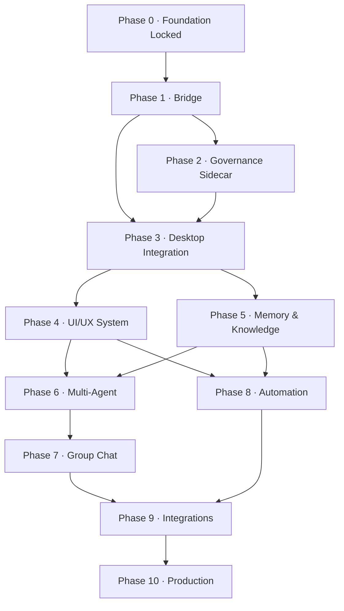

# OS Master Execution Roadmap · OS-ի գլխավոր կատարման ճանապարհ

**Status: `Active — Canonical Execution Authority`**
**Կարգավիճակ՝ `Active — Canonical Execution Authority` (ակտիվ, կանոնական կատարման իշխանություն)**

> This document is the **single execution source** for `menqstudio/OS`. When a Claude (or ChatGPT)
> session is told *"go build the next thing"*, it opens this file, finds the current phase, and takes
> the next **unchecked** task — without needing any chat context. When state changes, this file is
> updated **in the same commit** as the change. It is *Active*, not *Locked*: only Phase 0 (Foundation)
> is frozen; every other phase is executable now.
>
> Սա `menqstudio/OS`-ի **միակ կատարման աղբյուրն** է։ Երբ session-ին ասում են «գնա կառուցիր հաջորդը»,
> ինքը բացում է այս ֆայլը, գտնում ընթացիկ phase-ը, վերցնում հաջորդ **unchecked** task-ը՝ առանց chat
> context-ի կարիքի։ Վիճակ փոխվելիս՝ այս ֆայլը թարմացվում է **նույն commit-ում**։ *Active* է, ոչ *Locked*.

---

## A. How to use this document · Ինչպես օգտագործել

1. **`git pull`**, then read the [canonical files](./CLAUDE.md) per the Startup Law (`CLAUDE.md` →
   `PROJECT_STATE.md` → `TASKS.md` → `OWNERS.md` → `docs/ARCHITECTURE.md`).
2. Open this roadmap. Find the **first phase** whose *Definition of Done* is not fully checked.
3. Inside that phase, take the **first unchecked task** in its task checklist. Confirm no one else holds
   it (`TASKS.md`), then claim it there and on the task line here.
4. Do the work on a **feature branch**, open a **draft PR**, satisfy the phase's *Merge gate*, hand Gev
   the exact push/merge command. **You never push or merge** (see §B.5).
5. When you finish a task, check its box **in the same commit**. When every box in a phase is checked and
   the *Merge gate* is green, mark the phase ✅ in the roadmap table below.

**Golden reading order for a cold-start session:** §B (rules) → §C (design system) → §D (page-spec
template) → §E (dependency map) → your phase. That is the whole onboarding for *building*.

### Phase status board · Phase-երի վիճակ
| Phase | Name | Status |
|---|---|---|
| 0 | Foundation | ✅ **Locked (done)** |
| 1 | Bridge | 🔨 **In progress** — slice 1 built & verified (8/8); slices 2–3 open |
| 2 | Governance Sidecar | ⏳ Ready (P1 contract exists) |
| 3 | Desktop Integration | ⏳ Blocked on P1 round-trip + P2 gate |
| 4 | UI/UX System | ⏳ Blocked on P3 |
| 5 | Memory & Knowledge | ⏳ Blocked on P3 |
| 6 | Multi-Agent | ⏳ Blocked on P4+P5 |
| 7 | Group Chat | ⏳ Blocked on P6 |
| 8 | Automation | ⏳ Blocked on P4+P5 |
| 9 | Integrations | ⏳ Blocked on P7+P8 |
| 10 | Production | ⏳ Blocked on P9 |

---

## B. Global conventions · Ընդհանուր կանոններ

These apply to **every phase**. A phase section never repeats them; it only names deviations.

### B.1 Roles
| Who | Role | Owns |
|---|---|---|
| 👑 **Gev** (`menqstudio`) | Owner / Final Approver | Approves & merges every PR; the only push/merge authority; final architecture calls. |
| 📐 **ChatGPT** | Architect / Auditor | Architecture, security review, sign-off gates, coordination. |
| 🔨 **Claude** | Builder / Executor | Code, tests, commits, PRs, docs. Executes this roadmap. |

### B.2 Work rules
- **No direct work on `main`.** Every task = its own branch + PR, merged only after Owner approval.
- **Never two agents on the same task.** Claim in [`TASKS.md`](./TASKS.md) first.
- **Docs stay synced.** `CLAUDE.md` · `PROJECT_STATE.md` · `TASKS.md` · this roadmap are updated in the
  **same commit** as the change they describe. A stale brain is worse than none.
- **Do not start execution without Gev's explicit go** (`«սկսի»` / `start`). Collect context, don't act.

### B.3 Environment (Windows box) — read before running tools
- **`cargo` MUST run from PowerShell, never the Bash tool** (Git Bash `link` shadows MSVC `link.exe` →
  bogus *"extra operand"*). MSVC C++ Build Tools present.
- **Engine tests need `BRO_ENV=ci`** (without it operator-pin gating denies and tests error).
- **The permission classifier BLOCKS `git push` and `gh pr merge` for the AI.** Prepare the exact
  command and hand it to Gev. Never try to work around this.
- **Enforcement-hook wedge:** the engine ships `.claude/settings.json` hooks (`bro_hook.py`) that can
  crash on Windows with a cp1252 `UnicodeEncodeError` and fail-closed-cascade the session. If it wedges:
  set `PYTHONUTF8=1` and relaunch, or rename `settings.json`. Hooks load from the repo **root** only.
- **Commit identity:** `user.name "menqstudio"`, `user.email "ohanyan.88@gmail.com"`. End every commit
  message with: `Co-Authored-By: Claude Opus 4.8 (1M context) <noreply@anthropic.com>`.
- **Toolchain:** cargo 1.96, node 24, npm 11, python 3.13, Pillow. Tauri Windows build needs
  `apps/desktop/src-tauri/icons/icon.ico` (already generated).

### B.4 Canonical verification commands
Run each from the component's directory; **verify before claiming green** (`CLAUDE.md` §7).
```bash
# Cockpit — frontend (Node)
cd apps/desktop && npm ci && npm run build        # tsc --noEmit + vite build

# Cockpit — Rust data core + app   (⚠️ PowerShell, NOT the Bash tool)
cargo test  -p brops-core --manifest-path apps/desktop/src-tauri/core/Cargo.toml   # 29 tests
cargo check --manifest-path apps/desktop/src-tauri/Cargo.toml

# Engine — Python governance runtime  (MUST set BRO_ENV=ci)
cd engine && BRO_ENV=ci python -m unittest discover -s tests   # ~615 tests, ~16 Windows platform-skips

# Bridge — Phase-1 governed adapter
cd bridge && BRO_ENV=ci python -m unittest discover -s tests    # slice-1: 8/8

# Documentation validation (run before every roadmap/docs PR)
python engine/tools/bro_docs_freshness.py        # doc inventory / freshness
python engine/tools/bro_validate.py               # SST + registry validation
```

### B.5 Push / release rule
The AI never pushes or merges. For every completed task the Builder prepares:
```bash
git add -A && git commit -m "<message>"      # local only
# Then hand Gev exactly:
git push -u origin <branch>
gh pr create --draft --title "<t>" --body "<b>"   # or: gh pr ready / gh pr merge  (Gev runs)
```

---

## C. Canonical design system · Կանոնական դիզայն-համակարգ

The single visual/interaction reference is **`brops-aios.html`** (the `BrPS · MENQ OS v0.9`
cockpit prototype, ~24k lines, Armenian UI). All desktop UI work reproduces its system in real
React/TS components. **When the prototype and this roadmap disagree, the prototype wins on look &
feel; this roadmap wins on scope & sequencing.**

### C.1 Design tokens (from the prototype `:root`)
| Group | Tokens |
|---|---|
| **Brand / accent** | `--azure #0A84FF` (primary), `--azure-hover #3DA5FF`, `--cyan #38BDF8`, `--mint #34D6C6` |
| **Surfaces (dark)** | `--bg #05070C`, `--surface #0B0F18`, `--raised #111725`, `--hi #18202E`, `--line #1B2333` |
| **Ink** | `--ink #EAF0F8`, `--ink-muted #8993A8` |
| **Semantic** | `--success #37D6A0`, `--warning #E9B44C`, `--danger #F0616D`, `--info #3DA5FF` |
| **Type scale** | hero 32 · h1 24 · h2 19 · body 15 · ui 14 · small 12 · micro 10 (px) |
| **Fonts** | `Baloo 2` (display), `Inter` (UI Latin), `Noto Sans Armenian` (UI HY), `JetBrains Mono` (code/data) |
| **Radii** | sm 9 · base 12 · lg 18 · xl 26 · pill 999 (px) |
| **Spacing** | 4 · 8 · 12 · 16 · 20 · 24 · 32 · 40 (px) — `--s1..--s10` |
| **Motion** | `--fast 130ms`, `--slow 220ms`, `--spring cubic-bezier(.16,1,.3,1)`, `--enter 640ms`, `--stagger 52ms` |

Every component honors `prefers-reduced-motion` (disable drift/ember/reveal animations, keep opacity
state changes). Every color pair meets WCAG AA on `--bg`/`--surface`.

### C.2 Canonical page inventory (22 pages)
These are the exact pages the prototype ships. Each is delivered by the phase in the **Phase** column;
its full page-spec (per §D) lives in that phase's *UI/UX work* section.

| # | Key | Icon | Title (HY) | English | Phase |
|---|---|---|---|---|---|
| 1 | `home` | ⌂ | Ամփոփում | Overview / home | **3** |
| 2 | `chat` | ✦ | Զրույց Bro-ի հետ | Chat with Bro | **3** |
| 3 | `settings` | ⚙ | Կարգավորումներ | Settings | **3** |
| 4 | `approvals` | ✔ | Հաստատումներ | Approval gate | **2** |
| 5 | `decisions` | ⚖ | Որոշումներ | Decision ledger | **2** |
| 6 | `security` | ⛨ | Անվտանգություն | Security / evidence chain | **2** |
| 7 | `notifications` | ◈ | Ազդանշաններ | Notifications / signals | **2** |
| 8 | `activity` | ♥ | Զարկերակ | Live activity / vitals | **4** |
| 9 | `analytics` | ◈ | Վերլուծություն | Analytics | **4** |
| 10 | `library` | ❑ | Դարան | Component / prompt library | **4** |
| 11 | `memory` | ❖ | Հիշողություն | Memory | **5** |
| 12 | `knowledge` | ⁂ | Գիտելիք | Knowledge base | **5** |
| 13 | `research` | ⌖ | Հետազոտում | Research | **5** |
| 14 | `files` | ▤ | Ֆայլեր | Files | **5** |
| 15 | `agents` | ⬡ | Կենդանի Ցանց | Live agent network (lattice) | **6** |
| 16 | `command` | ❖ | Հրամանի Միջուկ | Command core | **6** |
| 17 | `tasks` | ◈ | Առաքելություն | Missions / tasks | **6** |
| 18 | `projects` | ❖ | Հոսքեր | Flows / projects | **6** |
| 19 | `group` | ⧉ | Համագործակցության Սրահ | Collaboration hall (group chat) | **7** |
| 20 | `automations` | ⇶ | Ավտոմատներ | Automations | **8** |
| 21 | `calendar` | ▦ | Օրացույց | Calendar | **8** |
| 22 | `integrations` | ✦ | Ինտեգրումներ | Integrations | **9** |

The **app shell** (`<aside class="side">` brand + `#nav` + `<main class="stage">`) and the global
**command dock** (`cmd-dock`, ⌘K-style) are cross-cutting; they are built in Phase 3 and extended by
later phases.

---

## D. Per-page UI/UX specification template · Էջի UI/UX ձևանմուշ

**UI/UX is a first-class deliverable in every phase (rule 3).** Every page a phase delivers MUST be
specified with all of the following before it is called done. A phase's *UI/UX work* section fills this
template per page; do not ship a page that leaves a row empty.

| Facet | What to specify |
|---|---|
| **Components** | The concrete React/TS components + which prototype block they reproduce (id/class). |
| **Layout & responsive** | Grid/rail structure; behavior at ≥1440 / 1024–1440 / <1024 (desktop-first, gracefully narrow). |
| **States** | `default`, `loading`, `empty`, `error`, `blocked` (governance-denied), plus any domain states. |
| **Loading** | Skeletons/shimmer (prototype uses `reveal`+`--stagger`); never a bare spinner where a skeleton fits. |
| **Empty** | First-run copy (Armenian) + primary CTA; distinguishes "nothing yet" from "filtered to nothing". |
| **Error** | User-legible cause + recovery action; technical detail behind a disclosure; never a dead end. |
| **Blocked** | Governance-denied state: shows the gate reason from the engine verdict; offers the lawful next step (request approval). Unique to a governed cockpit; **mandatory wherever an action crosses the wall.** |
| **Motion** | Enter/exit, state transitions, live-data pulse — using §C.1 tokens; honors `prefers-reduced-motion`. |
| **Keyboard UX** | Full keyboard path (Tab order, `Enter`/`Esc`, arrow nav in lists, `⌘K` command dock, page hotkey). |
| **Accessibility** | Roles, `aria-*`, focus-visible rings, live regions for async updates, AA contrast, HY screen-reader labels. The prototype already carries 457 aria attributes — match or exceed. |
| **Data source** | Which store/IPC feeds it (desktop SQLite vs engine ledger/evidence) and its refresh model. |

---

## E. Phase dependency graph & parallelization · Կախվածություն և զուգահեռություն



**Critical path:** 0 → 1 → 3 → 4 → 6 → 7 → 9 → 10.

**Parallelizable once their inputs exist:**
- After **P3**: P4 (UI/UX System) and P5 (Memory & Knowledge) can run in parallel — disjoint page sets,
  disjoint stores. Assign different agents; reconcile only the shared app-shell/nav seam.
- After **P4+P5**: P6 (Multi-Agent) and P8 (Automation) are largely independent (agents/command vs
  automations/calendar). P8 depends on P4's design system + P5's knowledge store, not on P6.
- **P2 (Governance Sidecar) can begin as soon as P1's contract exists**, in parallel with early P3
  shell work, because its surfaces (`approvals`, `decisions`, `security`, `notifications`) render engine
  data that P1 already produces.

**Serialization rule:** any task that touches `engine/` security code (wall, leases, gates, signatures,
control-plane, root model) is **never parallelized and never rushed** — it takes its own audited branch,
its own PR, and Owner approval (engine golden rule, `CLAUDE.md` §6).

---

## F. Contract & artifact index · Contract-ների ինդեքս

The shared truth every phase builds against. Phase 3 begins deduping these into `contracts/`; the full
dedupe into a single source is the original roadmap's "Contracts" milestone, finalized before Phase 10.

| Artifact | Location (today) | Shape |
|---|---|---|
| **bridge.task-request** | `bridge/contracts/task-request.schema.json` | `{task_id, task_class, rationale, protected_scope[]}` — **carries no lease, no key, no env** (mirrors `bro_supervisor.TaskRequest`). |
| **bridge.result** | `bridge/contracts/bridge-result.schema.json` | `{ok, result, receipt{task_id,status,exit_code,evidence[],verified}, error}`. **Fail-closed + VERIFIED-receipt-mandatory:** `result` non-null **iff** `ok=true` **and** `receipt.verified=true`. |
| **execution receipt** | `engine/runtime/bro_receipt.py` | `{receipt_id, task_id, command, candidate_head, candidate_tree, working_directory, exit_code, tests, key_id, runner_id, runner_platform, issued/started/finished_at_epoch}` (Ed25519-signed). |
| **execution lease** | `engine/runtime/bro_execution_lease.py` | Scoped, single-use; issued by the supervisor **into the builder**, never to the conductor. |
| **evidence chain** | `engine/runtime/bro_evidence.py` | Append-only, SHA-256-chained events; the audit truth. |
| **verifier / skill receipts** | `engine/schemas/verifier-receipt.schema.json`, `skill-receipt.schema.json` | Independent verdict + skill-run evidence. |

**Verified-receipt contract (the Phase-1 spine, integrated per rule 2):** the desktop is a *conductor*.
It sends a `task-request` (no lease/key/env) to the engine sidecar; the supervisor issues a single-use
lease **into a separate builder**, runs the AI turn behind the wall, and returns a `bridge.result`. The
adapter sets `receipt.verified=true` **only** after an injected verifier confirms the run's signed
evidence, and returns a non-null `result` **only** then. **No verified receipt ⇒ no result.** This
invariant holds in every phase that executes AI work; later phases add surfaces and scope but never
weaken it.

---

# Phases · Phase-եր

Each phase below carries the full required section set: **Objective · Scope · Architecture · UI/UX work ·
Backend work · Contracts/schemas · Data models · Dependencies · Security gates · Tests · CI requirements ·
Documentation updates · Acceptance criteria · Merge gate · Stop conditions · Definition of Done**, plus a
**Task checklist** of `- [ ]` items a cold-start session takes in order.

---

## Phase 0 — Foundation · Հիմք  ✅ Locked

**Objective.** Assemble the two audited halves into one monorepo with preserved history, unified CI, and
bilingual canonical docs, so all later phases build on one stable base. *(Done; frozen.)*

**Scope.** In: `git subtree` vendoring of `engine/` (Bro) and `apps/desktop/` (BroPS), unified
`.github/workflows` CI (3 legs), bilingual `README`/`CLAUDE`/`ARCHITECTURE`, coordination canon
(`OWNERS`/`PROJECT_STATE`/`TASKS`/Startup Law). Out: any wiring between the halves (that is Phase 1+).

**Architecture.** Two independent toolchains (Python engine, Rust+TS cockpit) coexisting; the git
top-level is `OS/`, each half a subdirectory. The engine's security perimeter still assumes `ROOT` is a
worktree root — resolved for now by **Option 1 (subtree + C)**: the 9 monorepo-coupled enforcement-path
tests (`FullExecutionTransactionE2ETests`, `HookSubprocessTests`) skip-guard themselves when `engine/`
is not a git checkout root. No runtime/security code touched. A native fix (submodule + `git rev-parse
--show-toplevel` in `bro_repository_state.worktrees()`) is deferred to **T-005**, a separate audited task.

**UI/UX work.** None new. Establishes that `brops-aios.html` is the canonical visual reference (§C) and
that the cockpit's existing shell in `apps/desktop/` is the starting point. Deliverable: the design-token
extraction table (§C.1) and the 22-page inventory (§C.2) — done in this roadmap.

**Backend work.** None new; both halves build independently (§B.4). Provenance recorded: `engine/` from
Bro `main`; `apps/desktop/` from BroPS `main` (PR #25).

**Contracts / schemas.** None new. The engine's existing contracts (lease, receipt, evidence, mode-grant)
are inventoried in §F as the shared truth later phases consume.

**Data models.** None new. Desktop SQLite (product/UI state) and engine ledger+evidence (security truth)
remain separate; IDs will cross the bridge in Phase 1 — no shared table.

**Dependencies.** None (this is the root).

**Security gates.** Both halves arrived audited & fixed (Engine: 1 Critical + 6 High + 9 Med + 13 Low, all
fixed; Cockpit: 1 High + 8 Med + 18 Low, all fixed). Residual/deferred engine items **O-1..O-5** are
tracked on Bro's `fix/audit-followups` and are **not** in scope here (wall/owner-env coupled).

**Tests.** Engine `BRO_ENV=ci python -m unittest discover -s tests` → green (591 passed, 38 skipped, 0
failed, option-C skip-guard). Cockpit `cargo test -p brops-core` 29/29; `npm run build` green.

**CI requirements.** One workflow, three legs: cockpit-frontend (npm build) · cockpit-core (cargo test) ·
engine (python unittest). Triggers on push→`main` and on `pull_request`.

**Documentation updates.** `README`, `CLAUDE.md`, `docs/ARCHITECTURE.md`, coordination canon — all
bilingual and current at merge.

**Acceptance criteria.** Monorepo assembled with both histories intact; all three CI legs green; canonical
docs present and bilingual; the root-model decision recorded with its verified finding.

**Merge gate.** ✅ Met (merged).

**Stop conditions.** Any attempt to change engine security code inside a Phase-0/coordination merge →
stop, split into an audited task (this is the exact failure Option 1 avoids).

**Definition of Done.**
- [x] Both halves vendored via `git subtree`, history preserved.
- [x] Unified CI, three legs green.
- [x] Bilingual canonical docs (`README`/`CLAUDE`/`ARCHITECTURE`) + coordination canon.
- [x] Root-model decision recorded (Option 1 now; T-005 deferred).

**Task checklist.** *(Phase complete — retained for provenance.)*
- [x] Vendor `engine/` and `apps/desktop/` with history.
- [x] Author unified CI workflow (3 legs).
- [x] Land coordination canon + Startup Law.
- [x] Record root-model decision + verified submodule finding.

---

## Phase 1 — Bridge · Կամուրջ  🔨 In progress

**Objective.** Route the desktop's AI execution through the engine's supervisor/lease/wall so every AI
turn the cockpit triggers is governed and returns a **verified** signed receipt — replacing the direct,
ungoverned `claude` spawn in `apps/desktop/src-tauri/src/ai.rs`.

**Scope.** In: the `bridge/` adapter, the request/result contracts, an **opt-in** governed provider
(default OFF), and a proven one-turn round-trip. Out (later slices): removing the direct `claude` path,
streaming through the governed path, multi-turn runs. **No engine/security code is touched** — the
entrypoint is `bridge/engine_adapter.py` with no engine-core change (Architect-approved).

**Architecture.** Subprocess/sidecar boundary (Rust → `python bro_supervisor`), per the resolved
decision. Trust root = an **operator-provisioned local supervisor sidecar** + localhost authenticated
IPC; the desktop holds **no lease, no key, no issuer**. Flow: `Webview → Tauri ai.rs → bridge adapter →
engine supervisor (authorize → issue lease into a separate builder → 🧱 wall → sandboxed turn) → result +
signed receipt + evidence → adapter verifies → Tauri returns result (+ receipt id)`.

**UI/UX work.** Minimal but real (UI is first-class even here):
- **Governed-provider toggle** (Settings, dev-visible): reproduces a settings row; `BROPS_AI_PROVIDER=engine`
  behind it; **default OFF**. States: `default`(off) / `on` / `blocked`(sidecar unavailable → shows the
  fail-closed reason). Keyboard: toggle focusable, `Space` flips, `aria-checked`.
- **Receipt indicator on the chat turn**: a small verified-receipt badge on each governed AI message
  (reproduces a `mark`/`pill` element). States: `pending` (turn running, shimmer), `verified` (mint check
  + receipt id on hover), `unverified/blocked` (danger — and per contract **no result is shown**), `error`.
  Motion: `--fast` badge flip; live region announces "governed turn verified". A11y: `aria-live=polite`
  on the badge, receipt id exposed as `aria-label`.
- Empty/first-run: if no governed turn has run, the badge area shows a one-line HY hint "Governed mode off".

**Backend work.** `bridge/engine_adapter.py` (spawn supervisor for one AI turn, parse outcome, run the
injected verifier, set `verified`). Rust: add `Provider::GovernedEngine` in `ai.rs` behind the env flag;
existing `claude-cli`/`anthropic`/`ollama` paths stay **byte-for-byte unchanged**. Slice 1 is
non-streaming (result at end).

**Contracts / schemas.** `bridge/contracts/task-request.schema.json` and `bridge/contracts/bridge-result.schema.json`
(see §F). `task-request` carries **no lease/key/env**; `bridge-result` is fail-closed + **VERIFIED-receipt-
mandatory** (`result` non-null iff `ok && receipt.verified`).

**Data models.** No shared DB table. The desktop stores the **receipt id** and `verified` flag alongside
the conversation turn (product state); the receipt/evidence themselves live in the engine ledger. IDs
cross the bridge; nothing else.

**Dependencies.** Phase 0. Requires an operator-provisioned supervisor sidecar + issuer key registry +
workspace binding **outside** the desktop (owner/architect provisioning — the crux question, answered:
local sidecar).

**Security gates.** Desktop never holds lease/key/env. Provider default OFF. Fail-closed: any missing
sidecar/lease/receipt → no result. `verified` set **only** after the injected verifier confirms signed
evidence. No engine security code modified (else → audited task).

**Tests.** `bridge/tests/test_engine_adapter.py` — slice 1 **8/8 green**. Cover: request shape rejects
lease/key/env; result fail-closed when `ok=false`; `result` null unless `verified`; verifier-negative →
no result. Existing engine + cockpit suites stay green.

**CI requirements.** Add a **bridge leg** (`cd bridge && BRO_ENV=ci python -m unittest discover -s tests`)
to the workflow; keep it green. A documented manual smoke is acceptable for the full round-trip if
key/lease provisioning is heavy (record the evidence).

**Documentation updates.** `bridge/DESIGN.md` (APPROVED), `bridge/README.md`, this roadmap's Phase-1
status, `PROJECT_STATE.md`. Update the F-index if a contract field changes.

**Acceptance criteria.** One governed AI round-trip proven end-to-end (or documented manual smoke);
`bridge.result` always fail-closed and verified-receipt-mandatory; default path unchanged; all suites +
bridge leg green.

**Merge gate.** Architect sign-off on the adapter + contracts (given for slice 1); bridge tests green;
no engine/security diff; Owner approval.

**Stop conditions.** If the round-trip needs a new engine entrypoint or any supervisor change → **stop**,
flag it as a separate audited engine task; do not edit engine code inside this PR. If key/trust-root
provisioning is unresolved → stop and escalate to Owner/Architect (do not hardcode keys).

**Definition of Done.**
- [x] `task-request` + `bridge-result` contracts defined and tested.
- [x] Adapter (`engine_adapter.py`) built; slice-1 tests 8/8.
- [x] Opt-in `Provider::GovernedEngine` (default OFF); legacy paths unchanged.
- [ ] One governed round-trip proven end-to-end (or documented manual smoke) — **slice 2**.
- [ ] Governed streaming path — **slice 3**.
- [ ] Bridge CI leg added and green.
- [ ] Chat receipt badge + settings toggle shipped in the cockpit UI.

**Task checklist.**
- [x] T-003 slice 1 — contract + adapter + tests (verified 8/8).
- [ ] Slice 2 — prove one governed round-trip (adapter ↔ real supervisor), record evidence.
- [ ] Slice 2 — add the bridge CI leg to the unified workflow.
- [ ] Slice 2 — ship the chat verified-receipt badge + Settings governed-provider toggle (per UI/UX above).
- [ ] Slice 3 — governed streaming (deltas through the wall), receipt at end.
- [ ] Update `PROJECT_STATE.md` + this roadmap when each slice lands.

---

## Phase 2 — Governance Sidecar · Կառավարման Sidecar

**Objective.** Give the cockpit read-only, faithful **surfaces** onto the engine's governance truth —
approvals, decisions, the evidence chain, and gate notifications — so the owner can see and act on every
governed decision. The engine remains authoritative; the desktop only mirrors and requests.

**Scope.** In: the four governance pages (`approvals`, `decisions`, `security`, `notifications`), the
read IPC that streams engine ledger/evidence/verdicts, and the **approve/deny request** path (the desktop
*requests*; the engine *decides*). Out: any desktop-side decision authority; any change to the engine's
gate logic.

**Architecture.** A read/notify channel from the engine sidecar to the desktop: the engine emits
governance events (pending approval, verdict issued, evidence appended); the desktop renders them and can
POST an owner approval **request** that the engine's Ed25519 approval system adjudicates. Mirrors, never
decides (ARCHITECTURE principle 2).

**UI/UX work.** Full page-specs (per §D) for four pages:

- **`approvals` ✔ Հաստատումներ (Approval gate).** Components: approval queue (`apQueue`), decision pill
  (`apPill`), grant/deny/escalate actions (`apGrant`/`apDeny`/`apEsc`), live gate state (`apGate`),
  countdown clock (`apClock`). States: `default`(queue), `loading`(skeleton rows), `empty`("no pending
  approvals" HY), `error`(engine unreachable), `blocked`(owner not authenticated). Motion: new item
  `reveal`+`--stagger`; grant → mint `stamp`, deny → danger `strike`. Keyboard: `↑/↓` select, `g` grant,
  `d` deny, `e` escalate, `Enter` confirm, `Esc` cancel; all actions confirm before committing.
  A11y: queue is a `role=list`, each item `role=listitem`, actions labeled HY, verdict announced via
  `aria-live`. Data: engine approval queue (read) + approval-request POST.
- **`decisions` ⚖ Որոշումներ (Decision ledger).** Components: chamber view (`chamber`), append-only ledger
  (`ledger`), evidence viewer (`chEvidence`), reweigh control (`chReweigh`). States incl. `empty`(no
  decisions), `blocked`(evidence sealed). Motion: ledger rows `reveal`; new decision `stamp`. Keyboard:
  arrow-navigate ledger, `Enter` opens evidence. A11y: ledger `role=log`, immutable rows marked
  `aria-readonly`. Data: engine decision ledger + evidence chain (read-only).
- **`security` ⛨ Անվտանգություն (Evidence chain / posture).** Components: chain integrity view, control-plane
  digest status, residual-item tracker (O-1..O-5), key/lease registry status. States: `default`,
  `loading`, `error`(chain break → danger), `blocked`. Motion: integrity pulse (`sigbreathe`). Keyboard:
  sectioned tab order. A11y: integrity status is a live region; a broken chain is announced. Data: engine
  evidence chain + protected-control-plane digest (read-only).
- **`notifications` ◈ Ազդանշաններ (Signals).** Components: signal feed, filter chips, per-signal action.
  States incl. `empty`("all clear" HY). Motion: incoming signal `reveal`; severity color from semantic
  tokens. Keyboard: `↑/↓` feed, `Enter` open, `x` dismiss. A11y: `role=feed`, `aria-live=polite` for new
  signals, severity in the accessible name. Data: engine governance events + desktop notification store.

**Backend work.** Rust IPC commands to read the engine ledger/evidence/queue and to POST an approval
request; a thin desktop mirror store for display and dedupe. **No gate logic in the desktop.**

**Contracts / schemas.** Consume `verifier-receipt` + `execution receipt` + evidence events (§F). Add a
small `approval-request` shape (desktop→engine) if one does not already exist in the engine schemas —
if it requires an engine schema change, that is an **audited engine task**, flagged, not done here.

**Data models.** Desktop mirror tables: `governance_signal`, `approval_mirror`, `decision_mirror` (all
display caches keyed by engine ids; the engine ledger stays authoritative; caches are rebuildable).

**Dependencies.** Phase 1 (the bridge produces receipts/evidence the surfaces render). Can start as soon
as the Phase-1 contract exists, in parallel with early Phase-3 shell work (§E).

**Security gates.** All four pages are **read + request only**. The desktop cannot mint, alter, or
approve on its own; owner approval is adjudicated by the engine's Ed25519 system. A chain-integrity break
renders the `blocked` state and disables dependent actions.

**Tests.** Rust IPC read/parse tests; a contract test that a desktop approval-request never carries a
key/lease; a UI test that `blocked`/`error` states render on engine-unreachable and chain-break; verdict
rendering matches the engine verdict byte-for-byte.

**CI requirements.** Cockpit legs stay green with the new IPC + pages; add UI state tests to the frontend
leg. No new engine leg unless an engine schema was (audited) added.

**Documentation updates.** `docs/ARCHITECTURE.md` (governance surfaces section), this phase's page-specs,
`PROJECT_STATE.md`.

**Acceptance criteria.** The four pages render live engine governance data faithfully; owner can *request*
an approval that the engine adjudicates; every page implements all §D states incl. `blocked`; no desktop
decision authority exists.

**Merge gate.** Architect confirms "mirror, never decide" holds; state coverage complete; contracts
unchanged (or engine change separately audited); Owner approval.

**Stop conditions.** Any temptation to let the desktop decide/approve locally, or to cache a key/lease →
stop. Any needed engine gate change → separate audited task.

**Definition of Done.**
- [ ] `approvals`, `decisions`, `security`, `notifications` pages built to full §D spec.
- [ ] Read IPC streams engine ledger/evidence/verdicts; approval-**request** path works.
- [ ] `blocked` + `error` states proven against engine-unreachable and chain-break.
- [ ] No desktop-side decision authority; no cached keys/leases.
- [ ] Docs + `PROJECT_STATE.md` synced.

**Task checklist.**
- [ ] Build the governance read IPC (ledger/evidence/queue) in Rust; parse tests.
- [ ] `approvals` page (queue + grant/deny/escalate **request**) per §D.
- [ ] `decisions` page (ledger + evidence viewer, read-only) per §D.
- [ ] `security` page (chain integrity + control-plane digest + residual tracker) per §D.
- [ ] `notifications` page (signal feed) per §D.
- [ ] Contract test: approval-request carries no key/lease; verdicts render faithfully.

---

## Phase 3 — Desktop Integration · Desktop-ի ինտեգրում

**Objective.** Stand up the real cockpit shell wired to the governed engine: the app frame (side nav +
stage + command dock), the `home` overview, governed `chat`, and `settings` — so the owner opens one app
whose core loop (talk to Bro → governed turn → verified result) works end-to-end.

**Scope.** In: the app shell (`.app`/`.side`/`#nav`/`.stage`), the global command dock (`cmd-dock`,
⌘K), routing across the 22-page registry, and three core pages (`home`, `chat`, `settings`) fully wired.
Out: the domain pages owned by later phases (they get placeholder routes now).

**Architecture.** React/TS webview in Tauri; Rust backend owns IPC + the bridge call from Phase 1. The
shell is the cross-cutting chrome every later page mounts into; the command dock routes to any page and
issues governed actions through the bridge. Begins the `contracts/` dedupe (shared shapes referenced,
not yet moved).

**UI/UX work.** Full §D specs for the shell + three pages:
- **App shell.** Components: brand (`.brand` `Br·PS` live mark), `#nav` (22-entry icon+label rail), `.stage`
  main region, `cmd-dock`. Responsive: rail collapses to icons <1024; stage single-column narrow. States:
  route `loading`/`error`(page failed to mount)/`blocked`. Motion: page `--enter` reveal, nav active
  `--fast`. Keyboard: `⌘K` opens dock, `1..9`/typed route jumps, `Tab` cycles rail, focus-visible rings.
  A11y: `nav` labeled HY "Ուղի/Նավիգացիա", `main tabindex=-1` receives focus on route change, current
  page `aria-current=page`.
- **`home` ⌂ Ամփոփում (Overview).** Components: summary tiles (system pulse, pending approvals count,
  recent turns, quick actions). States incl. `empty`(first-run welcome HY + "Talk to Bro" CTA). Motion:
  tiles `reveal`+`--stagger`. Keyboard: tiles are links, arrow-navigable. Data: aggregates engine status
  + desktop product state.
- **`chat` ✦ Զրույց Bro-ի հետ (governed).** Components: thread (`thread`), composer (`composer`/`compInput`),
  send (`sendBtn`), mention pop (`mentionPop`), context rail (`ctx-rail`: skill/confidence/recalls), the
  Phase-1 **verified-receipt badge** per turn. States: `default`, `loading`(turn running — `pwThink`
  pulse), `empty`(first message hint), `error`(turn failed), `blocked`(governed provider on but sidecar
  down → fail-closed reason, **no result**). Motion: message `emit`/`stream`; badge flip on verify.
  Keyboard: `Enter` send, `Shift+Enter` newline, `@` mention, `↑` edit last, `Esc` cancel run. A11y:
  thread `role=log aria-live=polite`, composer labeled, badge announces verification. Data: desktop
  SQLite conversation + bridge governed turn (receipt id + `verified`).
- **`settings` ⚙ Կարգավորումներ.** Components: sections (provider, appearance/theme, governance sidecar
  config, about `MENQ OS v0.9`). Includes the Phase-1 governed-provider toggle. States incl. `blocked`
  (sidecar misconfigured → guidance). Keyboard: sectioned tab order, toggles `Space`. A11y: each control
  labeled + described; theme change respects `prefers-reduced-motion`. Data: desktop settings store.

**Backend work.** Rust: route registry + IPC wiring; the governed chat command calling the Phase-1
adapter; settings persistence; theme. Frontend: the shell, router, three pages, design-token stylesheet
(reproducing §C.1). Placeholder routes for phases 2/4–9 pages.

**Contracts / schemas.** Reuse Phase-1 `bridge.*`. Begin `contracts/` dedupe: reference (do not yet
relocate) `execution-lease`/`approval`/`task-contract`/`mode-grant`; record the migration plan for the
final dedupe milestone.

**Data models.** Desktop SQLite: `conversation`, `message` (with `receipt_id`, `verified`), `setting`,
`route_state`. Product/UI state only; security truth stays in the engine.

**Dependencies.** Phase 1 (governed chat) + Phase 2 (governance surfaces reachable from the shell).

**Security gates.** Governed chat uses the fail-closed, verified-receipt-mandatory path (no verified
receipt ⇒ no message body). Settings can enable the governed provider but never holds keys/leases. The
shell exposes the Phase-2 `blocked` states wherever an action crosses the wall.

**Tests.** Frontend: shell routing, `⌘K` dock, three pages' state coverage (incl. `blocked`). Rust:
governed chat command returns fail-closed on missing receipt; settings persist/restore. Cockpit suites +
Phase-1 bridge tests stay green.

**CI requirements.** Frontend leg runs the new UI tests; `npm run build` (tsc + vite) green; `cargo
check` on the app crate green. Keep all Phase-0/1 legs green.

**Documentation updates.** `docs/ARCHITECTURE.md` (shell + governed chat loop), `README` screenshot/flow
if visuals change, this phase's specs, `PROJECT_STATE.md`, and the `contracts/` dedupe plan note.

**Acceptance criteria.** Owner opens the app → navigates the 22-page rail → talks to Bro → gets a
**verified** governed reply (or a legible fail-closed `blocked` state) → sees settings/theme persist.
All shell + three-page §D states implemented. Build green.

**Merge gate.** Governed chat proven fail-closed + verified; shell a11y (keyboard + aria) reviewed;
Architect confirms no security regression; Owner approval.

**Stop conditions.** If governed chat cannot produce a verified receipt in the desktop deployment →
stop, resolve trust-root provisioning with Owner (do not fall back to ungoverned by default). If shell
work pressures an engine change → audited task.

**Definition of Done.**
- [ ] App shell (nav + stage + `⌘K` dock) with full routing across all 22 registry entries.
- [ ] `home`, `chat` (governed), `settings` built to full §D spec incl. `blocked`.
- [ ] Design-token stylesheet reproducing §C.1; `prefers-reduced-motion` honored.
- [ ] Governed chat fail-closed + verified-receipt-mandatory, badge shown.
- [ ] `contracts/` dedupe plan recorded; docs + `PROJECT_STATE.md` synced.

**Task checklist.**
- [ ] Build the app shell + router + `#nav` (22 entries) + `cmd-dock` (`⌘K`).
- [ ] Ship the design-token stylesheet (colors/type/space/motion) from §C.1.
- [ ] `home` overview page per §D (incl. first-run empty state).
- [ ] `chat` page wired to the Phase-1 governed turn + receipt badge, all §D states.
- [ ] `settings` page (provider toggle, theme, sidecar config, about) per §D.
- [ ] Placeholder routes for phase-2/4–9 pages; a11y keyboard pass on the shell.

---

## Phase 4 — UI/UX System · UI/UX Համակարգ

**Objective.** Promote the design system from tokens-in-a-doc to a **real component library** and apply it
across the cockpit, then ship the observability pages (`activity`, `analytics`, `library`) so the product
looks and behaves like `brops-aios.html` — consistently, accessibly, in light and dark, with motion.

**Scope.** In: the reusable component set (surfaces, buttons, pills/marks, tiles, tables, charts,
skeletons, toasts, modals, rails), the theming layer, the motion system, the a11y baseline, and three
pages (`activity`, `analytics`, `library`). Out: domain data that later phases own (this phase renders
system/telemetry data already available).

**Architecture.** A `packages/ui` (or `apps/desktop/src/ui`) component library consuming §C.1 tokens as
CSS variables; a theme provider (dark default, light parity); a motion utility honoring
`prefers-reduced-motion`; a charting primitive (reproducing the prototype's `plot`/`beatline`/`sweep`
canvas visuals). Every Phase-3 page is refactored onto these components (no bespoke one-offs).

**UI/UX work.** The system itself is the deliverable, plus three pages:
- **Component library.** Surfaces (`surface`/`cut`/`hud`/`soft`), marks (`mark live`), pills, tiles,
  data tables, skeleton (`reveal`+`--stagger`), toast/inline-alert, modal/drawer, rails (`ctx-rail`/
  `cmd-rail`/`grp-rail`). Each component ships all §D states + keyboard + aria + reduced-motion variants
  and a usage doc. This is where the per-page §D template becomes enforceable via shared primitives.
- **`activity` ♥ Զարկերակ.** Components: ECG strip (`paBeatline`/`buildECG`), vitals readout (system pulse,
  avg response, network load, error rate), blip markers per event, freeze/plot/sweep controls
  (`paFreeze`/`paPlot`/`paSweep`), core panel (`paCore`). States: `default`(live), `loading`(strip
  skeleton), `empty`(no activity yet), `error`(stream lost), `blocked`. Motion: `nowPulse` heartbeat,
  integer count-up on vitals, blips `reveal`. Keyboard: `Space` freeze, `←/→` scrub blips, `Enter`
  open a beat's detail. A11y: strip has a text-equivalent live region ("system pulse 70/min"); blips are
  buttons with HY labels. Data: engine runtime telemetry (live).
- **`analytics` ◈ Վերլուծություն.** Components: live deck (`anLive`/`anDeck`), distribution-by-node
  (`anPlot`/`anCap`/`anTotal`), autonomy split, channel split, scrubber (`anScrub`). States incl. `empty`
  (no data range) and `error`. Motion: chart series `--enter`, scrub `--fast`. Keyboard: scrubber is a
  slider (`role=slider`, arrows), legend toggles focusable. A11y: each chart has an accessible summary +
  data table fallback; color is never the only signal (use §dataviz patterns). Data: engine analytics
  aggregates.
- **`library` ❑ Դարան.** Components: the component/prompt/pattern catalog with live previews, search,
  filter chips. States incl. `empty`("nothing saved") vs "filtered to nothing". Keyboard: `/` focus
  search, arrow-navigate results, `Enter` open. A11y: results `role=list`, previews labeled. Data:
  desktop library store (product) + engine skill registry (read).

**Backend work.** Minimal desktop backend: telemetry/analytics read IPC (aggregates from the engine),
library store CRUD. Most work is frontend (component library + theming + charts).

**Contracts / schemas.** No new cross-boundary contract. Define **internal** component prop contracts +
a `theme-tokens` source of truth (generated from §C.1) so tokens never drift between doc and code.

**Data models.** Desktop: `library_item`, `telemetry_snapshot` (cache). Engine analytics remain
authoritative; the desktop caches for display.

**Dependencies.** Phase 3 (shell + token stylesheet). Runs in parallel with Phase 5 (§E) — disjoint pages
+ stores; reconcile only the shared shell/nav.

**Security gates.** Presentational phase, but the `blocked` state and any action that crosses the wall
still route through the governed path. No telemetry leaves the machine (local-only), consistent with the
engine's local-first posture.

**Tests.** Component unit tests (states + a11y via jest-axe/testing-library); visual/interaction tests
for the three pages; reduced-motion snapshot; contrast assertion for every token pair on `--bg`/`--surface`.

**CI requirements.** Frontend leg runs component + page tests + an a11y assertion gate; `npm run build`
green. A contrast/token-drift check (generated tokens match §C.1) runs in CI.

**Documentation updates.** A `docs/DESIGN_SYSTEM.md` (component catalog + tokens + motion + a11y rules);
update this phase's specs; `PROJECT_STATE.md`.

**Acceptance criteria.** Every Phase-3 page is refactored onto the shared library; `activity`,
`analytics`, `library` shipped to full §D; light+dark parity; reduced-motion honored; a11y gate green.

**Merge gate.** a11y gate green; token-drift check green; Architect design review; Owner approval.

**Stop conditions.** If a page needs bespoke CSS that bypasses the token system → stop, extend the system
instead. If a chart encodes meaning in color alone → stop, add a non-color signal (§dataviz).

**Definition of Done.**
- [ ] Component library with full §D state/keyboard/aria/reduced-motion coverage + usage docs.
- [ ] Theme provider (dark default + light parity); generated tokens match §C.1 (drift check green).
- [ ] `activity`, `analytics`, `library` pages shipped to full §D.
- [ ] All Phase-3 pages refactored onto the library.
- [ ] `docs/DESIGN_SYSTEM.md` + `PROJECT_STATE.md` synced.

**Task checklist.**
- [ ] Build the component library (surfaces, marks, pills, tiles, tables, skeleton, toast, modal, rails).
- [ ] Theme provider + generated `theme-tokens` + CI token-drift/contrast check.
- [ ] Charting primitive (plot/beatline/sweep) with accessible summaries + table fallback.
- [ ] `activity` page per §D (ECG + vitals + scrub/freeze).
- [ ] `analytics` page per §D (distribution + autonomy/channel splits + scrubber).
- [ ] `library` page per §D (catalog + search + previews).
- [ ] Refactor Phase-3 pages onto the library; author `docs/DESIGN_SYSTEM.md`.

---

## Phase 5 — Memory & Knowledge · Հիշողություն և Գիտելիք

**Objective.** Give Bro durable memory and a knowledge substrate the owner can see and curate: `memory`
(what Bro remembers), `knowledge` (curated facts/docs), `research` (governed information-gathering runs),
and `files` (the document plane) — all local-first and, where they trigger AI work, governed.

**Scope.** In: the four pages, their desktop stores, retrieval (search/recall) surfaced in `chat`'s
context rail, and governed research runs that produce receipts. Out: multi-agent memory sharing (that is
Phase 6) and external knowledge integrations (Phase 9).

**Architecture.** Desktop SQLite is the product store for memory/knowledge/files; retrieval feeds the
`chat` context rail (`ctxRecalls`/`crCount`). A **research run** is a governed task through the bridge
(Phase 1) — it produces a verified receipt like any AI turn. Files are local; content that crosses the
wall (e.g. a file handed to a governed turn) obeys the engine's scope rules.

**UI/UX work.** Full §D specs for four pages:
- **`memory` ❖ Հիշողություն.** Components: memory list (typed: user/feedback/project/reference), detail,
  add/edit, link graph (`[[name]]` links), confidence. States incl. `empty`("Bro has no memories yet")
  and `blocked`(a memory that references sealed evidence). Keyboard: `/` search, `n` new, `Enter` open,
  `e` edit. A11y: list `role=list`; graph has a text-list fallback. Data: desktop memory store.
- **`knowledge` ⁂ Գիտելիք.** Components: knowledge base (collections, articles), editor, citation view,
  search. States incl. `empty` vs `filtered-empty`, `error`. Keyboard: full editor keymap, `/` search.
  A11y: article `role=article`, headings structured. Data: desktop knowledge store.
- **`research` ⌖ Հետազոտում.** Components: research query, run status (governed — with **verified-receipt
  badge**), sources list, synthesis, save-to-knowledge. States: `default`, `loading`(run in progress —
  pulse), `empty`(no runs), `error`(run failed), `blocked`(governed provider off/sidecar down → no
  result). Keyboard: `Enter` run, `Esc` cancel, arrow-navigate sources. A11y: run status live region;
  each source labeled + linked. Data: bridge governed research turn → receipt; results saved to knowledge.
- **`files` ▤ Ֆայլեր.** Components: file index (`frows`/`fCount`), query (`fQuery`/`fHits`/`fChips`),
  plane/preview (`plane`), tray, per-file guard state (open/read/sealed). States incl. `empty`(no files),
  `blocked`(sealed file → cannot open; shows guard reason). Keyboard: `/` query, arrows navigate,
  `Enter` preview, `Space` select. A11y: index `role=grid` or `list`; guard state in accessible name.
  Data: desktop file store + engine scope guard for wall-crossing content.

**Backend work.** Desktop stores + CRUD IPC for memory/knowledge/files; retrieval/search; wiring
`research` runs through the Phase-1 bridge; feeding recalls into `chat`'s context rail.

**Contracts / schemas.** No new cross-boundary contract for storage (local). A **research run** uses the
existing `bridge.task-request`/`bridge.result` (research is a governed task class). If file content
crosses the wall, it travels inside a governed task's declared `protected_scope` (exact paths only).

**Data models.** Desktop: `memory`(type, body, links, confidence), `knowledge_collection`,
`knowledge_article`(citations), `research_run`(query, receipt_id, verified, sources[]), `file`(path,
guard, index). Engine ledger holds the research receipt/evidence.

**Dependencies.** Phase 3 (shell + governed chat + context rail). Parallel with Phase 4 (§E).

**Security gates.** Research runs are governed (verified-receipt-mandatory). Sealed files cannot be opened
or handed to a turn; the `blocked` state shows the engine guard reason. No file content leaves the machine
except inside a governed task's declared scope. Local-first: memory/knowledge stay on-device.

**Tests.** Store CRUD + search tests; a governed-research test (receipt required, fail-closed on
verifier-negative); a files guard test (sealed → blocked, no open); recall-into-chat wiring test.

**CI requirements.** Cockpit legs green with new stores/pages; the governed-research path exercises the
bridge leg (mock supervisor acceptable, documented).

**Documentation updates.** `docs/ARCHITECTURE.md` (memory/knowledge/files + retrieval), this phase's
specs, `PROJECT_STATE.md`.

**Acceptance criteria.** Owner can create/curate memory + knowledge, run a **governed** research that
yields a verified result and saves to knowledge, browse files with guard states honored, and see recalls
in `chat`. All four pages meet §D incl. `blocked`.

**Merge gate.** Governed research proven verified + fail-closed; files guard proven; local-first upheld;
Architect + Owner approval.

**Stop conditions.** If research is tempted to bypass the governed path for speed → stop. If a file guard
can be circumvented from the desktop → stop, it is a wall issue → audited engine task.

**Definition of Done.**
- [ ] `memory`, `knowledge`, `research`, `files` pages to full §D incl. `blocked`.
- [ ] Governed research produces verified receipts; results save to knowledge.
- [ ] Files honor engine guard states (open/read/sealed); no unlawful open.
- [ ] Recall surfaced in `chat` context rail.
- [ ] Docs + `PROJECT_STATE.md` synced.

**Task checklist.**
- [ ] Desktop memory store + `memory` page (typed, linked, confidence) per §D.
- [ ] Knowledge store + `knowledge` page (collections/articles/citations) per §D.
- [ ] `research` page wired to governed bridge run + verified badge, all §D states.
- [ ] `files` page with guard states + preview/query per §D.
- [ ] Retrieval/recall into `chat` context rail; search across stores.
- [ ] Tests: CRUD/search, governed research fail-closed, files guard.

---

## Phase 6 — Multi-Agent · Բազմա-գործակալ

**Objective.** Surface and govern Bro's pack model: the live agent network (`agents`), the command core
that dispatches governed work (`command`), and the mission/flow surfaces (`tasks`, `projects`) — so the
owner can watch and steer multiple specialized agents, each governed by its own lease.

**Scope.** In: the four pages, the dispatch path that asks the engine supervisor to run a **pack/task
force** of governed builders, and per-agent lease/receipt visibility. Out: real-time human+agent group
chat (Phase 7) and external triggers (Phase 9).

**Architecture.** The engine already models one-conductor + packs of governed builders; each builder gets
its own single-use lease. The desktop `command` core sends a governed dispatch (a task with a class that
fans out to a pack) and renders each agent's live lease/receipt state. **The desktop never holds a
lease**; it observes many governed builders. `agents` visualizes the lattice; `tasks`/`projects` track
missions and flows the packs execute.

**UI/UX work.** Full §D specs for four pages:
- **`agents` ⬡ Կենդանի Ցանց.** Components: agent lattice (`lattice`/`latStage`/`latLinks`), dossier
  (`dossier`), per-agent state (idle/flowing/throttled/blocked/completed), owner + role. States: live
  lattice, `loading`(building), `empty`(no active agents), `error`(link lost), `blocked`. Motion: link
  `stream`/`emit`, node state color from semantic tokens, `suspend`/`interrupt` on throttle/block.
  Keyboard: arrow-navigate nodes, `Enter` open dossier, `Esc` close. A11y: lattice has a node **list**
  fallback (`role=list`), each node labeled "agent · role · state"; state announced on change. Data:
  engine supervisor live pack state.
- **`command` ❖ Հրամանի Միջուկ.** Components: command dock/reactor (`cmdForm`/`cmdInput`/`reactor`),
  active dispatch (`cmdActive`/`cmdStatePill`), trace (`cmdTrace`), assigned team (`cmdAssigned`),
  chains/recall/linked/confidence rails. States: `default`, `loading`(dispatch running), `empty`(no
  active command), `error`, `blocked`(dispatch denied by wall → reason). Motion: reactor `sigbreathe`,
  dispatch `emit`. Keyboard: `⌘K`/`Enter` dispatch, `Esc` abort, arrow-navigate trace. A11y: trace
  `role=log aria-live`, state pill in accessible name. Data: engine dispatch + per-builder receipts.
- **`tasks` ◈ Առաքելություն.** Components: mission board (states: todo/in-progress/review/done/blocked),
  claim, assignment, evidence link. States incl. `empty`("no missions") and `blocked`. Keyboard: board
  arrow-nav, `Enter` open, `c` claim. A11y: board columns `role=list`, cards labeled. Data: desktop
  mission store mirrored from engine task contracts.
- **`projects` ❖ Հոսքեր.** Components: flow view (pipelines of tasks), per-flow status, ownership. States
  incl. `empty` and `error`. Keyboard: arrow-navigate flows, `Enter` open. A11y: flow graph has a
  step-list fallback. Data: desktop flow store + engine task lifecycle.

**Backend work.** Dispatch IPC → engine supervisor pack run; live subscription to per-builder
lease/receipt state; mission/flow stores mirrored from engine task contracts. **No desktop lease
holding.**

**Contracts / schemas.** Reuse `bridge.task-request` with a **pack/task-force class**; each builder's
result is a `bridge.result` with its own verified receipt. If fan-out needs a new task class field, that
is an engine-side change → audited task, flagged.

**Data models.** Desktop: `agent_view`(id, role, state, lease_id, receipt_id), `mission`(status, claim,
evidence), `flow`(steps, status). Engine holds authoritative leases/receipts/contracts.

**Dependencies.** Phase 4 (design system for lattice/board visuals) + Phase 5 (memory/knowledge the packs
consume). Parallel with Phase 8 (§E).

**Security gates.** Every agent runs under its own single-use lease issued **into** it; the desktop
observes, never holds. A dispatch denied by the wall renders `blocked` with the verdict reason. Per-agent
receipts are verified before their results are shown (verified-receipt-mandatory, per agent).

**Tests.** Dispatch → multi-builder round-trip (mock supervisor acceptable, documented); per-builder
receipt verification; lattice/board state rendering; `blocked` on denied dispatch; no desktop-held lease
(contract test).

**CI requirements.** Cockpit legs green; the dispatch path exercises the bridge leg; a test asserts the
desktop never serializes a lease/key.

**Documentation updates.** `docs/ARCHITECTURE.md` (pack dispatch + per-agent governance), this phase's
specs, `PROJECT_STATE.md`.

**Acceptance criteria.** Owner dispatches a governed pack run from `command`, watches agents live in
`agents`, tracks missions/flows in `tasks`/`projects`, and sees each agent's **verified** receipt. All
four pages meet §D incl. `blocked`. No desktop-held lease.

**Merge gate.** Per-agent verified-receipt proven; no lease leakage to desktop; Architect confirms pack
governance; Owner approval.

**Stop conditions.** If fan-out tempts the desktop to hold/relay a lease → stop (that breaks the whole
model). If pack dispatch needs an engine change → audited task.

**Definition of Done.**
- [ ] `agents`, `command`, `tasks`, `projects` pages to full §D incl. `blocked`.
- [ ] Governed pack dispatch; per-builder verified receipts rendered.
- [ ] Desktop never holds a lease/key (contract test green).
- [ ] Missions/flows mirror engine task contracts.
- [ ] Docs + `PROJECT_STATE.md` synced.

**Task checklist.**
- [ ] `agents` lattice page (+ list fallback) per §D.
- [ ] `command` core dispatch page (governed) per §D.
- [ ] `tasks` mission board per §D; `projects` flow view per §D.
- [ ] Dispatch IPC → engine pack run; per-builder receipt verification.
- [ ] Contract test: no desktop-held lease/key; `blocked` on denied dispatch.

---

## Phase 7 — Group Chat · Խմբային Զրույց

**Objective.** Ship the collaboration hall (`group`) — a shared room where the owner and multiple agents
converse, hand off work, and reach consensus, with every agent turn governed and every action visible.

**Scope.** In: the `group` page (multi-participant room, handoffs, consensus, session log). Out:
non-Bro external chat integrations (Phase 9).

**Architecture.** A room is a conversation with multiple governed participants; each agent message is a
governed turn (verified receipt) and human messages are direct. The engine governs every agent action in
the room; the desktop renders the shared timeline, mentions, handoffs, and a consensus/□ readout.

**UI/UX work.** Full §D spec for `group`:
- **`group` ⧉ Համագործակցության Սրահ.** Components: room header (`grpTitle`/`grpSub`/`grpElapsed`/
  `grpPill`), shared thread (`grpLog`), session/participants (`grpSess`), loom/handoff view (`grpLoom`),
  composer with mentions, per-agent verified-receipt badges, consensus readout (participants/handoffs/
  messages/consensus %). States: `default`(active room), `loading`(joining), `empty`(new room hint),
  `error`(participant/turn failed), `blocked`(an agent turn denied by the wall → shown inline, no result).
  Motion: message `emit`/`stream`, handoff `--enter`, consensus meter `--slow`. Keyboard: `Enter` send,
  `@` mention participant, `↑` edit, `Esc` leave, arrow-navigate log. A11y: thread `role=log aria-live=
  polite`, each message names its author + governance state; consensus meter has a text value. Data:
  desktop room store + bridge governed turns per agent participant.

**Backend work.** Room store + multi-participant turn orchestration through the bridge (each agent turn a
governed task); handoff + consensus computation; mention resolution.

**Contracts / schemas.** Each agent turn = `bridge.task-request`/`result`. A lightweight desktop **room**
+ **handoff** shape (product state); no new cross-boundary contract.

**Data models.** Desktop: `room`(participants), `room_message`(author, receipt_id, verified, kind),
`handoff`(from, to, task), `consensus`(snapshot). Engine holds each turn's receipt/evidence.

**Dependencies.** Phase 6 (multi-agent dispatch + per-agent governance).

**Security gates.** Every agent message is a verified governed turn (no verified receipt ⇒ no agent
message body). Human messages are direct but logged. A denied agent turn renders `blocked` inline.

**Tests.** Multi-participant room round-trip (mock supervisor OK, documented); per-agent verified receipt
in-room; handoff + consensus computation; `blocked` inline on denied turn.

**CI requirements.** Cockpit legs green; room path exercises the bridge leg per agent participant.

**Documentation updates.** `docs/ARCHITECTURE.md` (group governance model), this phase's spec,
`PROJECT_STATE.md`.

**Acceptance criteria.** Owner runs a multi-agent room where each agent turn is **verified**, handoffs
and consensus render, and denied turns show `blocked` inline. `group` meets full §D.

**Merge gate.** Per-agent in-room verified-receipt proven; Architect confirms room governance; Owner
approval.

**Stop conditions.** If a room turn is shown without a verified receipt → stop (invariant break). If
consensus/handoff needs engine changes → audited task.

**Definition of Done.**
- [ ] `group` page to full §D incl. inline `blocked`.
- [ ] Each agent turn governed + verified in-room.
- [ ] Handoff + consensus render; mentions resolve.
- [ ] Docs + `PROJECT_STATE.md` synced.

**Task checklist.**
- [ ] Room store + multi-participant turn orchestration through the bridge.
- [ ] `group` page (thread, participants, loom/handoff, consensus, badges) per §D.
- [ ] Handoff + consensus computation; mention resolution.
- [ ] Tests: in-room verified receipts, handoff/consensus, inline `blocked`.

---

## Phase 8 — Automation · Ավտոմատացում

**Objective.** Let the owner schedule and run **governed** recurring/triggered work: `automations`
(rules/schedules that dispatch governed tasks) and `calendar` (time-based view + scheduling), so Bro can
act on a cadence without ever escaping the wall.

**Scope.** In: the two pages, a scheduler that fires governed dispatches (each a lease + verified
receipt), automation rules (trigger → governed action), and a calendar of scheduled/past runs. Out:
external event sources (Phase 9 provides those triggers).

**Architecture.** A desktop scheduler emits, at each fire, a **governed** `bridge.task-request`; the
engine issues a lease and runs it; the result carries a verified receipt. Automations are rules
(trigger + action + guard); the calendar visualizes schedule + run history. **No unattended action ever
bypasses the wall** — an automation that would need ungoverned execution is refused at authoring time.

**UI/UX work.** Full §D specs for two pages:
- **`automations` ⇶ Ավտոմատներ.** Components: automation index (`arows`/`aCount`/`afilter`), schematic/
  manifold view (`manifold`/`schem`), per-automation state (idle/flowing/throttled/blocked/completed),
  scheduler (`auSched`), owner. States: `default`(list), `loading`, `empty`("no automations yet" + create
  CTA), `error`, `blocked`(automation denied by wall / guard tripped → reason + how to fix). Motion:
  flow `stream`, state color from tokens, `suspend` on throttle. Keyboard: `n` new, `/` filter, arrow-nav,
  `Enter` open, `Space` enable/disable. A11y: index `role=list`, state in accessible name; the schematic
  has a step-list fallback. Data: desktop automation store → governed dispatch → receipts.
- **`calendar` ▦ Օրացույց.** Components: day grid (`daygrid`/`calGrid`), now-line (`calNow`), agenda
  (`calAgenda`), clock (`calClock`), playhead (`calPlay`/`calPhTime`). States incl. `empty`(no scheduled
  runs), `error`. Motion: now-line `nowPulse`, agenda `reveal`. Keyboard: arrow-navigate days/slots,
  `Enter` open, `t` today. A11y: grid `role=grid`, slots labeled with date+time+run; agenda `role=list`.
  Data: desktop schedule + run history (with receipt ids).

**Backend work.** Scheduler (fire → governed dispatch); automation rule store + evaluation; run history
with receipt ids; calendar aggregation.

**Contracts / schemas.** Each fire uses `bridge.task-request`/`result`. A desktop **automation** shape
(trigger, action, guard, schedule) — product state; no new cross-boundary contract. Guards reference the
engine's scope/mode rules.

**Data models.** Desktop: `automation`(trigger, action, guard, enabled), `schedule`(cron/interval),
`automation_run`(fired_at, receipt_id, verified, status). Engine holds each run's receipt/evidence.

**Dependencies.** Phase 4 (design system) + Phase 5 (knowledge/data automations act on). Parallel with
Phase 6 (§E).

**Security gates.** Every automated fire is governed (lease + verified receipt). An automation cannot be
authored to run ungoverned; the authoring UI refuses it (`blocked` at design time). A guard trip halts the
automation and surfaces the reason. Verified-receipt-mandatory applies to every unattended run.

**Tests.** Scheduler fire → governed dispatch → verified receipt (mock supervisor OK, documented);
authoring refuses an ungoverned action; guard-trip halts + surfaces reason; calendar run-history render.

**CI requirements.** Cockpit legs green; scheduler path exercises the bridge leg; a test asserts no
ungoverned automated action is possible.

**Documentation updates.** `docs/ARCHITECTURE.md` (governed automation model), this phase's specs,
`PROJECT_STATE.md`.

**Acceptance criteria.** Owner authors an automation that fires on schedule, each run **governed +
verified**, visible in `calendar`; ungoverned automations are impossible; guard trips surface clearly.
Both pages meet §D incl. `blocked`.

**Merge gate.** No-ungoverned-automation proven; verified receipts on unattended runs; Architect + Owner
approval.

**Stop conditions.** If a scheduled fire could run without a lease/receipt → stop (invariant break). If a
guard needs engine changes → audited task.

**Definition of Done.**
- [ ] `automations`, `calendar` pages to full §D incl. `blocked`.
- [ ] Scheduler fires **governed** dispatches; every run verified.
- [ ] Ungoverned automations impossible (authoring refuses); guard trips surface.
- [ ] Run history with receipt ids in `calendar`.
- [ ] Docs + `PROJECT_STATE.md` synced.

**Task checklist.**
- [ ] Automation store + rule evaluation; scheduler → governed dispatch.
- [ ] `automations` page (index + schematic + scheduler) per §D.
- [ ] `calendar` page (day grid + now-line + agenda + run history) per §D.
- [ ] Tests: governed fire + verified receipt, refuse-ungoverned, guard trip.

---

## Phase 9 — Integrations · Ինտեգրումներ

**Objective.** Connect OS to the outside world **through the wall**: `integrations` manages external
connectors (data sources, notification sinks, event triggers) so external input can start governed work
and governed output can reach external sinks — never ungoverned, never holding external secrets in the
desktop.

**Scope.** In: the `integrations` page, a connector registry, inbound triggers (external event →
**governed** task), outbound sinks (governed result → external channel), and secret handling delegated to
the engine/operator. Out: production packaging/rollout (Phase 10).

**Architecture.** Connectors are declared and enabled in the desktop, but **secrets and the actual
external call boundary live with the engine/operator sidecar**, not the desktop. An inbound event is
normalized into a `bridge.task-request` (governed); an outbound sink only sends a result that carries a
verified receipt. The desktop orchestrates and displays; it never stores an external credential.

**UI/UX work.** Full §D spec for `integrations`:
- **`integrations` ✦ Ինտեգրումներ.** Components: connector catalog (available/connected), per-connector
  config, health/status, inbound-trigger + outbound-sink mapping, auth handoff (to operator/engine).
  States: `default`(list), `loading`, `empty`("no integrations" + browse CTA), `error`(connector
  unhealthy), `blocked`(auth not provisioned / would run ungoverned → reason + how to provision). Motion:
  connect `--enter`, health pulse. Keyboard: `/` search catalog, `Enter` open, `Space` enable/disable.
  A11y: catalog `role=list`, health/status in accessible name; auth handoff clearly labeled. Data:
  desktop connector registry + engine/operator secret + governed inbound/outbound.

**Backend work.** Connector registry + config; inbound event → normalized governed task; outbound sink
(sends only verified results); **secret handling delegated** to engine/operator (desktop stores none);
health checks.

**Contracts / schemas.** Inbound events normalize to `bridge.task-request`; outbound uses a small
**sink-payload** shape carrying `{result, receipt_id, verified}` (never raw secrets). A **connector**
descriptor (type, config schema, auth-location=operator). If a connector needs an engine-side secret
holder, that is an operator/engine provisioning step, not desktop code.

**Data models.** Desktop: `connector`(type, config, enabled, health, auth_ref), `inbound_trigger`(map to
task class), `outbound_sink`(channel, filter). **No credential columns** on the desktop — only references
to operator/engine-held secrets.

**Dependencies.** Phase 7 (group/collaboration as an output surface) + Phase 8 (automation as a trigger
source). Both feed integrations (§E).

**Security gates.** The desktop stores **no external secrets** (auth handoff to engine/operator). Inbound
events cannot start ungoverned work; outbound sinks send only verified results. A connector that would
require the desktop to hold a secret or run ungoverned is refused (`blocked`). Verified-receipt-mandatory
on every inbound-triggered run.

**Tests.** Inbound event → governed task (receipt required); outbound sends only verified results; a
connector cannot be enabled if it would store a desktop secret (contract test); health/`blocked` states.

**CI requirements.** Cockpit legs green; integration paths exercise the bridge leg; a test asserts no
credential is persisted on the desktop.

**Documentation updates.** `docs/ARCHITECTURE.md` (integration boundary + secret delegation), a
`docs/SECURITY_MODEL.md` note on external-secret handling, this phase's spec, `PROJECT_STATE.md`.

**Acceptance criteria.** Owner connects an external source that triggers **governed** work and a sink that
receives **verified** output, with **no desktop-held secret**. `integrations` meets full §D incl.
`blocked`. Refuses connectors that would break governance.

**Merge gate.** No-desktop-secret proven; inbound-governed + outbound-verified proven; Architect security
review; Owner approval.

**Stop conditions.** If a connector needs a secret in the desktop, or would run ungoverned → stop, refuse
it. If the external boundary needs engine changes → audited task.

**Definition of Done.**
- [ ] `integrations` page to full §D incl. `blocked`.
- [ ] Inbound events start **governed** tasks; outbound sends only **verified** results.
- [ ] No external secret stored on the desktop (auth handoff to engine/operator).
- [ ] Refuses governance-breaking connectors.
- [ ] Docs (incl. security note) + `PROJECT_STATE.md` synced.

**Task checklist.**
- [ ] Connector registry + config + health; `integrations` page per §D.
- [ ] Inbound trigger → normalized governed task; outbound verified-only sink.
- [ ] Secret-delegation to engine/operator; contract test: no desktop secret.
- [ ] Tests: inbound-governed, outbound-verified, refuse-secret/ungoverned.

---

## Phase 10 — Production · Արտադրություն

**Objective.** Turn the wired product into a shippable, hardened, updatable desktop application: signed
builds, auto-update, packaging, performance + a11y gates across all 22 pages, the full enforcement-path
CI restored, the `contracts/` dedupe finalized, and the residual engine items resolved — so OS is
production-ready under the wall.

**Scope.** In: production build/packaging/signing, auto-update, crash/telemetry (local-first), a
production a11y + performance gate over every page, the native root-model fix (**T-005**) so the full
enforcement path runs in CI (retiring the option-C skips), the final `contracts/` dedupe, and closing the
residual engine items **O-1..O-5**. Out: nothing further — this is the last phase.

**Architecture.** Tauri production build (Windows first; `icon.ico` present) with code signing + auto-
update; the engine sidecar packaged/provisioned for a real install (issuer key registry + workspace
binding as an operator step); CI runs the **full** enforcement path (T-005 replaces the subtree worktree
check with `git rev-parse --show-toplevel`, unskipping `FullExecutionTransactionE2ETests` /
`HookSubprocessTests`); `contracts/` becomes the single source for lease/approval/task-contract/mode-grant.

**UI/UX work.** No new pages; instead a **production polish + gate pass** over all 22:
- Every page passes a production a11y audit (keyboard-complete, AA contrast, live regions, HY SR labels)
  and a performance budget (first-paint, interaction latency, reduced-motion parity).
- Empty/error/`blocked` states reviewed for real-install copy (Armenian) — no placeholder text ships.
- Onboarding/first-run flow (provision the sidecar, connect the first governed turn) is designed and shipped.
- Installer/updater UX (progress, failure, rollback) specified per §D.

**Backend work.** Packaging + signing + auto-update; sidecar provisioning/onboarding; crash reporting
(local-first, opt-in); the T-005 engine worktree-check fix (audited); the `contracts/` dedupe migration;
O-1..O-5 remediation (each its own audited engine task).

**Contracts / schemas.** Finalize `contracts/` as the single home for `execution-lease`, `approval`,
`task-contract`, `mode-grant`; both halves consume from there; delete the duplicated shapes. Version the
contracts for update compatibility.

**Data models.** Migration story for updates (the cockpit's non-atomic-migration High was fixed; keep
migrations atomic + tested). Telemetry/crash stores local-first, opt-in, purgeable.

**Dependencies.** Phase 9 (feature-complete). T-005 (root-model native fix) and O-1..O-5 (engine
residuals) are **security-adjacent audited tasks** — each its own branch/PR/Owner approval; never rushed.

**Security gates.** Full enforcement-path CI green (no option-C skips). O-1..O-5 closed or explicitly,
honestly deferred with owner sign-off. Signed builds; auto-update integrity-checked. Verified-receipt
invariant holds across the whole product. No secret in the desktop. The engine golden rule governs every
security-code change here.

**Tests.** Full engine suite **including** the previously-skipped enforcement-path tests (post-T-005);
cockpit core + frontend; bridge; end-to-end governed flows across pages; update/rollback tests; a11y +
performance gates as CI checks.

**CI requirements.** All legs green with the **full** enforcement path (skips retired). Add a11y +
performance + contract-version gates. A signed-build + update smoke on Windows.

**Documentation updates.** `README` (install/first-run), `docs/ARCHITECTURE.md` (final contracts + full
enforcement path), `docs/SECURITY_MODEL.md` (O-1..O-5 status), `CLAUDE.md` roadmap → all phases done,
`PROJECT_STATE.md` → production.

**Acceptance criteria.** A signed, updatable OS install runs the full governed product; **full**
enforcement-path CI is green (no skips); `contracts/` is the single source; O-1..O-5 closed or
owner-signed-deferred; every page passes production a11y + performance gates.

**Merge gate.** Full-enforcement CI green; security review of T-005 + O-1..O-5; signed-build + update
smoke green; Architect + Owner final approval.

**Stop conditions.** If T-005 or any O-item is rushed or destabilizes the wall → stop, it is an audited
task. If a page ships placeholder copy or fails the a11y/perf gate → stop, it is not done. If full-
enforcement CI cannot go green honestly → stop, do not hide it behind skips.

**Definition of Done.**
- [ ] Signed, auto-updating Windows build; onboarding/first-run flow shipped.
- [ ] **Full** enforcement-path CI green (option-C skips retired via T-005).
- [ ] `contracts/` finalized as the single source; duplicates deleted; versioned.
- [ ] O-1..O-5 closed or owner-signed-deferred (each audited).
- [ ] Every page passes production a11y + performance gates; no placeholder copy.
- [ ] `README`/`ARCHITECTURE`/`SECURITY_MODEL`/`CLAUDE`/`PROJECT_STATE` all final and synced.

**Task checklist.**
- [ ] Production build + signing + auto-update (Windows) + update/rollback tests.
- [ ] Onboarding/first-run (sidecar provisioning + first governed turn).
- [ ] T-005 (audited): engine worktree-check native fix → retire option-C skips → full enforcement CI green.
- [ ] `contracts/` final dedupe (lease/approval/task-contract/mode-grant) + versioning.
- [ ] O-1..O-5 remediation (each its own audited engine branch/PR/Owner approval).
- [ ] Production a11y + performance gate pass over all 22 pages; real HY copy.
- [ ] Finalize all docs; mark every phase ✅.

---

# Appendix · Հավելված

## G. Cross-document sync · Փաստաթղթերի համաժամեցում
This roadmap is the **execution** authority; `CLAUDE.md` remains the **brain** (identity, rules, env).
When they touch the same fact (phase list, current state), update **both in the same commit**. Precedence:
for *scope & sequencing* this roadmap wins; for *rules & environment* `CLAUDE.md` wins; for *look & feel*
`brops-aios.html` wins. `PROJECT_STATE.md` reflects the live "who's on what / where we are"; `TASKS.md`
is the claim board. A phase task here should have a matching `TASKS.md` row when someone claims it.

## H. Glossary · Բառարան
- **The wall / 🧱** — the engine's fail-closed enforcement hook (`bro_hook.py`) governing every tool call.
- **Lease** — a scoped, single-use Ed25519-signed execution grant, issued **into a builder**, never held
  by the conductor (the desktop is a conductor).
- **Verified receipt** — a signed execution receipt confirmed by an injected verifier; **no verified
  receipt ⇒ no result** (the product-wide invariant).
- **Conductor / builder / pack** — one orchestrator; governed workers it dispatches; a task force of them.
- **Governed turn** — an AI turn run behind the wall under a lease, returning result + verified receipt.
- **`blocked` state** — the UI state when an action is denied by the wall; shows the verdict reason and the
  lawful next step. Mandatory wherever an action crosses the wall.
- **Option 1 / Option 2 / T-005** — subtree+skip-guard (now) vs submodule+native worktree fix (audited,
  Phase 10) for the engine root-model.
- **O-1..O-5** — residual/deferred engine security items (bytecode-shadow, audit-head anchor, conductor
  session token, control-room actor, evidence high-water), closed in Phase 10.

## I. Provenance · Ծագում
Built from: `brops-aios.html` (canonical UI, 22 pages + design tokens), `bridge/DESIGN.md` (APPROVED,
slice-1 verified 8/8), `bridge/contracts/*.schema.json`, `engine/runtime/bro_receipt.py` +
`bro_execution_lease.py` + `bro_evidence.py`, and the canonical docs (`CLAUDE.md`, `PROJECT_STATE.md`,
`TASKS.md`, `OWNERS.md`, `docs/ARCHITECTURE.md`). Language: English execution body (identifiers/commands),
bilingual headers, Armenian page names — matching the repo's bilingual convention while keeping the
execution spec precise and greppable.

---

<div align="center"><sub>menqstudio · OS · Master Execution Roadmap · governed by the wall 🧱</sub></div>
