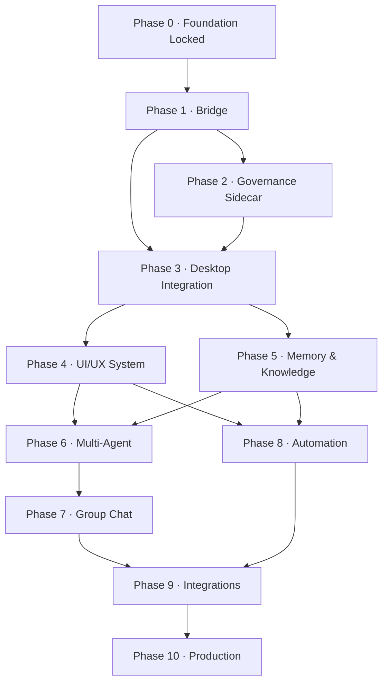

# OS Master Execution Roadmap · OS-ի գլխավոր կատարման ճանապարհ

**Status: `v1.0 · Canonical Execution Authority` — 🔒 Locked (Owner-approved 2026-07-21 · basis HEAD `2e0157b`)**
**Կարգավիճակ՝ `v1.0 · Canonical Execution Authority` — 🔒 Locked (Owner-approved 2026-07-21 · basis HEAD `2e0157b`)**

> This document is the **single execution source** for `menqstudio/OS`. When a Claude (or ChatGPT)
> session is told *"go build the next thing"*, it opens this file, finds the current phase, and takes
> the next **unchecked** task — without needing any chat context. When state changes, this file is
> updated **in the same commit** as the change.
>
> **🔒 Locked at v1.0** (Owner-approved 2026-07-21; basis HEAD `2e0157b` — the exact merged `main` HEAD
> audited GREEN before approval). **Locked ≠ frozen execution:** phases run, task boxes get checked,
> `PROJECT_STATE.md` moves — building proceeds normally. What Lock protects is the **plan**: the product
> content (architecture, trust boundaries, security model, execution order, phase scope) does not change
> without the §I Change-Control process — propose → Architect audit → Owner approve → implement. Only
> Phase 0 (Foundation) is additionally *done*-locked.
>
> ---
> **⏱️ IMPLEMENTATION STATUS (2026-07-27 — facts only, locked scope UNCHANGED; machine mirror [`config/current_state.json`](./config/current_state.json)).**
> - **Phase 0:** done. **Phase 1:** in progress. **Phases 2–10:** not done. The whole app is NOT finished; the security spine below is a subset.
> - **The self-asserted `receipt.verified: bool` contract described in the Phase-1 spine below is SUPERSEDED** by the cryptographic receipt chain delivered in **Wave 3a** (Ed25519-signed receipt the desktop verifies via RFC 8785 JCS + `verify_strict`; one-time challenge nonce bound to `request_sha256`; `receipt_verification_attempts` evidence; `receipt_ids_seen` replay ledger; tri-state `trusted_verified | development_untrusted | blocked`, migrations through **0014**). Read every "adapter sets `verified=true`" clause below as historical: the real contract is "no *verified signature* ⇒ no result," fail-closed. The boolean is not the authority.
> - **Phase-1 wired vs unwired (real state):** the governed provider path + fail-closed verify-seam + receipt-plumbing are **WIRED** (Wave 3a / T-016, PR #28 `8a580028`): every governed turn `issue_challenge → verify_and_record_receipt(&NoTrustedManifest) → Blocked`. Production **"Verified"** (`trusted_verified`) is **UNWIRED** — it awaits the Wave 3b isolated signer + signed manifest (Wave 3b-0 design merged PR #30; Wave 3b-1 in progress on PR #31/#32, not merged). Governed **delta-streaming** is **DESCOPED** as of 2026-08-09, not merely unimplemented: a governed turn is buffered *by construction*, because the desktop's authority is a signature over the whole output and there is no per-delta signature to show one against (Phase 1 §Scope carries the ruling; `governed_turn.rs` says the same thing). Do not read the §4.10(f) output pull as that streaming — it is the chunked **pull** of a *completed* output. Its supervisor hop landed 2026-08-10 in the engine; the `core/src/governed_output_stream.rs` (deleted 2026-08-10, see this cell) ladder that used to be named here was deleted in the same change (zero production callers, divergent table), and `rust_symbols` in `config/reachability-declarations.json` is now empty. The old "+ Settings governed toggle" clause is stale (the toggle was removed in Wave 1 / PR #15; provider status is read-only — and Phase 1's UI/UX section was amended on 2026-08-09 to specify the read-only three-state control instead of promising a switch).
> - **Not every AI entry point is governed yet** (Phase-2.3 work): only the main chat streaming seam runs the governed pipeline today; run-steps / Ask Bro / conversation-reply and other execution surfaces are not yet wired to the governed receipt chain. This is tracked, not done.
> ---
>
> Սա `menqstudio/OS`-ի **միակ կատարման աղբյուրն** է։ Երբ session-ին ասում են «գնա կառուցիր հաջորդը»,
> ինքը բացում է այս ֆայլը, գտնում ընթացիկ phase-ը, վերցնում հաջորդ **unchecked** task-ը՝ առանց chat
> context-ի կարիքի։ **🔒 Locked v1.0-ում** (Owner-approved 2026-07-21, basis HEAD `2e0157b`)։ **Locked ≠
> սառեցված execution** — phase-երը գնում են, box-երը նշվում են, building-ը շարունակվում ա։ Lock-ը պաշտպանում
> ա **պլանը**՝ product content-ը (architecture/trust/security/execution order/phase scope) չի փոխվում առանց
> §I change-control-ի (propose → Architect audit → Owner approve → implement)։ Միայն Phase 0-ն է *done*-locked.

---

## A. How to use this document · Ինչպես օգտագործել

1. **`git pull`**, then read the [canonical files](./CLAUDE.md) per the Startup Law (`CLAUDE.md` →
   `PROJECT_STATE.md` → `TASKS.md` → `OWNERS.md` → `docs/ARCHITECTURE.md`).
2. Open this roadmap. Find the **first phase** whose *Definition of Done* is not fully checked.
3. Inside that phase, take the **first unchecked task** in its task checklist. Confirm no one else holds
   it (`TASKS.md`), then claim it there and on the task line here.
4. Do the work on a **feature branch**, open a **PR**, satisfy the phase's *Merge gate*, and merge it
   yourself — **but only once every required check is green on the exact head that will merge**
   (amended 2026-08-14 by Owner waiver; the full rule, and why that clause is load-bearing, is §B.5).
5. When you finish a task, check its box **in the same commit**. When every box in a phase is checked and
   the *Merge gate* is green, mark the phase ✅ in the roadmap table below.

**Golden reading order for a cold-start session:** §B (rules) → §C (design system) → §D (page-spec
template) → §E (dependency map) → §G (ownership) → §H (artifact registry) → §I (change control) → your
phase. That is the whole onboarding for *building*.

### Phase status board · Phase-երի վիճակ

> **Read the board as "what exists", never as "what is guaranteed to work".** Every phase from 1
> to 10 has surfaces built and wired; the honest remaining work is mostly *connecting* things that
> were built and *removing* claims nothing established. The one status that is a hard fact rather
> than a judgement is the production gate, and it is **CLOSED** — by three refusals, not by the
> `platform_governed_execution_supported()` these documents used to name (no function of that name
> exists in the tree; it is the §0.1 spec symbol). `governed_verification_unconfigured()` returns
> `Some(...)` unconditionally before the model is invoked, `connect_broker()` refuses off Linux, and
> the broker serves `UpstreamBlockedExecutor` unless `$BROPS_BROKER_CONFIG` names a TCB-root-signed
> deployment config — which nothing in the shipped app sets.
>
> The board below was rewritten on **2026-08-08**. It previously showed phases 2–10 as *Blocked*,
> which had been false for weeks — the dependency chain it described (P3 blocked on P2, P4 on P3,
> and so on) was never how the work actually proceeded.

| Phase | Name | Status |
|---|---|---|
| 0 | Foundation | ✅ **Locked (done)** |
| 1 | Bridge | 🔨 **Wired, real mode still refuses.** Contract, adapter, broker and receipt are real; the three previously unreachable commands (`read_decision_ledger`, `read_verifier_verdicts`, `governed_turn_execute`) now have wrappers and a `bridge` route. `engine_sidecar._real_callables()` still raises unconditionally, pending the supervisor-reserved execution attempt and the authoritative execution→receipt binding — correct and fail-closed. **2026-08-09:** two long-open questions were settled in writing rather than left to disagree with the code. Governed **delta-streaming is descoped** (a governed turn is buffered by construction — the desktop's authority is a signature over the whole output); what stays open under that heading is the §4.10(f) chunked output **pull** — whose SUPERVISOR hop landed 2026-08-10 in the engine, while its DESKTOP hop does not exist; the `core/src/governed_output_stream.rs` (deleted 2026-08-10, see this cell) ladder that used to sit here uncalled was deleted in that change rather than wired, because its table diverged from the design it cited. The **Settings governed-provider row was amended to a read-only three-state control** — the provider is resolved from the backend environment and this phase's own gate is "Desktop never holds lease/key/env", so a switch the webview could flip is not buildable honestly; it now reports `default`/`on`/`blocked` and is keyboard-reachable instead of dropping out of the tab order. The phase stays **open**, and as of **2026-08-10** by one box more than this cell used to admit. The DoD row *One governed round-trip proven end-to-end* had been ticked and marked "done" and was false: the production order at `commands.rs:1338-1428` returns at `:1382`, before `ai::governed_turn` and before `verify_and_record_receipt`, so those two have zero runtime-reachable callers. The refusal is deliberate and stays — the row is open because the roadmap was describing a round-trip the gate forbids. Read the rest of this cell with that in mind: "contract, adapter, broker and receipt are real" is true about the code and says nothing about whether anything reaches it. Two DoD boxes are now unchecked, matching this cell. |
| 2 | Governance Sidecar | 🔨 **Reachable at last.** The engine serves a three-valued `brops.governance-read.v1`, the sidecar dispatches named ops, and the desktop no longer requires the AI provider to be `governed-engine` to read a mirror. The mirror was never empty — it was never asked. |
| 3 | Desktop Integration | ✅ **Done 2026-08-15 — 11/11, verified against the code first.** 23 routes on a total `Record<RouteId, …>` so a missing page is a compile error, an error boundary that renders the real cause, route-change focus, and a `cmd-dock` that is now a real ARIA dialog. Verification found two live defects: an undeclared `--s7` that silently removed the padding from two empty states, and a modal the keyboard could walk out of. `tools/check_c1_tokens.py` holds the stylesheet to §C.1 so the first cannot recur. |
| 4 | UI/UX System | ✅ **Done 2026-08-16 — 12/12, verified against the code first.** 28 library primitives with usage docs, light/dark parity on all 42 colour tokens, and the three pages this phase owns finished to §D. Four §D sweeps (keyboard · states · a11y · motion) plus a read of the phase's own pages found **six** user-facing defects, including a `command` page that rendered a governed refusal identically to a dropped connection. |
| 5 | Memory & Knowledge | ✅ **Done 2026-08-16 — 11/11, verified against the code first.** The check found `research` with **no governed run at all** — a local CRUD list in the one page of this phase that is supposed to cross the wall — and a files guard that was implemented and **never tested**, against a merge gate that says *files guard proven*. Research now runs through `stream_ask` and saves via a command that takes a one-time id and never a body; the guard has six cases with a positive control. |
| 6 | Multi-Agent | ✅ **Done 2026-08-16 — 10/10, verified against the code first.** The pages and the dispatch service existed; the gap was the phase's own stop condition, left unasserted — *no desktop-held lease*. Six contract cases now, whitelist not blacklist, and rewriting the builder to spread the assignment turns two of them red. |
| 7 | Group Chat | ✅ **Done 2026-08-16 — 8/8, verified against the code first.** The room, the governed turns, the handoff trail and a full consensus module existed; the missing §D component was the room readout. Building it forced the distinction it now tests in both directions: a count the page cannot establish reads `—`, and a measured zero reads `0`. |
| 8 | Automation | ◑ **7/9, verified against the code first (2026-08-16; the fraction was 8/10 and neither number was countable — ninth audit `I-07`).** The two open boxes are one fact the code already stated about itself: `run_automation` is a local write, not a governed dispatch, so its `engine_receipt` evidence is permanently unobserved and there are no receipt ids to show. The `calendar` had no run history at all; it has one now, and it says in one line that no engine receipt exists rather than leaving a column that would read as pending. |
| 9 | Integrations | ◑ **7/9, verified against the code first (2026-08-16; the fraction was 8/9 — ninth audit `I-07`).** Already the most honest page in the cockpit: enabled and verified are separate numbers and neither borrows the other's meaning. The one open box is inbound/outbound, which has no backing command and is rendered as `blocked` with provisioning steps rather than a control that pretends. Added the other half of the no-secret guarantee — nothing the page SENDS carries one either, on a per-command whitelist. |
| 10 | Production | ⏳ **Supply chain strong, release blocked.** Release refuses to ship unsigned. O-1…O-5 are inventoried in [`docs/PHASE_10_PRODUCTION_ITEMS.md`](./docs/PHASE_10_PRODUCTION_ITEMS.md) and **all five remain OPEN**. **None needs an Owner-minted artifact** — that column reads `no` for all five and is machine-checked by `tools/check_residual_items.py`; this cell said “three needing an Owner-minted artifact” until 2026-08-09. What blocks them is deployment wiring and a second principal. |

**What "blocked" now means here:** not a dependency on an earlier phase, but a named thing that
does not exist — an Owner artifact, an independent audit, or an approval. Each is written down
where it applies rather than inferred from a chain.

> *(A headerless copy of the SUPERSEDED phase table stood here until 2026-08-09 — the same ten rows,
> still reading “Blocked on P3 / P4+P5 / P9”, left behind by the 2026-08-08 rewrite of the board above.
> A reader scrolling past the corrected board met the old one a dozen lines later. Deleted, not
> annotated: two tables cannot both be the board.)*

---

## B. Global conventions · Ընդհանուր կանոններ

These apply to **every phase**. A phase section never repeats them; it only names deviations.

### B.1 Roles
| Who | Role | Owns |
|---|---|---|
| 👑 **Gev** (`menqstudio`) | Owner / Final Approver | Final architecture calls; owns this roadmap. **Push/merge delegated to the Builder 2026-08-14** (§B.5, Owner waiver, revocable by editing that line). |
| 📐 **ChatGPT** | Architect / Auditor | Architecture, security review, sign-off gates, coordination. |
| 🔨 **Claude** | Builder / Executor | Code, tests, commits, PRs, docs. Executes this roadmap. |

### B.2 Work rules
- **No direct work on `main`.** Every task = its own branch + PR, merged only after Owner approval.
- **Never two agents on the same task.** Claim in [`TASKS.md`](./TASKS.md) first.
- **Docs stay synced.** `CLAUDE.md` · `PROJECT_STATE.md` · `TASKS.md` · this roadmap are updated in the
  **same commit** as the change they describe. A stale brain is worse than none.
- **Do not start execution without Gev's explicit go** (`«սկսի»` / `start`). Collect context, don't act.

### B.3 Environment (Debian box) — read before running tools
- **`cargo` runs from an ordinary shell.** This bullet required PowerShell and forbade the Bash
  tool, because Git Bash's `link` shadowed MSVC's `link.exe` on the old Windows box. On this
  Debian machine `cargo test --workspace` passes 1012 tests from a normal shell. Corrected
  2026-08-29 (`T-045`) in the five canonical documents that carried it.
- **Engine tests need `BRO_ENV=ci`** (without it operator-pin gating denies and tests error).
- **The Builder pushes and merges** (§B.5, delegated 2026-08-14 by Owner waiver). This bullet said the
  permission classifier *blocks* both and that the command must be handed to Gev — it was the **fifth**
  place in this file saying that, and #88 amended the other four and missed it. The classifier allows
  both once the settings carry the rule. **Never merge before every required check is green on the exact
  head that merges**, and never mid-run: that is the clause §B.5 does not delegate.
- **Enforcement-hook wedge:** the engine ships `.claude/settings.json` hooks (`bro_hook.py`) that can
  crash on Windows with a cp1252 `UnicodeEncodeError` and fail-closed-cascade the session. If it wedges:
  set `PYTHONUTF8=1` and relaunch, or rename `settings.json`. Hooks load from the repo **root** only.
- **Commit identity:** `user.name "MenQ"`, `user.email "menqstudio@gmail.com"`. End every commit
  message with: `Co-Authored-By: Claude Opus 5 <noreply@anthropic.com>`.
- **Toolchain:** cargo 1.97.1, node 20.20.2, npm 10.8.2. *(This line said cargo 1.96 / node 24 / npm 11 — `tools/check_doc_claims.py` now compares it against the machine.)* Tauri Windows build needs
  `apps/desktop/src-tauri/icons/icon.ico` (already generated).

### B.4 Canonical verification commands
Run each from the component's directory; **verify before claiming green** (`CLAUDE.md` §7).
```bash
# Cockpit — frontend (Node)
cd apps/desktop && npm ci && npm run build        # tsc --noEmit + vite build

# Cockpit — Rust data core + app   (⚠️ PowerShell, NOT the Bash tool)
cargo test  -p brops-core --manifest-path apps/desktop/src-tauri/core/Cargo.toml   # 69 tests (grows per security slice)
cargo check --manifest-path apps/desktop/src-tauri/Cargo.toml

# Engine — Python governance runtime  (MUST set BRO_ENV=ci)
cd engine && BRO_ENV=ci python -m unittest discover -s tests   # ~615 tests, ~16 Windows platform-skips

# Bridge — Phase-1 governed adapter
cd bridge && BRO_ENV=ci python -m unittest discover -s tests    # slice-1: 10/10 (PR #3, commit 5be8d95)

# Documentation validation (run before every roadmap/docs PR)
python engine/tools/bro_docs_freshness.py        # doc inventory / freshness
python engine/tools/bro_validate.py               # SST + registry validation
```

### B.5 Push / release rule

> **AMENDED 2026-08-14 — Owner decision, recorded as an Owner waiver.** No Architect audit was
> performed, and this line says so rather than letting the amendment read as audited — the same
> form as the rev-30 `OWNER_APPROVED_NOT_ARCHITECT_AUDITED` token. This rule read *"The AI never
> pushes or merges"* until now, and it was the standing rule on the day #84, #85 and #86 merged.
> The Owner's stated reason for amending it: this roadmap is already the standing instruction, and
> a human pressing the merge button adds no information to it.

**The Builder may push, open pull requests, and merge them.** Three things do NOT move:

1. **A merge requires every required check GREEN on the EXACT head being merged.** Not "green
   earlier", not "green on the parent" — the head that merges. #84 merged with `Repo-state · live
   GitHub truth verifier` **red**; #85 and #86 merged while their runs were still in flight, so the
   head that landed was never the one the checks passed on; all three carried an
   `AUDIT_CANDIDATE_HEAD` marker that no longer named the merged head. This clause is the property
   those three violated, and delegating the button does not relax it — it moves who is answerable
   for it.
2. **The Owner stays Final Approver** and can revoke this delegation by editing this line.
3. **Nothing about the product gate changes.** The governed surfaces stay fail-closed and the
   standing independent verdict stays RED. Who may press merge and what may ship are different
   questions; this amendment answers only the first.

For every completed task the Builder runs, in this order:
```bash
git add -A && git commit -m "<message>"
git push -u origin <branch>
gh pr create --title "<t>" --body "<b>"        # body carries AUDIT_CANDIDATE_HEAD: <40-hex>
python tools/sync_active_pr.py --pr <n> --branch <branch> --summary "<s>"
git commit -am "..." && git push               # the carrier move is its own commit
gh pr edit <n> --body-file <f>                 # marker := the head that will merge
gh run watch <run-id> --exit-status            # WAIT. do not merge in flight
gh pr checks <n>                               # every check pass, none pending
gh pr merge <n> --merge                        # only now
```

---

## C. Canonical design system · Կանոնական դիզայն-համակարգ

The single visual/interaction reference is **`brops-aios.html`** (the `BrPS · MENQ OS v0.9`
cockpit prototype, ~24k lines, Armenian UI). All desktop UI work reproduces its system in real
React/TS components. **When the prototype and this roadmap disagree, the prototype wins on look &
feel; this roadmap wins on scope & sequencing.**

### C.1 Design tokens (from the prototype `:root`)
| Group | Tokens |
|---|---|
| **Brand / accent** | `--azure #0A84FF` (primary), `--azure-hover #3DA5FF`, `--cyan #38BDF8`, `--mint #34D6C6` |
| **Surfaces (dark)** | `--bg #05070C`, `--surface #0B0F18`, `--raised #111725`, `--hi #18202E`, `--line #1B2333` |
| **Ink** | `--ink #EAF0F8`, `--ink-muted #8993A8` |
| **Semantic** | `--success #37D6A0`, `--warning #E9B44C`, `--danger #F0616D`, `--info #3DA5FF` |
| **Type scale** | hero 32 · h1 24 · h2 19 · body 15 · ui 14 · small 12 · micro 10 (px) |
| **Fonts** | `Baloo 2` (display), `Inter` (UI Latin), `Noto Sans Armenian` (UI HY), `JetBrains Mono` (code/data) |
| **Radii** | sm 9 · base 12 · lg 18 · xl 26 · pill 999 (px) |
| **Spacing** | 4 · 8 · 12 · 16 · 20 · 24 · 28 · 32 · 36 · 40 (px) — `--s1..--s10` |
| **Motion** | `--fast 130ms`, `--slow 220ms`, `--spring cubic-bezier(.16,1,.3,1)`, `--enter 640ms`, `--stagger 52ms` |

Every component honors `prefers-reduced-motion` (disable drift/ember/reveal animations, keep opacity
state changes). Every color pair meets WCAG AA on `--bg`/`--surface`.

### C.2 Canonical page inventory (22 pages)
These are the exact pages the prototype ships. Each is delivered by the phase in the **Phase** column;
its full page-spec (per §D) lives in that phase's *UI/UX work* section.

| # | Key | Icon | Title (HY) | English | Phase |
|---|---|---|---|---|---|
| 1 | `home` | ⌂ | Ամփոփում | Overview / home | **3** |
| 2 | `chat` | ✦ | Զրույց Bro-ի հետ | Chat with Bro | **3** |
| 3 | `settings` | ⚙ | Կարգավորումներ | Settings | **3** |
| 4 | `approvals` | ✔ | Հաստատումներ | Approval gate | **2** |
| 5 | `decisions` | ⚖ | Որոշումներ | Decision ledger | **2** |
| 6 | `security` | ⛨ | Անվտանգություն | Security / evidence chain | **2** |
| 7 | `notifications` | ◈ | Ազդանշաններ | Notifications / signals | **2** |
| 8 | `activity` | ♥ | Զարկերակ | Live activity / vitals | **4** |
| 9 | `analytics` | ◈ | Վերլուծություն | Analytics | **4** |
| 10 | `library` | ❑ | Դարան | Component / prompt library | **4** |
| 11 | `memory` | ❖ | Հիշողություն | Memory | **5** |
| 12 | `knowledge` | ⁂ | Գիտելիք | Knowledge base | **5** |
| 13 | `research` | ⌖ | Հետազոտում | Research | **5** |
| 14 | `files` | ▤ | Ֆայլեր | Files | **5** |
| 15 | `agents` | ⬡ | Կենդանի Ցանց | Live agent network (lattice) | **6** |
| 16 | `command` | ❖ | Հրամանի Միջուկ | Command core | **6** |
| 17 | `tasks` | ◈ | Առաքելություն | Missions / tasks | **6** |
| 18 | `projects` | ❖ | Հոսքեր | Flows / projects | **6** |
| 19 | `group` | ⧉ | Համագործակցության Սրահ | Collaboration hall (group chat) | **7** |
| 20 | `automations` | ⇶ | Ավտոմատներ | Automations | **8** |
| 21 | `calendar` | ▦ | Օրացույց | Calendar | **8** |
| 22 | `integrations` | ✦ | Ինտեգրումներ | Integrations | **9** |

The **app shell** (`<aside class="side">` brand + `#nav` + `<main class="stage">`) and the global
**command dock** (`cmd-dock`, ⌘K-style) are cross-cutting; they are built in Phase 3 and extended by
later phases.

---

## D. Per-page UI/UX specification template · Էջի UI/UX ձևանմուշ

**UI/UX is a first-class deliverable in every phase (rule 3).** Every page a phase delivers MUST be
specified with all of the following before it is called done. A phase's *UI/UX work* section fills this
template per page; do not ship a page that leaves a row empty.

| Facet | What to specify |
|---|---|
| **Components** | The concrete React/TS components + which prototype block they reproduce (id/class). |
| **Layout & responsive** | Grid/rail structure; behavior at ≥1440 / 1024–1440 / <1024 (desktop-first, gracefully narrow). |
| **States** | `default`, `loading`, `empty`, `error`, `blocked` (governance-denied), plus any domain states. |
| **Loading** | Skeletons/shimmer (prototype uses `reveal`+`--stagger`); never a bare spinner where a skeleton fits. |
| **Empty** | First-run copy (Armenian) + primary CTA; distinguishes "nothing yet" from "filtered to nothing". |
| **Error** | User-legible cause + recovery action; technical detail behind a disclosure; never a dead end. |
| **Blocked** | Governance-denied state: shows the gate reason from the engine verdict; offers the lawful next step (request approval). Unique to a governed cockpit; **mandatory wherever an action crosses the wall.** |
| **Motion** | Enter/exit, state transitions, live-data pulse — using §C.1 tokens; honors `prefers-reduced-motion`. |
| **Keyboard UX** | Full keyboard path (Tab order, `Enter`/`Esc`, arrow nav in lists, `⌘K` command dock, page hotkey). |
| **Accessibility** | Roles, `aria-*`, focus-visible rings, live regions for async updates, AA contrast, HY screen-reader labels. The prototype already carries 457 aria attributes — match or exceed. |
| **Data source** | Which store/IPC feeds it (desktop SQLite vs engine ledger/evidence) and its refresh model. |

---

## E. Phase dependency graph & parallelization · Կախվածություն և զուգահեռություն


```mermaid
flowchart TD
    P0[Phase 0 · Foundation Locked] --> P1[Phase 1 · Bridge]
    P1 --> P2[Phase 2 · Governance Sidecar]
    P1 --> P3[Phase 3 · Desktop Integration]
    P2 --> P3
    P3 --> P4[Phase 4 · UI/UX System]
    P3 --> P5[Phase 5 · Memory & Knowledge]
    P4 --> P6[Phase 6 · Multi-Agent]
    P5 --> P6
    P6 --> P7[Phase 7 · Group Chat]
    P4 --> P8[Phase 8 · Automation]
    P5 --> P8
    P7 --> P9[Phase 9 · Integrations]
    P8 --> P9
    P9 --> P10[Phase 10 · Production]
```

**Critical path:** 0 → 1 → 3 → 4 → 6 → 7 → 9 → 10.

**Parallelizable once their inputs exist:**
- After **P3**: P4 (UI/UX System) and P5 (Memory & Knowledge) can run in parallel — disjoint page sets,
  disjoint stores. Assign different agents; reconcile only the shared app-shell/nav seam.
- After **P4+P5**: P6 (Multi-Agent) and P8 (Automation) are largely independent (agents/command vs
  automations/calendar). P8 depends on P4's design system + P5's knowledge store, not on P6.
- **P2 (Governance Sidecar) can begin as soon as P1's contract exists**, in parallel with early P3
  shell work, because its surfaces (`approvals`, `decisions`, `security`, `notifications`) render engine
  data that P1 already produces.

**Serialization rule:** any task that touches `engine/` security code (wall, leases, gates, signatures,
control-plane, root model) is **never parallelized and never rushed** — it takes its own audited branch,
its own PR, and Owner approval (engine golden rule, `CLAUDE.md` §6).

---

## F. Contract & artifact index · Contract-ների ինդեքս

The shared truth every phase builds against. Phase 3 begins deduping these into `contracts/`; the full
dedupe into a single source is the original roadmap's "Contracts" milestone, finalized before Phase 10.

| Artifact | Location (today) | Shape |
|---|---|---|
| **bridge.task-request** | `bridge/contracts/task-request.schema.json` | `{task_id, task_class, rationale, protected_scope[]}` — **carries no lease, no key, no env** (mirrors `bro_supervisor.TaskRequest`). |
| **bridge.result** | `bridge/contracts/bridge-result.schema.json` | `{ok, result, receipt{task_id,status,exit_code,evidence[],verified}, error}`. **Fail-closed + VERIFIED-receipt-mandatory:** `result` non-null **iff** `ok=true` **and** `receipt.verified=true`. |
| **execution receipt** | `engine/runtime/bro_receipt.py` | `{receipt_id, task_id, command, candidate_head, candidate_tree, working_directory, exit_code, tests, key_id, runner_id, runner_platform, issued/started/finished_at_epoch}` (Ed25519-signed). |
| **execution lease** | `engine/runtime/bro_execution_lease.py` | Scoped, single-use; issued by the supervisor **into the builder**, never to the conductor. |
| **evidence chain** | `engine/runtime/bro_evidence.py` | Append-only, SHA-256-chained events; the audit truth. |
| **verifier / skill receipts** | `engine/schemas/verifier-receipt.schema.json`, `skill-receipt.schema.json` | Independent verdict + skill-run evidence. |

**Verified-receipt contract (the Phase-1 spine, integrated per rule 2):** the desktop is a *conductor*.
It sends a `task-request` (no lease/key/env) to the engine sidecar; the supervisor issues a single-use
lease **into a separate builder**, runs the AI turn behind the wall, and returns a `bridge.result`. The
adapter sets `receipt.verified=true` **only** after an injected verifier confirms the run's signed
evidence, and returns a non-null `result` **only** then. **No verified receipt ⇒ no result.** This
invariant holds in every phase that executes AI work; later phases add surfaces and scope but never
weaken it.

---

## G. Execution Ownership Matrix · Կատարման պատասխանատվության մատրից

No task is ambiguous about who builds, who audits, and who must approve. **Accountable Owner is always
Gev** (👑) — he alone approves and merges. The columns below assign the rest.

**Roles:** 🔨 **Builder** = Claude (writes code/tests/docs). 📐 **Audit** = ChatGPT (Architect review /
security audit / sign-off). ✅ **Human approval** = Gev (Owner) must approve before merge; 🛑 = Owner
approval **and** an Architect security sign-off are **both** mandatory *before implementation*, not just
before merge.

### G.1 Per-phase ownership
| Phase | Builder | Audit (ChatGPT) | Human approval (Gev) | Notes |
|---|---|---|---|---|
| 0 · Foundation | 🔨 | 📐 | ✅ | Done/locked. |
| 1 · Bridge | 🔨 | 📐 (contract + no-engine-diff) | ✅ | Slice sign-off gates the build. |
| 2 · Governance Sidecar | 🔨 | 📐 (mirror-never-decide) | ✅ | Read/request only. |
| 3 · Desktop Integration | 🔨 | 📐 (fail-closed chat) | ✅ | Governed core loop. |
| 4 · UI/UX System | 🔨 | 📐 (design + a11y) | ✅ | Token-drift/contrast gate. |
| 5 · Memory & Knowledge | 🔨 | 📐 (governed research) | ✅ | Local-first. |
| 6 · Multi-Agent | 🔨 | 📐 (no lease leakage) | ✅ | Per-agent receipts. |
| 7 · Group Chat | 🔨 | 📐 (in-room governance) | ✅ | Per-turn verified. |
| 8 · Automation | 🔨 | 📐 (no ungoverned fire) | ✅ | Unattended = governed. |
| 9 · Integrations | 🔨 | 📐 (no desktop secret) | 🛑 | External boundary — security sign-off required. |
| 10 · Production | 🔨 | 📐 (full-enforcement CI) | 🛑 | Signing/updater/T-005/O-1..O-5. |

### G.2 Task-class overrides (apply in **every** phase)
These override the per-phase row whenever a task falls into the class — regardless of which phase it sits in.
| Task class | Builder | Audit | Approval | Rule |
|---|---|---|---|---|
| Any `engine/` security code (wall · leases · gates · signatures · control-plane · root model) | 🔨 (own audited branch) | 📐 **mandatory** | 🛑 **before implementation** | Never rushed, never parallelized (§E serialization rule). |
| Trust-boundary / key / secret handling | 🔨 | 📐 **mandatory** | 🛑 | Desktop never holds keys/leases/secrets. |
| Contract / schema change (`bridge/`, `contracts/`, engine schemas) | 🔨 | 📐 **mandatory** | ✅ | Versioned; consumers updated same PR. |
| Execution-order / dependency-graph change (§E) | 🔨 (proposal) | 📐 **mandatory** | 🛑 | This is a §I Change-Control event. |
| `git push` / `gh pr merge` | 🔨 | — | delegated | Builder may merge, and **only on an all-green exact head** (§B.5, Owner waiver 2026-08-14). Was "Gev only, the AI is blocked by the classifier" — which was the rule while #84 merged red. |
| Release / tag / publish | — | — | ✅ **Gev only** | Not covered by the §B.5 delegation. Shipping is a separate question from merging, and the production gate stays fail-closed regardless. |
| UI/copy/docs-only, no arch/security/order impact | 🔨 | 📐 (light) | ✅ | Normal PR flow. |

---

## H. Canonical Artifact Registry · Կանոնական աղբյուրների ռեգիստր

The single answer to *"which file is the source of truth for X?"*. If two artifacts conflict, the one
marked **Canonical** for that domain wins; a **Derived/Mirror** artifact must be regenerated, never
hand-forked; a **Superseded** artifact is kept only for provenance.

| Artifact | Domain / role | Status | Authority |
|---|---|---|---|
| `MASTER_EXECUTION_ROADMAP.md` | Execution plan (scope · sequence · per-phase spec) | **Canonical (v1.0, 🔒 Locked)** | This document |
| `CLAUDE.md` | The brain — identity · rules · environment | **Canonical** | Owner/Architect |
| `brops-aios.html` | UI / interaction reference (22 pages · design tokens) | **Canonical UI Reference** | Owner |
| `bridge/contracts/task-request.schema.json` · `bridge-result.schema.json` | Bridge request/result contract | **Canonical Contract** | Architect-approved |
| `engine/runtime/bro_receipt.py` · `bro_execution_lease.py` · `bro_evidence.py` | Security truth — receipts · leases · evidence chain | **Canonical (engine)** | Engine (audited) |
| `engine/schemas/verifier-receipt.schema.json` · `skill-receipt.schema.json` | Verifier / skill evidence schemas | **Canonical (engine)** | Engine (audited) |
| `docs/ARCHITECTURE.md` | Design + resolved decisions | **Canonical (design)** | Architect |
| `PROJECT_STATE.md` | Live status (who / where / blockers) | **Canonical (coordination, live)** | All, same-commit |
| `TASKS.md` | Claim board | **Canonical (coordination, live)** | All, same-commit |
| `OWNERS.md` | Roles | **Canonical** | Owner |
| `contracts/` (shared home) | Deduped lease/approval/task-contract/mode-grant | **Target (Phase 3 begins → Phase 10 final)** | Architect-approved |
| Design tokens table (§C.1) / `theme-tokens` (Phase 4) | Design token source | **Derived from `brops-aios.html`** | Regenerate, don't fork |
| Old 4-phase framing (Scaffold · Bridge · Approval gate · Contracts) | Prior roadmap shape | **Superseded** by this v1.0 | Provenance only |

**Rule:** a new source-of-truth artifact is added here **in the same PR** that introduces it. An artifact
not in this registry is **not** authoritative.

---

## I. Change Control · Փոփոխության վերահսկում

This roadmap is **🔒 Locked at v1.0** (Owner-approved 2026-07-21, basis HEAD `2e0157b`). It is now
**change-controlled**: the product content does not change without the process below — protecting it from
drifting mid-work, the exact failure the Architecture Freeze exists to stop (ten rounds of redesign, zero
applied lines). Editorial/status updates still flow normally (see "Not controlled" below).

**A change that touches any of these is a _controlled change_:**
1. **Architecture** (component boundaries, the subprocess/sidecar model, data ownership).
2. **Trust boundary** (who holds leases/keys/secrets; the conductor-never-holds-the-lease rule).
3. **Security** (the wall, gates, signatures, verified-receipt invariant, fail-closed behavior).
4. **Execution order** (the phase dependency graph §E, phase scope, or a phase's Merge gate).

**Process for a controlled change (before implementation):**
1. **Propose** — open a PR (or issue) describing the change and its blast radius; do **not** implement yet.
2. **Audit** — 📐 ChatGPT reviews (security + architecture); for trust/security/engine items this is 🛑 mandatory.
3. **Approve** — 👑 Gev approves the *change to the plan*.
4. **Implement** — only then edit the roadmap + code, in-scope, on a branch, normal PR flow.
5. **Record** — bump the roadmap version (v1.0 → v1.1 …) and note the change in §I.1 below.

**Not controlled (normal flow, no pre-approval):** checking task boxes, updating `PROJECT_STATE.md`/status,
fixing typos, clarifying copy, adding a page-spec detail that doesn't change scope/order/security. These
still go through a PR and Owner merge, but need no §I proposal step.

**Bypassing Change Control is itself a stop condition.** A session that finds it must edit architecture,
trust, security, or order to make progress **stops** and raises a controlled-change proposal instead.

### I.1 Version log
| Version | Date | Change | Approved by |
|---|---|---|---|
| v1.0 | 2026-07-21 | Initial canonical execution source: 11 phases × 16 sections, per-page UI specs, verified-receipt spine, ownership matrix, artifact registry, change control. | 👑 **Gev — 🔒 Locked** (basis HEAD `2e0157b`) |

---

# Phases · Phase-եր

Each phase below carries the full required section set: **Objective · Scope · Architecture · UI/UX work ·
Backend work · Contracts/schemas · Data models · Dependencies · Security gates · Tests · CI requirements ·
Documentation updates · Acceptance criteria · Merge gate · Stop conditions · Definition of Done**, plus a
**Task checklist** of `- [ ]` items a cold-start session takes in order.

---

<!-- PHASES -->

# Appendix · Հավելված

## J. Cross-document sync · Փաստաթղթերի համաժամեցում
This roadmap is the **execution** authority; `CLAUDE.md` remains the **brain** (identity, rules, env).
When they touch the same fact (phase list, current state), update **both in the same commit**. Precedence:
for *scope & sequencing* this roadmap wins; for *rules & environment* `CLAUDE.md` wins; for *look & feel*
`brops-aios.html` wins. `PROJECT_STATE.md` reflects the live "who's on what / where we are"; `TASKS.md`
is the claim board. A phase task here should have a matching `TASKS.md` row when someone claims it.

**Scope of "same commit" (precise, so the law is followed, not silently skipped):** this roadmap is the
stable **PLAN** — the phase list, objectives, and sequencing. It changes only when the *plan* changes, NOT
on every cycle. The live per-cycle **STATUS** ("who's on what / where we are / active PR / wave") lives in
`PROJECT_STATE.md` + `NEXT_CHAT.md` and is what moves each commit. The **same fact** that must stay synced
same-commit is any *status cell inside this roadmap* — the Phase status-board table (§ near the top) and
the Phase-checklist boxes — which must agree with the `PROJECT_STATE` `CURRENT_*` tokens and
`config/current_state.json`. A code/status change that does NOT alter this roadmap's plan or its status
cells does not require a roadmap edit; one that contradicts a status cell here MUST update that cell in the
same commit. (This resolves the prior drift where the Phase-1 board cell said "verify-seam still open"
while `CURRENT_VERIFY_SEAM: complete`.)

## K. Glossary · Բառարան
- **The wall / 🧱** — the engine's fail-closed enforcement hook (`bro_hook.py`) governing every tool call.
- **Lease** — a scoped, single-use Ed25519-signed execution grant, issued **into a builder**, never held
- **Verified receipt** — a signed execution receipt confirmed by an injected verifier; **no verified
- **Conductor / builder / pack** — one orchestrator; governed workers it dispatches; a task force of them.
- **Governed turn** — an AI turn run behind the wall under a lease, returning result + verified receipt.
- **`blocked` state** — the UI state when an action is denied by the wall; shows the verdict reason and the
- **Option 1 / Option 2 / T-005** — subtree+skip-guard (now) vs submodule+native worktree fix (audited,
- **O-1..O-5** — residual/deferred engine security items (bytecode-shadow, audit-head anchor, conductor

## L. Provenance · Ծագում
Built from: `brops-aios.html` (canonical UI, 22 pages + design tokens), `bridge/DESIGN.md` (APPROVED,
slice-1 verified 10/10, PR #3 commit 5be8d95), `bridge/contracts/*.schema.json`, `engine/runtime/bro_receipt.py` +
`bro_execution_lease.py` + `bro_evidence.py`, and the canonical docs (`CLAUDE.md`, `PROJECT_STATE.md`,
`TASKS.md`, `OWNERS.md`, `docs/ARCHITECTURE.md`). Language: English execution body (identifiers/commands),
bilingual headers, Armenian page names — matching the repo's bilingual convention while keeping the
execution spec precise and greppable.

---

<div align="center"><sub>menqstudio · OS · Master Execution Roadmap · governed by the wall 🧱</sub></div>
