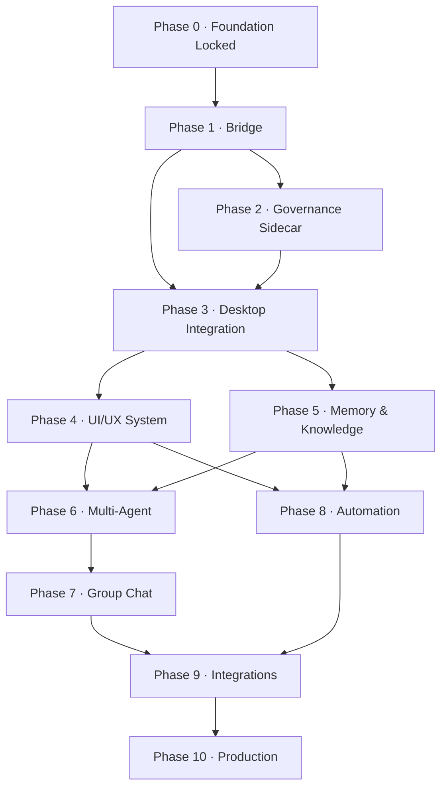

# OS Master Execution Roadmap · OS-ի գլխավոր կատարման ճանապարհ

**Status: `v1.0 · Canonical Execution Authority` — 🔒 Locked (Owner-approved 2026-07-21 · basis HEAD `2e0157b`)**
**Կարգավիճակ՝ `v1.0 · Canonical Execution Authority` — 🔒 Locked (Owner-approved 2026-07-21 · basis HEAD `2e0157b`)**

> This document is the **single execution source** for `menqstudio/OS`. When a Claude (or ChatGPT)
> session is told *"go build the next thing"*, it opens this file, finds the current phase, and takes
> the next **unchecked** task — without needing any chat context. When state changes, this file is
> updated **in the same commit** as the change.
>
> **🔒 Locked at v1.0** (Owner-approved 2026-07-21; basis HEAD `2e0157b` — the exact merged `main` HEAD
> audited GREEN before approval). **Locked ≠ frozen execution:** phases run, task boxes get checked,
> `PROJECT_STATE.md` moves — building proceeds normally. What Lock protects is the **plan**: the product
> content (architecture, trust boundaries, security model, execution order, phase scope) does not change
> without the §I Change-Control process — propose → Architect audit → Owner approve → implement. Only
> Phase 0 (Foundation) is additionally *done*-locked.
>
> ---
> **⏱️ IMPLEMENTATION STATUS (2026-07-27 — facts only, locked scope UNCHANGED; machine mirror [`config/current_state.json`](./config/current_state.json)).**
> - **Phase 0:** done. **Phase 1:** in progress. **Phases 2–10:** not done. The whole app is NOT finished; the security spine below is a subset.
> - **The self-asserted `receipt.verified: bool` contract described in the Phase-1 spine below is SUPERSEDED** by the cryptographic receipt chain delivered in **Wave 3a** (Ed25519-signed receipt the desktop verifies via RFC 8785 JCS + `verify_strict`; one-time challenge nonce bound to `request_sha256`; `receipt_verification_attempts` evidence; `receipt_ids_seen` replay ledger; tri-state `trusted_verified | development_untrusted | blocked`, migrations through **0014**). Read every "adapter sets `verified=true`" clause below as historical: the real contract is "no *verified signature* ⇒ no result," fail-closed. The boolean is not the authority.
> - **Phase-1 wired vs unwired (real state):** the governed provider path + fail-closed verify-seam + receipt-plumbing are **WIRED** (Wave 3a / T-016, PR #28 `8a580028`): every governed turn `issue_challenge → verify_and_record_receipt(&NoTrustedManifest) → Blocked`. Production **"Verified"** (`trusted_verified`) is **UNWIRED** — it awaits the Wave 3b isolated signer + signed manifest (Wave 3b-0 design merged PR #30; Wave 3b-1 in progress on PR #31/#32, not merged). Governed **delta-streaming** is **DESCOPED** as of 2026-08-09, not merely unimplemented: a governed turn is buffered *by construction*, because the desktop's authority is a signature over the whole output and there is no per-delta signature to show one against (Phase 1 §Scope carries the ruling; `governed_turn.rs` says the same thing). Do not read the §4.10(f) output pull as that streaming — it is the chunked **pull** of a *completed* output. Its supervisor hop landed 2026-08-10 in the engine; the `core/src/governed_output_stream.rs` (deleted 2026-08-10, see this cell) ladder that used to be named here was deleted in the same change (zero production callers, divergent table), and `rust_symbols` in `config/reachability-declarations.json` is now empty. The old "+ Settings governed toggle" clause is stale (the toggle was removed in Wave 1 / PR #15; provider status is read-only — and Phase 1's UI/UX section was amended on 2026-08-09 to specify the read-only three-state control instead of promising a switch).
> - **Not every AI entry point is governed yet** (Phase-2.3 work): only the main chat streaming seam runs the governed pipeline today; run-steps / Ask Bro / conversation-reply and other execution surfaces are not yet wired to the governed receipt chain. This is tracked, not done.
> ---
>
> Սա `menqstudio/OS`-ի **միակ կատարման աղբյուրն** է։ Երբ session-ին ասում են «գնա կառուցիր հաջորդը»,
> ինքը բացում է այս ֆայլը, գտնում ընթացիկ phase-ը, վերցնում հաջորդ **unchecked** task-ը՝ առանց chat
> context-ի կարիքի։ **🔒 Locked v1.0-ում** (Owner-approved 2026-07-21, basis HEAD `2e0157b`)։ **Locked ≠
> սառեցված execution** — phase-երը գնում են, box-երը նշվում են, building-ը շարունակվում ա։ Lock-ը պաշտպանում
> ա **պլանը**՝ product content-ը (architecture/trust/security/execution order/phase scope) չի փոխվում առանց
> §I change-control-ի (propose → Architect audit → Owner approve → implement)։ Միայն Phase 0-ն է *done*-locked.

---

## A. How to use this document · Ինչպես օգտագործել

1. **`git pull`**, then read the [canonical files](./CLAUDE.md) per the Startup Law (`CLAUDE.md` →
   `PROJECT_STATE.md` → `TASKS.md` → `OWNERS.md` → `docs/ARCHITECTURE.md`).
2. Open this roadmap. Find the **first phase** whose *Definition of Done* is not fully checked.
3. Inside that phase, take the **first unchecked task** in its task checklist. Confirm no one else holds
   it (`TASKS.md`), then claim it there and on the task line here.
4. Do the work on a **feature branch**, open a **PR**, satisfy the phase's *Merge gate*, and merge it
   yourself — **but only once every required check is green on the exact head that will merge**
   (amended 2026-08-14 by Owner waiver; the full rule, and why that clause is load-bearing, is §B.5).
5. When you finish a task, check its box **in the same commit**. When every box in a phase is checked and
   the *Merge gate* is green, mark the phase ✅ in the roadmap table below.

**Golden reading order for a cold-start session:** §B (rules) → §C (design system) → §D (page-spec
template) → §E (dependency map) → §G (ownership) → §H (artifact registry) → §I (change control) → your
phase. That is the whole onboarding for *building*.

### Phase status board · Phase-երի վիճակ

> **Read the board as "what exists", never as "what is guaranteed to work".** Every phase from 1
> to 10 has surfaces built and wired; the honest remaining work is mostly *connecting* things that
> were built and *removing* claims nothing established. The one status that is a hard fact rather
> than a judgement is the production gate, and it is **CLOSED** — by three refusals, not by the
> `platform_governed_execution_supported()` these documents used to name (no function of that name
> exists in the tree; it is the §0.1 spec symbol). `governed_verification_unconfigured()` returns
> `Some(...)` unconditionally before the model is invoked, `connect_broker()` refuses off Linux, and
> the broker serves `UpstreamBlockedExecutor` unless `$BROPS_BROKER_CONFIG` names a TCB-root-signed
> deployment config — which nothing in the shipped app sets.
>
> The board below was rewritten on **2026-08-08**. It previously showed phases 2–10 as *Blocked*,
> which had been false for weeks — the dependency chain it described (P3 blocked on P2, P4 on P3,
> and so on) was never how the work actually proceeded.

| Phase | Name | Status |
|---|---|---|
| 0 | Foundation | ✅ **Locked (done)** |
| 1 | Bridge | 🔨 **Wired, real mode still refuses.** Contract, adapter, broker and receipt are real; the three previously unreachable commands (`read_decision_ledger`, `read_verifier_verdicts`, `governed_turn_execute`) now have wrappers and a `bridge` route. `engine_sidecar._real_callables()` still raises unconditionally, pending the supervisor-reserved execution attempt and the authoritative execution→receipt binding — correct and fail-closed. **2026-08-09:** two long-open questions were settled in writing rather than left to disagree with the code. Governed **delta-streaming is descoped** (a governed turn is buffered by construction — the desktop's authority is a signature over the whole output); what stays open under that heading is the §4.10(f) chunked output **pull** — whose SUPERVISOR hop landed 2026-08-10 in the engine, while its DESKTOP hop does not exist; the `core/src/governed_output_stream.rs` (deleted 2026-08-10, see this cell) ladder that used to sit here uncalled was deleted in that change rather than wired, because its table diverged from the design it cited. The **Settings governed-provider row was amended to a read-only three-state control** — the provider is resolved from the backend environment and this phase's own gate is "Desktop never holds lease/key/env", so a switch the webview could flip is not buildable honestly; it now reports `default`/`on`/`blocked` and is keyboard-reachable instead of dropping out of the tab order. The phase stays **open**, and as of **2026-08-10** by one box more than this cell used to admit. The DoD row *One governed round-trip proven end-to-end* had been ticked and marked "done" and was false: the production order at `commands.rs:1338-1428` returns at `:1382`, before `ai::governed_turn` and before `verify_and_record_receipt`, so those two have zero runtime-reachable callers. The refusal is deliberate and stays — the row is open because the roadmap was describing a round-trip the gate forbids. Read the rest of this cell with that in mind: "contract, adapter, broker and receipt are real" is true about the code and says nothing about whether anything reaches it. Two DoD boxes are now unchecked, matching this cell. |
| 2 | Governance Sidecar | 🔨 **Reachable at last.** The engine serves a three-valued `brops.governance-read.v1`, the sidecar dispatches named ops, and the desktop no longer requires the AI provider to be `governed-engine` to read a mirror. The mirror was never empty — it was never asked. |
| 3 | Desktop Integration | ✅ **Done 2026-08-15 — 11/11, verified against the code first.** 23 routes on a total `Record<RouteId, …>` so a missing page is a compile error, an error boundary that renders the real cause, route-change focus, and a `cmd-dock` that is now a real ARIA dialog. Verification found two live defects: an undeclared `--s7` that silently removed the padding from two empty states, and a modal the keyboard could walk out of. `tools/check_c1_tokens.py` holds the stylesheet to §C.1 so the first cannot recur. |
| 4 | UI/UX System | ✅ **Done 2026-08-16 — 12/12, verified against the code first.** 28 library primitives with usage docs, light/dark parity on all 42 colour tokens, and the three pages this phase owns finished to §D. Four §D sweeps (keyboard · states · a11y · motion) plus a read of the phase's own pages found **six** user-facing defects, including a `command` page that rendered a governed refusal identically to a dropped connection. |
| 5 | Memory & Knowledge | ✅ **Done 2026-08-16 — 11/11, verified against the code first.** The check found `research` with **no governed run at all** — a local CRUD list in the one page of this phase that is supposed to cross the wall — and a files guard that was implemented and **never tested**, against a merge gate that says *files guard proven*. Research now runs through `stream_ask` and saves via a command that takes a one-time id and never a body; the guard has six cases with a positive control. |
| 6 | Multi-Agent | ✅ **Done 2026-08-16 — 10/10, verified against the code first.** The pages and the dispatch service existed; the gap was the phase's own stop condition, left unasserted — *no desktop-held lease*. Six contract cases now, whitelist not blacklist, and rewriting the builder to spread the assignment turns two of them red. |
| 7 | Group Chat | ✅ **Done 2026-08-16 — 8/8, verified against the code first.** The room, the governed turns, the handoff trail and a full consensus module existed; the missing §D component was the room readout. Building it forced the distinction it now tests in both directions: a count the page cannot establish reads `—`, and a measured zero reads `0`. |
| 8 | Automation | ◑ **7/9, verified against the code first (2026-08-16; the fraction was 8/10 and neither number was countable — ninth audit `I-07`).** The two open boxes are one fact the code already stated about itself: `run_automation` is a local write, not a governed dispatch, so its `engine_receipt` evidence is permanently unobserved and there are no receipt ids to show. The `calendar` had no run history at all; it has one now, and it says in one line that no engine receipt exists rather than leaving a column that would read as pending. |
| 9 | Integrations | ◑ **7/9, verified against the code first (2026-08-16; the fraction was 8/9 — ninth audit `I-07`).** Already the most honest page in the cockpit: enabled and verified are separate numbers and neither borrows the other's meaning. The one open box is inbound/outbound, which has no backing command and is rendered as `blocked` with provisioning steps rather than a control that pretends. Added the other half of the no-secret guarantee — nothing the page SENDS carries one either, on a per-command whitelist. |
| 10 | Production | ⏳ **Supply chain strong, release blocked.** Release refuses to ship unsigned. O-1…O-5 are inventoried in [`docs/PHASE_10_PRODUCTION_ITEMS.md`](./docs/PHASE_10_PRODUCTION_ITEMS.md) and **all five remain OPEN**. **None needs an Owner-minted artifact** — that column reads `no` for all five and is machine-checked by `tools/check_residual_items.py`; this cell said “three needing an Owner-minted artifact” until 2026-08-09. What blocks them is deployment wiring and a second principal. |

**What "blocked" now means here:** not a dependency on an earlier phase, but a named thing that
does not exist — an Owner artifact, an independent audit, or an approval. Each is written down
where it applies rather than inferred from a chain.

> *(A headerless copy of the SUPERSEDED phase table stood here until 2026-08-09 — the same ten rows,
> still reading “Blocked on P3 / P4+P5 / P9”, left behind by the 2026-08-08 rewrite of the board above.
> A reader scrolling past the corrected board met the old one a dozen lines later. Deleted, not
> annotated: two tables cannot both be the board.)*

---

## B. Global conventions · Ընդհանուր կանոններ

These apply to **every phase**. A phase section never repeats them; it only names deviations.

### B.1 Roles
| Who | Role | Owns |
|---|---|---|
| 👑 **Gev** (`menqstudio`) | Owner / Final Approver | Final architecture calls; owns this roadmap. **Push/merge delegated to the Builder 2026-08-14** (§B.5, Owner waiver, revocable by editing that line). |
| 📐 **ChatGPT** | Architect / Auditor | Architecture, security review, sign-off gates, coordination. |
| 🔨 **Claude** | Builder / Executor | Code, tests, commits, PRs, docs. Executes this roadmap. |

### B.2 Work rules
- **No direct work on `main`.** Every task = its own branch + PR, merged only after Owner approval.
- **Never two agents on the same task.** Claim in [`TASKS.md`](./TASKS.md) first.
- **Docs stay synced.** `CLAUDE.md` · `PROJECT_STATE.md` · `TASKS.md` · this roadmap are updated in the
  **same commit** as the change they describe. A stale brain is worse than none.
- **Do not start execution without Gev's explicit go** (`«սկսի»` / `start`). Collect context, don't act.

### B.3 Environment (Debian box) — read before running tools
- **`cargo` runs from an ordinary shell.** This bullet required PowerShell and forbade the Bash
  tool, because Git Bash's `link` shadowed MSVC's `link.exe` on the old Windows box. On this
  Debian machine `cargo test --workspace` passes 1012 tests from a normal shell. Corrected
  2026-08-29 (`T-045`) in the five canonical documents that carried it.
- **Engine tests need `BRO_ENV=ci`** (without it operator-pin gating denies and tests error).
- **The Builder pushes and merges** (§B.5, delegated 2026-08-14 by Owner waiver). This bullet said the
  permission classifier *blocks* both and that the command must be handed to Gev — it was the **fifth**
  place in this file saying that, and #88 amended the other four and missed it. The classifier allows
  both once the settings carry the rule. **Never merge before every required check is green on the exact
  head that merges**, and never mid-run: that is the clause §B.5 does not delegate.
- **Enforcement-hook wedge:** the engine ships `.claude/settings.json` hooks (`bro_hook.py`) that can
  crash on Windows with a cp1252 `UnicodeEncodeError` and fail-closed-cascade the session. If it wedges:
  set `PYTHONUTF8=1` and relaunch, or rename `settings.json`. Hooks load from the repo **root** only.
- **Commit identity:** `user.name "MenQ"`, `user.email "menqstudio@gmail.com"`. End every commit
  message with: `Co-Authored-By: Claude Opus 5 <noreply@anthropic.com>`.
- **Toolchain:** cargo 1.97.1, node 20.20.2, npm 10.8.2. *(This line said cargo 1.96 / node 24 / npm 11 — `tools/check_doc_claims.py` now compares it against the machine.)* Tauri Windows build needs
  `apps/desktop/src-tauri/icons/icon.ico` (already generated).

### B.4 Canonical verification commands
Run each from the component's directory; **verify before claiming green** (`CLAUDE.md` §7).
```bash
# Cockpit — frontend (Node)
cd apps/desktop && npm ci && npm run build        # tsc --noEmit + vite build

# Cockpit — Rust data core + app   (⚠️ PowerShell, NOT the Bash tool)
cargo test  -p brops-core --manifest-path apps/desktop/src-tauri/core/Cargo.toml   # 69 tests (grows per security slice)
cargo check --manifest-path apps/desktop/src-tauri/Cargo.toml

# Engine — Python governance runtime  (MUST set BRO_ENV=ci)
cd engine && BRO_ENV=ci python -m unittest discover -s tests   # ~615 tests, ~16 Windows platform-skips

# Bridge — Phase-1 governed adapter
cd bridge && BRO_ENV=ci python -m unittest discover -s tests    # slice-1: 10/10 (PR #3, commit 5be8d95)

# Documentation validation (run before every roadmap/docs PR)
python engine/tools/bro_docs_freshness.py        # doc inventory / freshness
python engine/tools/bro_validate.py               # SST + registry validation
```

### B.5 Push / release rule

> **AMENDED 2026-08-14 — Owner decision, recorded as an Owner waiver.** No Architect audit was
> performed, and this line says so rather than letting the amendment read as audited — the same
> form as the rev-30 `OWNER_APPROVED_NOT_ARCHITECT_AUDITED` token. This rule read *"The AI never
> pushes or merges"* until now, and it was the standing rule on the day #84, #85 and #86 merged.
> The Owner's stated reason for amending it: this roadmap is already the standing instruction, and
> a human pressing the merge button adds no information to it.

**The Builder may push, open pull requests, and merge them.** Three things do NOT move:

1. **A merge requires every required check GREEN on the EXACT head being merged.** Not "green
   earlier", not "green on the parent" — the head that merges. #84 merged with `Repo-state · live
   GitHub truth verifier` **red**; #85 and #86 merged while their runs were still in flight, so the
   head that landed was never the one the checks passed on; all three carried an
   `AUDIT_CANDIDATE_HEAD` marker that no longer named the merged head. This clause is the property
   those three violated, and delegating the button does not relax it — it moves who is answerable
   for it.
2. **The Owner stays Final Approver** and can revoke this delegation by editing this line.
3. **Nothing about the product gate changes.** The governed surfaces stay fail-closed and the
   standing independent verdict stays RED. Who may press merge and what may ship are different
   questions; this amendment answers only the first.

For every completed task the Builder runs, in this order:
```bash
git add -A && git commit -m "<message>"
git push -u origin <branch>
gh pr create --title "<t>" --body "<b>"        # body carries AUDIT_CANDIDATE_HEAD: <40-hex>
python tools/sync_active_pr.py --pr <n> --branch <branch> --summary "<s>"
git commit -am "..." && git push               # the carrier move is its own commit
gh pr edit <n> --body-file <f>                 # marker := the head that will merge
gh run watch <run-id> --exit-status            # WAIT. do not merge in flight
gh pr checks <n>                               # every check pass, none pending
gh pr merge <n> --merge                        # only now
```

---

## C. Canonical design system · Կանոնական դիզայն-համակարգ

The single visual/interaction reference is **`brops-aios.html`** (the `BrPS · MENQ OS v0.9`
cockpit prototype, ~24k lines, Armenian UI). All desktop UI work reproduces its system in real
React/TS components. **When the prototype and this roadmap disagree, the prototype wins on look &
feel; this roadmap wins on scope & sequencing.**

### C.1 Design tokens (from the prototype `:root`)
| Group | Tokens |
|---|---|
| **Brand / accent** | `--azure #0A84FF` (primary), `--azure-hover #3DA5FF`, `--cyan #38BDF8`, `--mint #34D6C6` |
| **Surfaces (dark)** | `--bg #05070C`, `--surface #0B0F18`, `--raised #111725`, `--hi #18202E`, `--line #1B2333` |
| **Ink** | `--ink #EAF0F8`, `--ink-muted #8993A8` |
| **Semantic** | `--success #37D6A0`, `--warning #E9B44C`, `--danger #F0616D`, `--info #3DA5FF` |
| **Type scale** | hero 32 · h1 24 · h2 19 · body 15 · ui 14 · small 12 · micro 10 (px) |
| **Fonts** | `Baloo 2` (display), `Inter` (UI Latin), `Noto Sans Armenian` (UI HY), `JetBrains Mono` (code/data) |
| **Radii** | sm 9 · base 12 · lg 18 · xl 26 · pill 999 (px) |
| **Spacing** | 4 · 8 · 12 · 16 · 20 · 24 · 28 · 32 · 36 · 40 (px) — `--s1..--s10` |
| **Motion** | `--fast 130ms`, `--slow 220ms`, `--spring cubic-bezier(.16,1,.3,1)`, `--enter 640ms`, `--stagger 52ms` |

Every component honors `prefers-reduced-motion` (disable drift/ember/reveal animations, keep opacity
state changes). Every color pair meets WCAG AA on `--bg`/`--surface`.

### C.2 Canonical page inventory (22 pages)
These are the exact pages the prototype ships. Each is delivered by the phase in the **Phase** column;
its full page-spec (per §D) lives in that phase's *UI/UX work* section.

| # | Key | Icon | Title (HY) | English | Phase |
|---|---|---|---|---|---|
| 1 | `home` | ⌂ | Ամփոփում | Overview / home | **3** |
| 2 | `chat` | ✦ | Զրույց Bro-ի հետ | Chat with Bro | **3** |
| 3 | `settings` | ⚙ | Կարգավորումներ | Settings | **3** |
| 4 | `approvals` | ✔ | Հաստատումներ | Approval gate | **2** |
| 5 | `decisions` | ⚖ | Որոշումներ | Decision ledger | **2** |
| 6 | `security` | ⛨ | Անվտանգություն | Security / evidence chain | **2** |
| 7 | `notifications` | ◈ | Ազդանշաններ | Notifications / signals | **2** |
| 8 | `activity` | ♥ | Զարկերակ | Live activity / vitals | **4** |
| 9 | `analytics` | ◈ | Վերլուծություն | Analytics | **4** |
| 10 | `library` | ❑ | Դարան | Component / prompt library | **4** |
| 11 | `memory` | ❖ | Հիշողություն | Memory | **5** |
| 12 | `knowledge` | ⁂ | Գիտելիք | Knowledge base | **5** |
| 13 | `research` | ⌖ | Հետազոտում | Research | **5** |
| 14 | `files` | ▤ | Ֆայլեր | Files | **5** |
| 15 | `agents` | ⬡ | Կենդանի Ցանց | Live agent network (lattice) | **6** |
| 16 | `command` | ❖ | Հրամանի Միջուկ | Command core | **6** |
| 17 | `tasks` | ◈ | Առաքելություն | Missions / tasks | **6** |
| 18 | `projects` | ❖ | Հոսքեր | Flows / projects | **6** |
| 19 | `group` | ⧉ | Համագործակցության Սրահ | Collaboration hall (group chat) | **7** |
| 20 | `automations` | ⇶ | Ավտոմատներ | Automations | **8** |
| 21 | `calendar` | ▦ | Օրացույց | Calendar | **8** |
| 22 | `integrations` | ✦ | Ինտեգրումներ | Integrations | **9** |

The **app shell** (`<aside class="side">` brand + `#nav` + `<main class="stage">`) and the global
**command dock** (`cmd-dock`, ⌘K-style) are cross-cutting; they are built in Phase 3 and extended by
later phases.

---

## D. Per-page UI/UX specification template · Էջի UI/UX ձևանմուշ

**UI/UX is a first-class deliverable in every phase (rule 3).** Every page a phase delivers MUST be
specified with all of the following before it is called done. A phase's *UI/UX work* section fills this
template per page; do not ship a page that leaves a row empty.

| Facet | What to specify |
|---|---|
| **Components** | The concrete React/TS components + which prototype block they reproduce (id/class). |
| **Layout & responsive** | Grid/rail structure; behavior at ≥1440 / 1024–1440 / <1024 (desktop-first, gracefully narrow). |
| **States** | `default`, `loading`, `empty`, `error`, `blocked` (governance-denied), plus any domain states. |
| **Loading** | Skeletons/shimmer (prototype uses `reveal`+`--stagger`); never a bare spinner where a skeleton fits. |
| **Empty** | First-run copy (Armenian) + primary CTA; distinguishes "nothing yet" from "filtered to nothing". |
| **Error** | User-legible cause + recovery action; technical detail behind a disclosure; never a dead end. |
| **Blocked** | Governance-denied state: shows the gate reason from the engine verdict; offers the lawful next step (request approval). Unique to a governed cockpit; **mandatory wherever an action crosses the wall.** |
| **Motion** | Enter/exit, state transitions, live-data pulse — using §C.1 tokens; honors `prefers-reduced-motion`. |
| **Keyboard UX** | Full keyboard path (Tab order, `Enter`/`Esc`, arrow nav in lists, `⌘K` command dock, page hotkey). |
| **Accessibility** | Roles, `aria-*`, focus-visible rings, live regions for async updates, AA contrast, HY screen-reader labels. The prototype already carries 457 aria attributes — match or exceed. |
| **Data source** | Which store/IPC feeds it (desktop SQLite vs engine ledger/evidence) and its refresh model. |

---

## E. Phase dependency graph & parallelization · Կախվածություն և զուգահեռություն


```mermaid
flowchart TD
    P0[Phase 0 · Foundation Locked] --> P1[Phase 1 · Bridge]
    P1 --> P2[Phase 2 · Governance Sidecar]
    P1 --> P3[Phase 3 · Desktop Integration]
    P2 --> P3
    P3 --> P4[Phase 4 · UI/UX System]
    P3 --> P5[Phase 5 · Memory & Knowledge]
    P4 --> P6[Phase 6 · Multi-Agent]
    P5 --> P6
    P6 --> P7[Phase 7 · Group Chat]
    P4 --> P8[Phase 8 · Automation]
    P5 --> P8
    P7 --> P9[Phase 9 · Integrations]
    P8 --> P9
    P9 --> P10[Phase 10 · Production]
```

**Critical path:** 0 → 1 → 3 → 4 → 6 → 7 → 9 → 10.

**Parallelizable once their inputs exist:**
- After **P3**: P4 (UI/UX System) and P5 (Memory & Knowledge) can run in parallel — disjoint page sets,
  disjoint stores. Assign different agents; reconcile only the shared app-shell/nav seam.
- After **P4+P5**: P6 (Multi-Agent) and P8 (Automation) are largely independent (agents/command vs
  automations/calendar). P8 depends on P4's design system + P5's knowledge store, not on P6.
- **P2 (Governance Sidecar) can begin as soon as P1's contract exists**, in parallel with early P3
  shell work, because its surfaces (`approvals`, `decisions`, `security`, `notifications`) render engine
  data that P1 already produces.

**Serialization rule:** any task that touches `engine/` security code (wall, leases, gates, signatures,
control-plane, root model) is **never parallelized and never rushed** — it takes its own audited branch,
its own PR, and Owner approval (engine golden rule, `CLAUDE.md` §6).

---

## F. Contract & artifact index · Contract-ների ինդեքս

The shared truth every phase builds against. Phase 3 begins deduping these into `contracts/`; the full
dedupe into a single source is the original roadmap's "Contracts" milestone, finalized before Phase 10.

| Artifact | Location (today) | Shape |
|---|---|---|
| **bridge.task-request** | `bridge/contracts/task-request.schema.json` | `{task_id, task_class, rationale, protected_scope[]}` — **carries no lease, no key, no env** (mirrors `bro_supervisor.TaskRequest`). |
| **bridge.result** | `bridge/contracts/bridge-result.schema.json` | `{ok, result, receipt{task_id,status,exit_code,evidence[],verified}, error}`. **Fail-closed + VERIFIED-receipt-mandatory:** `result` non-null **iff** `ok=true` **and** `receipt.verified=true`. |
| **execution receipt** | `engine/runtime/bro_receipt.py` | `{receipt_id, task_id, command, candidate_head, candidate_tree, working_directory, exit_code, tests, key_id, runner_id, runner_platform, issued/started/finished_at_epoch}` (Ed25519-signed). |
| **execution lease** | `engine/runtime/bro_execution_lease.py` | Scoped, single-use; issued by the supervisor **into the builder**, never to the conductor. |
| **evidence chain** | `engine/runtime/bro_evidence.py` | Append-only, SHA-256-chained events; the audit truth. |
| **verifier / skill receipts** | `engine/schemas/verifier-receipt.schema.json`, `skill-receipt.schema.json` | Independent verdict + skill-run evidence. |

**Verified-receipt contract (the Phase-1 spine, integrated per rule 2):** the desktop is a *conductor*.
It sends a `task-request` (no lease/key/env) to the engine sidecar; the supervisor issues a single-use
lease **into a separate builder**, runs the AI turn behind the wall, and returns a `bridge.result`. The
adapter sets `receipt.verified=true` **only** after an injected verifier confirms the run's signed
evidence, and returns a non-null `result` **only** then. **No verified receipt ⇒ no result.** This
invariant holds in every phase that executes AI work; later phases add surfaces and scope but never
weaken it.

---

## G. Execution Ownership Matrix · Կատարման պատասխանատվության մատրից

No task is ambiguous about who builds, who audits, and who must approve. **Accountable Owner is always
Gev** (👑) — he alone approves and merges. The columns below assign the rest.

**Roles:** 🔨 **Builder** = Claude (writes code/tests/docs). 📐 **Audit** = ChatGPT (Architect review /
security audit / sign-off). ✅ **Human approval** = Gev (Owner) must approve before merge; 🛑 = Owner
approval **and** an Architect security sign-off are **both** mandatory *before implementation*, not just
before merge.

### G.1 Per-phase ownership
| Phase | Builder | Audit (ChatGPT) | Human approval (Gev) | Notes |
|---|---|---|---|---|
| 0 · Foundation | 🔨 | 📐 | ✅ | Done/locked. |
| 1 · Bridge | 🔨 | 📐 (contract + no-engine-diff) | ✅ | Slice sign-off gates the build. |
| 2 · Governance Sidecar | 🔨 | 📐 (mirror-never-decide) | ✅ | Read/request only. |
| 3 · Desktop Integration | 🔨 | 📐 (fail-closed chat) | ✅ | Governed core loop. |
| 4 · UI/UX System | 🔨 | 📐 (design + a11y) | ✅ | Token-drift/contrast gate. |
| 5 · Memory & Knowledge | 🔨 | 📐 (governed research) | ✅ | Local-first. |
| 6 · Multi-Agent | 🔨 | 📐 (no lease leakage) | ✅ | Per-agent receipts. |
| 7 · Group Chat | 🔨 | 📐 (in-room governance) | ✅ | Per-turn verified. |
| 8 · Automation | 🔨 | 📐 (no ungoverned fire) | ✅ | Unattended = governed. |
| 9 · Integrations | 🔨 | 📐 (no desktop secret) | 🛑 | External boundary — security sign-off required. |
| 10 · Production | 🔨 | 📐 (full-enforcement CI) | 🛑 | Signing/updater/T-005/O-1..O-5. |

### G.2 Task-class overrides (apply in **every** phase)
These override the per-phase row whenever a task falls into the class — regardless of which phase it sits in.
| Task class | Builder | Audit | Approval | Rule |
|---|---|---|---|---|
| Any `engine/` security code (wall · leases · gates · signatures · control-plane · root model) | 🔨 (own audited branch) | 📐 **mandatory** | 🛑 **before implementation** | Never rushed, never parallelized (§E serialization rule). |
| Trust-boundary / key / secret handling | 🔨 | 📐 **mandatory** | 🛑 | Desktop never holds keys/leases/secrets. |
| Contract / schema change (`bridge/`, `contracts/`, engine schemas) | 🔨 | 📐 **mandatory** | ✅ | Versioned; consumers updated same PR. |
| Execution-order / dependency-graph change (§E) | 🔨 (proposal) | 📐 **mandatory** | 🛑 | This is a §I Change-Control event. |
| `git push` / `gh pr merge` | 🔨 | — | delegated | Builder may merge, and **only on an all-green exact head** (§B.5, Owner waiver 2026-08-14). Was "Gev only, the AI is blocked by the classifier" — which was the rule while #84 merged red. |
| Release / tag / publish | — | — | ✅ **Gev only** | Not covered by the §B.5 delegation. Shipping is a separate question from merging, and the production gate stays fail-closed regardless. |
| UI/copy/docs-only, no arch/security/order impact | 🔨 | 📐 (light) | ✅ | Normal PR flow. |

---

## H. Canonical Artifact Registry · Կանոնական աղբյուրների ռեգիստր

The single answer to *"which file is the source of truth for X?"*. If two artifacts conflict, the one
marked **Canonical** for that domain wins; a **Derived/Mirror** artifact must be regenerated, never
hand-forked; a **Superseded** artifact is kept only for provenance.

| Artifact | Domain / role | Status | Authority |
|---|---|---|---|
| `MASTER_EXECUTION_ROADMAP.md` | Execution plan (scope · sequence · per-phase spec) | **Canonical (v1.0, 🔒 Locked)** | This document |
| `CLAUDE.md` | The brain — identity · rules · environment | **Canonical** | Owner/Architect |
| `brops-aios.html` | UI / interaction reference (22 pages · design tokens) | **Canonical UI Reference** | Owner |
| `bridge/contracts/task-request.schema.json` · `bridge-result.schema.json` | Bridge request/result contract | **Canonical Contract** | Architect-approved |
| `engine/runtime/bro_receipt.py` · `bro_execution_lease.py` · `bro_evidence.py` | Security truth — receipts · leases · evidence chain | **Canonical (engine)** | Engine (audited) |
| `engine/schemas/verifier-receipt.schema.json` · `skill-receipt.schema.json` | Verifier / skill evidence schemas | **Canonical (engine)** | Engine (audited) |
| `docs/ARCHITECTURE.md` | Design + resolved decisions | **Canonical (design)** | Architect |
| `PROJECT_STATE.md` | Live status (who / where / blockers) | **Canonical (coordination, live)** | All, same-commit |
| `TASKS.md` | Claim board | **Canonical (coordination, live)** | All, same-commit |
| `OWNERS.md` | Roles | **Canonical** | Owner |
| `contracts/` (shared home) | Deduped lease/approval/task-contract/mode-grant | **Target (Phase 3 begins → Phase 10 final)** | Architect-approved |
| Design tokens table (§C.1) / `theme-tokens` (Phase 4) | Design token source | **Derived from `brops-aios.html`** | Regenerate, don't fork |
| Old 4-phase framing (Scaffold · Bridge · Approval gate · Contracts) | Prior roadmap shape | **Superseded** by this v1.0 | Provenance only |

**Rule:** a new source-of-truth artifact is added here **in the same PR** that introduces it. An artifact
not in this registry is **not** authoritative.

---

## I. Change Control · Փոփոխության վերահսկում

This roadmap is **🔒 Locked at v1.0** (Owner-approved 2026-07-21, basis HEAD `2e0157b`). It is now
**change-controlled**: the product content does not change without the process below — protecting it from
drifting mid-work, the exact failure the Architecture Freeze exists to stop (ten rounds of redesign, zero
applied lines). Editorial/status updates still flow normally (see "Not controlled" below).

**A change that touches any of these is a _controlled change_:**
1. **Architecture** (component boundaries, the subprocess/sidecar model, data ownership).
2. **Trust boundary** (who holds leases/keys/secrets; the conductor-never-holds-the-lease rule).
3. **Security** (the wall, gates, signatures, verified-receipt invariant, fail-closed behavior).
4. **Execution order** (the phase dependency graph §E, phase scope, or a phase's Merge gate).

**Process for a controlled change (before implementation):**
1. **Propose** — open a PR (or issue) describing the change and its blast radius; do **not** implement yet.
2. **Audit** — 📐 ChatGPT reviews (security + architecture); for trust/security/engine items this is 🛑 mandatory.
3. **Approve** — 👑 Gev approves the *change to the plan*.
4. **Implement** — only then edit the roadmap + code, in-scope, on a branch, normal PR flow.
5. **Record** — bump the roadmap version (v1.0 → v1.1 …) and note the change in §I.1 below.

**Not controlled (normal flow, no pre-approval):** checking task boxes, updating `PROJECT_STATE.md`/status,
fixing typos, clarifying copy, adding a page-spec detail that doesn't change scope/order/security. These
still go through a PR and Owner merge, but need no §I proposal step.

**Bypassing Change Control is itself a stop condition.** A session that finds it must edit architecture,
trust, security, or order to make progress **stops** and raises a controlled-change proposal instead.

### I.1 Version log
| Version | Date | Change | Approved by |
|---|---|---|---|
| v1.0 | 2026-07-21 | Initial canonical execution source: 11 phases × 16 sections, per-page UI specs, verified-receipt spine, ownership matrix, artifact registry, change control. | 👑 **Gev — 🔒 Locked** (basis HEAD `2e0157b`) |

---

# Phases · Phase-եր

Each phase below carries the full required section set: **Objective · Scope · Architecture · UI/UX work ·
Backend work · Contracts/schemas · Data models · Dependencies · Security gates · Tests · CI requirements ·
Documentation updates · Acceptance criteria · Merge gate · Stop conditions · Definition of Done**, plus a
**Task checklist** of `- [ ]` items a cold-start session takes in order.

---

## Phase 0 — Foundation · Հիմք  ✅ Locked

**Objective.** Assemble the two audited halves into one monorepo with preserved history, unified CI, and
bilingual canonical docs, so all later phases build on one stable base. *(Done; frozen.)*

**Scope.** In: `git subtree` vendoring of `engine/` (Bro) and `apps/desktop/` (BroPS), unified
`.github/workflows` CI (3 legs), bilingual `README`/`CLAUDE`/`ARCHITECTURE`, coordination canon
(`OWNERS`/`PROJECT_STATE`/`TASKS`/Startup Law). Out: any wiring between the halves (that is Phase 1+).

**Architecture.** Two independent toolchains (Python engine, Rust+TS cockpit) coexisting; the git
top-level is `OS/`, each half a subdirectory. The engine's security perimeter still assumes `ROOT` is a
worktree root — resolved for now by **Option 1 (subtree + C)**: the 9 monorepo-coupled enforcement-path
tests (`FullExecutionTransactionE2ETests`, `HookSubprocessTests`) skip-guard themselves when `engine/`
is not a git checkout root. No runtime/security code touched. A native fix (submodule + `git rev-parse
--show-toplevel` in `bro_repository_state.worktrees()`) is deferred to **T-005**, a separate audited task.

**UI/UX work.** None new. Establishes that `brops-aios.html` is the canonical visual reference (§C) and
that the cockpit's existing shell in `apps/desktop/` is the starting point. Deliverable: the design-token
extraction table (§C.1) and the 22-page inventory (§C.2) — done in this roadmap.

**Backend work.** None new; both halves build independently (§B.4). Provenance recorded: `engine/` from
Bro `main`; `apps/desktop/` from BroPS `main` (PR #25).

**Contracts / schemas.** None new. The engine's existing contracts (lease, receipt, evidence, mode-grant)
are inventoried in §F as the shared truth later phases consume.

**Data models.** None new. Desktop SQLite (product/UI state) and engine ledger+evidence (security truth)
remain separate; IDs will cross the bridge in Phase 1 — no shared table.

**Dependencies.** None (this is the root).

**Security gates.** Both halves arrived audited & fixed (Engine: 1 Critical + 6 High + 9 Med + 13 Low, all
fixed; Cockpit: 1 High + 8 Med + 18 Low, all fixed). Residual/deferred engine items **O-1..O-5** are
tracked on Bro's `fix/audit-followups` and are **not** in scope here (wall/owner-env coupled).

**Tests.** Engine `BRO_ENV=ci python -m unittest discover -s tests` → green (1282 tests, 43 skipped, 0
failed, option-C skip-guard). Cockpit `cargo test -p brops-core` 29/29; `npm run build` green.

**CI requirements.** One workflow, three legs: cockpit-frontend (npm build) · cockpit-core (cargo test) ·
engine (python unittest). Triggers on push→`main` and on `pull_request`.

**Documentation updates.** `README`, `CLAUDE.md`, `docs/ARCHITECTURE.md`, coordination canon — all
bilingual and current at merge.

**Acceptance criteria.** Monorepo assembled with both histories intact; all three CI legs green; canonical
docs present and bilingual; the root-model decision recorded with its verified finding.

**Merge gate.** ✅ Met (merged).

**Stop conditions.** Any attempt to change engine security code inside a Phase-0/coordination merge →
stop, split into an audited task (this is the exact failure Option 1 avoids).

**Definition of Done.**
- [x] Both halves vendored via `git subtree`, history preserved.
- [x] Unified CI, three legs green.
- [x] Bilingual canonical docs (`README`/`CLAUDE`/`ARCHITECTURE`) + coordination canon.
- [x] Root-model decision recorded (Option 1 now; T-005 deferred).

**Task checklist.** *(Phase complete — retained for provenance.)*
- [x] Vendor `engine/` and `apps/desktop/` with history.
- [x] Author unified CI workflow (3 legs).
- [x] Land coordination canon + Startup Law.
- [x] Record root-model decision + verified submodule finding.

---

## Phase 1 — Bridge · Կամուրջ  🔨 In progress

**Objective.** Route the desktop's AI execution through the engine's supervisor/lease/wall so every AI
turn the cockpit triggers is governed and returns a **verified** signed receipt — replacing the direct,
ungoverned `claude` spawn in `apps/desktop/src-tauri/src/ai.rs`.

**Scope.** In: the `bridge/` adapter, the request/result contracts, an **opt-in** governed provider
(default OFF), and a proven one-turn round-trip. Out (later slices): removing the direct `claude` path,
multi-turn runs. **No engine/security code is touched** — the entrypoint is `bridge/engine_adapter.py`
with no engine-core change (Architect-approved).

**Out — DESCOPED 2026-08-09: governed delta-streaming ("slice 3").** Not deferred; **descoped by
construction**, and the decision is now stated in one place rather than contradicted in three. The
desktop's sole authority over a governed reply is the isolated signer's envelope, which binds
`output_bytes` + `output_sha256` over the **whole** output; there is no per-delta signature and no
contract that could produce one. A streamed delta would therefore be unverified content rendered
*before any verdict exists* — the exact inverse of this phase's rule, "no verified signature ⇒ no
result". The transport says the same thing structurally: the renderer→broker channel is one framed
request and one framed reply (`governed_turn.rs`, `broker/src/main.rs`), and both call a governed turn
**buffered by design**. What remains genuinely open is a *different* thing that was being mistaken for
this one: the rev-30 §4.10(f) chunked **output pull**, which moves the COMPLETED output of a buffered
turn when it is too large to ride the reply frame, checked against that same whole-output digest.
**Its SUPERVISOR hop landed 2026-08-10** in the engine: `brops.governed-turn-output-read.v1` served to
the sidecar principal (`engine/runtime/governed_output_read.py`), the durable `governed_output_streams`
table in the canonical `supervisor_ledger.sql`, and a mint with a real production caller in the §5
`complete-run` op. The `core/src/governed_output_stream.rs` (deleted 2026-08-10, see this cell) ladder that used to be described here — a
one-shot token, TTL tombstone, sweep, per-install cap and nine unit tests, with **zero production
callers** and a table that diverged from the design it cited — was DELETED in that change rather than
wired, because wiring it was a rewrite and because its `CREATE TABLE IF NOT EXISTS` ran on the same
connection one line before `supervisor_ledger::create_schema`. What is STILL open is the DESKTOP hop:
`bridge.governed-turn-output-read.v1` and the internal helper that would drive the loop and apply the
§4.6/§7.1 whole-output digest. The `rust_symbols` section of `config/reachability-declarations.json` is
now empty, and the gate turns RED if a declaration outlives the file it describes.

**Architecture.** Subprocess/sidecar boundary (Rust → `python bro_supervisor`), per the resolved
decision. Trust root = an **operator-provisioned local supervisor sidecar** + localhost authenticated
IPC; the desktop holds **no lease, no key, no issuer**. Flow: `Webview → Tauri ai.rs → bridge adapter →
engine supervisor (authorize → issue lease into a separate builder → 🧱 wall → sandboxed turn) → result +
signed receipt + evidence → adapter verifies → Tauri returns result (+ receipt id)`.

**UI/UX work.** Minimal but real (UI is first-class even here):
- **Governed-provider status control** (Settings). **AMENDED 2026-08-09 — it reports; it does not set.**
- **Receipt indicator on the chat turn**: a small verified-receipt badge on each governed AI message
- Empty/first-run: if no governed turn has run, the badge area shows a one-line HY hint "Governed mode off".

**Backend work.** `bridge/engine_adapter.py` (spawn supervisor for one AI turn, parse outcome, run the
injected verifier, set `verified`) — **done on PR #3** (10/10). Rust (**slice 2, NOT yet implemented**):
add `Provider::GovernedEngine` in `ai.rs` behind the env flag; existing `claude-cli`/`anthropic`/`ollama`
paths stay **byte-for-byte unchanged**. Slice 1 is non-streaming (result at end).

**Contracts / schemas.** `bridge/contracts/task-request.schema.json` and `bridge/contracts/bridge-result.schema.json`
(see §F). `task-request` carries **no lease/key/env**; `bridge-result` is fail-closed + **VERIFIED-receipt-
mandatory** (`result` non-null iff `ok && receipt.verified`).

**Data models.** No shared DB table. The desktop stores the **receipt id** and `verified` flag alongside
the conversation turn (product state); the receipt/evidence themselves live in the engine ledger. IDs
cross the bridge; nothing else.

**Dependencies.** Phase 0. Requires an operator-provisioned supervisor sidecar + issuer key registry +
workspace binding **outside** the desktop (owner/architect provisioning — the crux question, answered:
local sidecar).

**Security gates.** Desktop never holds lease/key/env. Provider default OFF. Fail-closed: any missing
sidecar/lease/receipt → no result. `verified` set **only** after the injected verifier confirms signed
evidence. No engine security code modified (else → audited task).

**Tests.** `bridge/tests/test_engine_adapter.py` — slice 1 **10/10 green** (PR #3, commit `5be8d95`, a `menqstudio/BroPS` id from before the subtree import — it does not resolve in this repository). Cover: request shape rejects
lease/key/env; result fail-closed when `ok=false`; `result` null unless `verified`; verifier-negative →
no result. Existing engine + cockpit suites stay green.

**CI requirements.** Add a **bridge leg** (`cd bridge && BRO_ENV=ci python -m unittest discover -s tests`)
to the workflow; keep it green. A documented manual smoke is acceptable for the full round-trip if
key/lease provisioning is heavy (record the evidence).

**Documentation updates.** `bridge/DESIGN.md` (APPROVED), `bridge/README.md`, this roadmap's Phase-1
status, `PROJECT_STATE.md`. Update the F-index if a contract field changes.

**Acceptance criteria.** One governed AI round-trip proven end-to-end (or documented manual smoke);
`bridge.result` always fail-closed and verified-receipt-mandatory; default path unchanged; all suites +
bridge leg green.

**Merge gate.** Architect sign-off on the adapter + contracts (given for slice 1); bridge tests green;
no engine/security diff; Owner approval.

**Stop conditions.** If the round-trip needs a new engine entrypoint or any supervisor change → **stop**,
flag it as a separate audited engine task; do not edit engine code inside this PR. If key/trust-root
provisioning is unresolved → stop and escalate to Owner/Architect (do not hardcode keys).

> **Nine ticks, six facts — read this before counting.** The Definition of Done and the Task checklist
> restate the same work: the adapter + its 10 tests, the `bridge` CI job, and the badge + provider control
> each appear twice. A reader scanning nine `[x]` boxes saw roughly 50% more delivered than exists.
> Reduced honestly, of the six distinct facts: **two are true and reached** (the `task-request` contract is
> validated at runtime; the `bridge` CI job exists and passes), **two are true but dead** (the adapter and
> the governed-provider transport are built and tested and nothing can invoke them), **one is true but
> hollow** (the UI ships and a user reaches it, but it can only paint a Windows-only demonstration badge),
> and **one was false** (the end-to-end governed round-trip — see its row). Checked against the code on
> 2026-08-10, not against the commit messages the boxes cite.

**Definition of Done.**
- [x] `task-request` + `bridge-result` contracts defined and tested — **but only `task-request` is
- [x] Adapter (`engine_adapter.py`) built; slice-1 tests **10/10** (PR #3, commit `5be8d95`) — re-run
- [x] Opt-in `Provider::GovernedEngine` in desktop `ai.rs` (default OFF) — **transport shipped** (PR #8,
- [ ] One governed round-trip proven end-to-end. **Still open, and an independent auditor has now
- [ ] Governed output delivery through the wall. **Delta-streaming is DESCOPED** (see Scope — a governed
- [x] Bridge CI leg added and green (PR #3, merged to `main`) — job `bridge` at `ci.yml:574-586`, no
- [x] Chat receipt badge + governed-provider status control shipped in the cockpit UI — **shipped and

**Task checklist.**
- [x] T-003 slice 1 — contract + adapter + tests (verified **10/10**, PR #3, commit `5be8d95`). *Same
- [x] Slice 2 — prove one governed round-trip (adapter ↔ real supervisor), record evidence — **done
- [x] Bridge CI leg added to the unified workflow (PR #3, merged `41cf4ff`) — job `bridge`, one of
- [x] Slice 2 — ship the chat verified-receipt badge + Settings governed-provider control (per UI/UX
- [x] Slice 3 — the §4.10(f) chunked output pull — **done 2026-08-12, on a real Linux runner.**
- [ ] Update `PROJECT_STATE.md` + this roadmap when each slice lands. **Standing — never permanently

---

## Phase 2 — Governance Sidecar · Կառավարման Sidecar

**Objective.** Give the cockpit read-only, faithful **surfaces** onto the engine's governance truth —
approvals, decisions, the evidence chain, and gate notifications — so the owner can see and act on every
governed decision. The engine remains authoritative; the desktop only mirrors and requests.

**Scope.** In: the four governance pages (`approvals`, `decisions`, `security`, `notifications`), the
read IPC that streams engine ledger/evidence/verdicts, and the **approve/deny request** path (the desktop
*requests*; the engine *decides*). Out: any desktop-side decision authority; any change to the engine's
gate logic.

**Architecture.** A read/notify channel from the engine sidecar to the desktop: the engine emits
governance events (pending approval, verdict issued, evidence appended); the desktop renders them and can
POST an owner approval **request** that the engine's Ed25519 approval system adjudicates. Mirrors, never
decides (ARCHITECTURE principle 2).

**UI/UX work.** Full page-specs (per §D) for four pages:

- **`approvals` ✔ Հաստատումներ (Approval gate).** Components: approval queue (`apQueue`), decision pill
- **`decisions` ⚖ Որոշումներ (Decision ledger).** Components: chamber view (`chamber`), append-only ledger
- **`security` ⛨ Անվտանգություն (Evidence chain / posture).** Components: chain integrity view, control-plane
- **`notifications` ◈ Ազդանշաններ (Signals).** Components: signal feed, filter chips, per-signal action.

**Backend work.** Rust IPC commands to read the engine ledger/evidence/queue and to POST an approval
request; a thin desktop mirror store for display and dedupe. **No gate logic in the desktop.**

**Contracts / schemas.** Consume `verifier-receipt` + `execution receipt` + evidence events (§F). Add a
small `approval-request` shape (desktop→engine) if one does not already exist in the engine schemas —
if it requires an engine schema change, that is an **audited engine task**, flagged, not done here.

**Data models.** Desktop mirror tables: `governance_signal`, `approval_mirror`, `decision_mirror` (all
display caches keyed by engine ids; the engine ledger stays authoritative; caches are rebuildable).

**Dependencies.** Phase 1 (the bridge produces receipts/evidence the surfaces render). Can start as soon
as the Phase-1 contract exists, in parallel with early Phase-3 shell work (§E).

**Security gates.** All four pages are **read + request only**. The desktop cannot mint, alter, or
approve on its own; owner approval is adjudicated by the engine's Ed25519 system. A chain-integrity break
renders the `blocked` state and disables dependent actions.

**Tests.** Rust IPC read/parse tests; a contract test that a desktop approval-request never carries a
key/lease; a UI test that `blocked`/`error` states render on engine-unreachable and chain-break; verdict
rendering matches the engine verdict byte-for-byte.

**CI requirements.** Cockpit legs stay green with the new IPC + pages; add UI state tests to the frontend
leg. No new engine leg unless an engine schema was (audited) added.

**Documentation updates.** `docs/ARCHITECTURE.md` (governance surfaces section), this phase's page-specs,
`PROJECT_STATE.md`.

**Acceptance criteria.** The four pages render live engine governance data faithfully; owner can *request*
an approval that the engine adjudicates; every page implements all §D states incl. `blocked`; no desktop
decision authority exists.

**Merge gate.** Architect confirms "mirror, never decide" holds; state coverage complete; contracts
unchanged (or engine change separately audited); Owner approval.

**Stop conditions.** Any temptation to let the desktop decide/approve locally, or to cache a key/lease →
stop. Any needed engine gate change → separate audited task.

> **⚖ Phase 2 was CHECKED AGAINST THE CODE before anything was built (T-019, 2026-08-15).** The
> exemption in `config/roadmap-order-exemptions.json` unlocked this phase while all four pages
> already existed, so the first act was verification, not construction. Every box below carries its
> evidence — file, line, test name — and a box whose surface exists but whose obligation is unmet
> **stays unticked and says which obligation**. Six of eleven were ticked; **eight are now**, after
> the Owner delegated both remaining decisions on 2026-08-15 and fact 2 turned out to be a build task
> after all. The three still open are one fact, tracked as `T-021`. Both facts as they stood:
>
> 1. **The approval-REQUEST path does not exist, on either side** (boxes 2 · 7 · 11). There is no
>    `approval-request` schema in `engine/schemas/` (21 schemas; none is one) and no desktop→engine
>    command. The `approvals` page's grant/deny/escalate drive the **desktop's own** approval system
>    (T-010/T-011 over local SQLite, behind a native confirmation the webview cannot forge) — a real
>    authority, correctly gated, but the desktop's, not a request across the wall. This phase's own
>    **Contracts** row pre-authorised that outcome: an `approval-request` needing an engine schema
>    change is *"an audited engine task, flagged, not done here"*. It is flagged, in
>    `governance.rs`'s module docs, here, and — since 2026-08-15 — on the one page that says what is
>    blocked and on whom: [`docs/OWNER_ACTION_REQUIRED.md` §2a(ii)](docs/OWNER_ACTION_REQUIRED.md).
>    Being flagged in the roadmap is not the same as being *routed*: a decision recorded only beside
>    the box it blocks is a decision the Owner has to go looking for.
>
>    **DECIDED 2026-08-15 (Owner delegated): opened as `T-021`, and still not built here.** Neither
>    "build it now" nor "carry it" was right. Building it now would add a new desktop→engine input to
>    a trust boundary whose standing audit verdict is **RED**, and would break this phase's own scope
>    line. Carrying it as a roadmap note is how an obligation disappears — Phase 2's **acceptance
>    criteria** promise *"owner can request an approval that the engine adjudicates"*, and a phase
>    must not close over a promise it kept only in prose. So the task exists, with its contract
>    invariants **fixed now** while the reasoning is fresh — no key, no lease, no nonce, no verdict
>    crosses; the desktop requests and never decides; the desktop's own T-010/T-011 authority stays a
>    separate thing — and it is sequenced explicitly **behind the standing audit**. Boxes 2 · 7 · 11
>    stay unticked, because the capability does not exist, and now they name what will build it.
> 2. ~~**`security`'s §D `sigbreathe` integrity pulse is deliberately NOT applied**~~ — **DECIDED
>    AND BUILT, 2026-08-15 (boxes 1 · 9 now ticked).** The Owner delegated the decision; it was taken
>    by reading the page rather than the argument about it, and **the argument turned out to be
>    wrong in its own favour**. The reasoning on record was sound — a breathing instrument would
>    paint liveness onto a chain nothing has confirmed — but `Security.tsx` was **already breathing**:
>    `.mc-halo` carried an unconditional `secHalo 2.6s infinite`, so the instrument pulsed hardest in
>    `blocked`, the exact state the comment two hundred lines above forbade it in. *An honesty
>    argument written in a comment is not an honesty property of the page.*
>
>    "Never animate" and "animate always" were also not the only options. §D's pulse is now
>    **bound to state**: `checking` is a chain read genuinely in flight, so motion there depicts
>    something that is happening; `broken` takes the faster danger cadence §D asks for; `blocked` is
>    **still**, which it was not before. The pulse says *"this surface is reading the chain right
>    now"* — a fact the desktop can establish — never *"the chain is alive"*, which it cannot:
>    `RECORDS_ARE_AUTHENTICATED` is permanently `false`. A pulse gated on a **confirmed** chain would
>    have been a branch that can never run — the shape this repository deletes rather than ships —
>    which is why the obvious "make it conditional on verified" reading was rejected.
>
>    Three mutants, all killed: applied unconditionally (2 tests red), never applied (1), bound to
>    `blocked` instead of `checking` (2). Reduced motion still stills all of it.
>
> One §D gap WAS closed rather than reported: §D binds `g` to grant and no `g` handler existed, so a
> keyboard owner could deny and escalate by keystroke and not grant. `g` now stages the same confirm
> dialog `d`/`e` stage — §D's own *"all actions confirm before committing"* — instead of committing
> on one keypress, which would have made the deliberate press-and-hold bypassable by the binding
> meant to complete it (`Approvals.tsx`; two tests, both mutation-verified).
>
> **One stale claim was corrected on the way.** `governance.rs` opened with *"the Phase-2 engine read
> endpoints do not answer yet"*. They answer: `bro_control_room_api.GOVERNANCE_SURFACES:47` names all
> four and `governance_read:568` dispatches them. What is still true is narrower — a shipped install
> reaches `Blocked` because nothing sets `BROPS_GOVERNANCE_STATE_DIR`. The steady state is unchanged;
> the reason for it is a deployment input, not a missing endpoint.

**Definition of Done.**
- [x] `approvals`, `decisions`, `security`, `notifications` pages built to full §D spec. — all four exist and are real, every §D state, keyboard map and a11y role verified against the source. The one thing this box was held open for — `security`'s `sigbreathe` pulse — is **built and bound to state** (2026-08-15, Owner-delegated decision; see fact 2 above): `Security.tsx` adds the `sigbreathe` class in `checking` only, the halo's cadence is per-state, and `blocked` is now still where it used to breathe. Three mutants killed (`Security.test.tsx`); reduced motion stills all of it. **The change that closed this box also broke it, for one day.** The `animation` shorthand replaced `.reveal`'s entrance, so the instrument rendered at `opacity:0` for the whole of `checking` — the fifth audit measured it in a real browser (`A-01`) and nothing here could, because vitest runs with `css: false`. Fixed 2026-08-16 by composing the animation list, and `tools/check_c1_tokens.py::animation_clobber` now refuses the shape statically: putting the shorthand back turns the gate RED.
- [ ] Read IPC streams engine ledger/evidence/verdicts; approval-**request** path works. — **the read half is complete and wired end to end**: four commands (`governance.rs:611/619/626/634`), registered (`lib.rs:227-230`), served by the engine (`bro_control_room_api.py:47`, `:568`, `:616-621`), relayed verbatim (`engine_sidecar.py:477`, `:808`), consumed by the renderer (`desktop.ts:344-355`). **The approval-request half does not exist** — no engine schema, no command. **Tracked as `T-021`** (opened 2026-08-15 by Owner-delegated decision), sequenced behind the standing audit, with its contract invariants fixed in the task row. Stays unticked: a capability that does not exist does not tick, and naming its owner is not the same as having it.
- [x] `blocked` + `error` states proven against engine-unreachable and chain-break. — unreachable: `governance.rs::unreachable_transport_maps_to_unreachable`, plus `Notifications.chain.test.tsx:76`, `Security.test.tsx:40`, `Approvals.test.tsx:41`. Chain-break, both doors: the engine reporting one (`ok_false_reply_maps_to_blocked`) and a malformed link arriving in the records (`a_broken_chain_link_blocks_the_whole_read_rather_than_showing_part_of_it`, with a positive control and mutant `P1` killed). **The limit is written inside the box:** the desktop does not WALK the chain — it checks `previous_event_hash` is null-or-64-hex and no more. Fork detection is the supervisor's on both platforms; re-deriving a head from records the desktop cannot authenticate would be a check that cannot fail.
- [x] No desktop-side decision authority; no cached keys/leases. — structural, and now **checked** rather than asserted: `no_governance_command_can_take_a_key_a_lease_or_the_database` reads this module's own source and requires every `#[tauri::command]` to take nothing but an optional `task_id` filter (mutant `P2` — a command growing a `key_id` parameter — killed). The request carries `read_only: true` and no key/lease/nonce/verdict (`governance.rs:586-595`); `RECORDS_ARE_AUTHENTICATED` is `false` and the engine's own `record_authentication` claim is pinned as unable to flip it. CI-enforced at `tools/check_capabilities.py:53-60`, which names all four with written reasons; gate GREEN.
- [x] Docs + `PROJECT_STATE.md` synced. — `docs/ARCHITECTURE.md` gained the **governance surfaces** section this phase's Documentation row names and that had never been written; `PROJECT_STATE.md` / `NEXT_CHAT.md` / `TASKS.md` / `config/current_state.json` updated in the same commit per the Continuous-Documentation Law.

**Task checklist.**
- [x] Build the governance read IPC (ledger/evidence/queue) in Rust; parse tests. — `apps/desktop/src-tauri/src/governance.rs`, four commands + a fail-closed three-valued `GovernanceRead`, validated against `verifier-receipt.schema.json` and `evidence-event.schema.json`. **29 tests, measured** (`cargo test -p brops --lib governance::` → 29 passed).
- [ ] `approvals` page (queue + grant/deny/escalate **request**) per §D. — the page is built and its actions are real, but they are the **desktop's** approval commands, not an engine request. Unticked for fact 1 above, not for a missing surface; the request half is `T-021`.
- [x] `decisions` page (ledger + evidence viewer, read-only) per §D. — `Decisions.tsx`: `chamber` (`:464`), `ledger` `role=log` + `aria-readonly` (`:229-245`), `chEvidence` (`:500`), arrow/Home/End navigation and `Enter`-opens-evidence (`:193-203`), `aria-live` announcer (`:557`). `chReweigh` is present and **disabled by design** (`:508`) — reweighing is the engine's. Evidence renders the real `ok`/`blocked`/`unreachable` read and fabricates nothing (`Decisions.evidence.test.tsx`, `Decisions.governance.test.tsx`).
- [x] `security` page (chain integrity + control-plane digest + residual tracker) per §D. — all four sections are built (integrity instrument, posture strip, control-plane digest honestly blocked, residual tracker O-1..O-5, key/lease registry blocked by design) with `[`/`]` sectioned tab order and a live region that escalates to `assertive` on a break. §D's `sigbreathe` motion is applied and **bound to state** (fact 2 above) — and closing it removed an existing dishonesty rather than adding a feature: the halo animated unconditionally, so the instrument breathed hardest in `blocked`.
- [x] `notifications` page (signal feed) per §D. — `Notifications.tsx`: `role=feed` (`:269`), per-signal `role=article` (`:287`), `aria-live=polite` (`:256`), filter chips (`:247`), `↑/↓` · `Enter` · `x` (`:123-136`). The read-path chain node is earned, never assumed — `Notifications.chain.test.tsx` covers unreachable / blocked / empty-ok / unauthenticated-records / the engine's attributed reason, six tests.
- [ ] Contract test: approval-request carries no key/lease; verdicts render faithfully. — the second half holds (`parse_verifier_receipt` enforces `verdict == GREEN`, the id and 64-hex patterns and a non-empty evidence list; `Bridge.test.tsx` drives the real command). The **first half is structurally unwritable today**: there is no approval-request, and a test asserting that a nonexistent request carries no key is a check that cannot fail — the shape this repository deletes rather than ships. It becomes writable with `T-021`, and the invariant it must pin is already written in that task row so the test is not designed by whoever is trying to pass it.

---

## Phase 3 — Desktop Integration · Desktop-ի ինտեգրում

**Objective.** Stand up the real cockpit shell wired to the governed engine: the app frame (side nav +
stage + command dock), the `home` overview, governed `chat`, and `settings` — so the owner opens one app
whose core loop (talk to Bro → governed turn → verified result) works end-to-end.

**Scope.** In: the app shell (`.app`/`.side`/`#nav`/`.stage`), the global command dock (`cmd-dock`,
⌘K), routing across the 22-page registry, and three core pages (`home`, `chat`, `settings`) fully wired.
Out: the domain pages owned by later phases (they get placeholder routes now).

**Architecture.** React/TS webview in Tauri; Rust backend owns IPC + the bridge call from Phase 1. The
shell is the cross-cutting chrome every later page mounts into; the command dock routes to any page and
issues governed actions through the bridge. Begins the `contracts/` dedupe (shared shapes referenced,
not yet moved).

**UI/UX work.** Full §D specs for the shell + three pages:
- **App shell.** Components: brand (`.brand` `Br·PS` live mark), `#nav` (22-entry icon+label rail), `.stage`
- **`home` ⌂ Ամփոփում (Overview).** Components: summary tiles (system pulse, pending approvals count,
- **`chat` ✦ Զրույց Bro-ի հետ (governed).** Components: thread (`thread`), composer (`composer`/`compInput`),
- **`settings` ⚙ Կարգավորումներ.** Components: sections (provider, appearance/theme, governance sidecar

**Backend work.** Rust: route registry + IPC wiring; the governed chat command calling the Phase-1
adapter; settings persistence; theme. Frontend: the shell, router, three pages, design-token stylesheet
(reproducing §C.1). Placeholder routes for phases 2/4–9 pages.

**Contracts / schemas.** Reuse Phase-1 `bridge.*`. Begin `contracts/` dedupe: reference (do not yet
relocate) `execution-lease`/`approval`/`task-contract`/`mode-grant`; record the migration plan for the
final dedupe milestone.

**Data models.** Desktop SQLite: `conversation`, `message` (with `receipt_id`, `verified`), `setting`,
`route_state`. Product/UI state only; security truth stays in the engine.

**Dependencies.** Phase 1 (governed chat) + Phase 2 (governance surfaces reachable from the shell).

**Security gates.** Governed chat uses the fail-closed, verified-receipt-mandatory path (no verified
receipt ⇒ no message body). Settings can enable the governed provider but never holds keys/leases. The
shell exposes the Phase-2 `blocked` states wherever an action crosses the wall.

**Tests.** Frontend: shell routing, `⌘K` dock, three pages' state coverage (incl. `blocked`). Rust:
governed chat command returns fail-closed on missing receipt; settings persist/restore. Cockpit suites +
Phase-1 bridge tests stay green.

**CI requirements.** Frontend leg runs the new UI tests; `npm run build` (tsc + vite) green; `cargo
check` on the app crate green. Keep all Phase-0/1 legs green.

**Documentation updates.** `docs/ARCHITECTURE.md` (shell + governed chat loop), `README` screenshot/flow
if visuals change, this phase's specs, `PROJECT_STATE.md`, and the `contracts/` dedupe plan note.

**Acceptance criteria.** Owner opens the app → navigates the 22-page rail → talks to Bro → gets a
**verified** governed reply (or a legible fail-closed `blocked` state) → sees settings/theme persist.
All shell + three-page §D states implemented. Build green.

**Merge gate.** Governed chat proven fail-closed + verified; shell a11y (keyboard + aria) reviewed;
Architect confirms no security regression; Owner approval.

**Stop conditions.** If governed chat cannot produce a verified receipt in the desktop deployment →
stop, resolve trust-root provisioning with Owner (do not fall back to ungoverned by default). If shell
work pressures an engine change → audited task.

> **⚖ Phase 3 was CHECKED AGAINST THE CODE before anything was built (2026-08-15),** the same way
> Phase 2 was, and under the committed exemption in `config/roadmap-order-exemptions.json` — Phase 1
> and Phase 2 are both held by the Owner's production gate, so 3 is the first phase with buildable
> work. The shell, the router, all 23 routes and the three core pages **already existed**. So the
> first act was verification, and it earned its keep: **two live defects nothing could see.**
>
> 1. **`--s7` and `--s9` were never declared**, on a ladder documented as `--s1..--s10`, while
>    `padding:var(--s7) var(--s5)` shipped on the Agents and Automations empty states. An undeclared
>    custom property makes the whole declaration invalid at computed-value time, so **those panels
>    rendered with no padding at all.** §C.1 listed eight values for a ten-name range, which is why
>    the gap read as deliberate to everyone who checked. Six more bare `var()` references were
>    dropping their declarations the same way and now carry their base state as a fallback.
> 2. **The `cmd-dock` was a modal the keyboard could walk out of.** No `role="dialog"`, so a screen
>    reader announced nothing; no focus trap, so `Tab` left the palette while a scrim still covered
>    the page; no focus restoration; no `aria-activedescendant`, so the active row was a CSS class
>    and nothing more. §D nominates this surface as the keyboard route to all 23 pages, which makes
>    a keyboard-only owner its primary user and made it the surface that served them worst.
>
> Both fixed, both mutation-verified, and `tools/check_c1_tokens.py` now holds the stylesheet to
> §C.1 — 42 tokens — and refuses a bare `var()` that nothing declares. Restoring the `--s7` bug
> turns that gate RED, so the check catches the defect that created it.

**Definition of Done.**
- [x] App shell (nav + stage + `⌘K` dock) with full routing across all 23 registry entries. — `Shell.tsx` (brand · grouped `#nav` with roving tabindex + `aria-current=page` · `main tabindex=-1` · skip link in `App.tsx` · off-canvas drawer under 860px), `routes.tsx` (a **total** `Record<RouteId, …>`, so a route id without a page is a compile error; lazy chunks; a route-level error boundary that prints the real thrown value; focus moved into the new page's heading on every navigation). `CommandPalette.tsx` is the `cmd-dock`: ⌘K/Ctrl+K, ARIA combobox owning a listbox, `aria-activedescendant`, `Tab` trap, focus restored to the opener, ↑/↓/Home/End/Enter/Esc. **Both of the last two were refuted as stated by the fifth audit and are true now, not then:** the trap was bound to the input alone, so one click on the panel's padding blurred to `<body>` and the next `Tab` escaped behind the scrim (`A-02`, found with trusted browser input — jsdom's tab model cannot see it); and the restore chased a node the route change had already unmounted, a silent no-op on the palette's primary path (`A-03`). The trap is now a mousedown guard plus a document-level handler, and the restore refuses a detached opener. **23**, not 22 — `bridge` became its own route when it stopped being reachable only from inside `decisions`.
- [x] `home`, `chat` (governed), `settings` built to full §D spec incl. `blocked`. — `Home.tsx` 562 · `Conversations.tsx` 1053 (which `Chat.tsx` renders as `kind="direct"`, so the delegation surface sits inside the workspace that owns the conversation) · `Settings.tsx` 433. Each carries the real §D state set — `Skeleton`/`EmptyState`/`ErrorState`, `blocked`, `aria-live` — against the real IPC with no fixture layer behind it: outside Tauri every call rejects and each panel renders its own error state.
- [x] Design-token stylesheet reproducing §C.1; `prefers-reduced-motion` honored. — **now checked, not asserted**: `tools/check_c1_tokens.py` reads §C.1 out of this file and holds `aios.css`'s `:root` to all 42 tokens, positional rows (type scale · radii · spacing) matched by order, with a row whose value count disagrees with its token-name range treated as an **error** rather than a partial read. `prefers-reduced-motion` is honoured globally (`aios.css`) and again per page. `check_token_parity` compares a *different* pair of files for a *different* set of names and never covered this ladder.
- [x] Governed chat fail-closed + verified-receipt-mandatory, badge shown. — `receiptBadge()` maps only the backend's own vocabulary and **fails closed on everything else**: `trusted_verified` → green, `demonstration_*` → info, `development_untrusted` → warning, and any unrecognised value gets **no badge**, never a promotion. A `blocked` governed turn persists no message at all — it raises a turn-level notice carrying the engine's reason (`Conversations.tsx`), so there is no body to badge. Covered by `Conversations.verified.test.tsx`.
- [x] `contracts/` dedupe plan recorded; docs + `PROJECT_STATE.md` synced. — [`docs/design/CONTRACTS_DEDUPE_PLAN.md`](docs/design/CONTRACTS_DEDUPE_PLAN.md), measured rather than recalled: **four** schema homes, not two, and **no duplicated schema file exists anywhere in the tree**. The real drift is a Python schema and a hand-written Rust type bound by nothing but a doc comment — so the milestone's first step is a **binding gate**, not a move. It also records that `approval`, named as canonical by both `contracts/README.md` and this phase's Contracts row, **does not exist** — the same absence Phase 2 found from the other end (`T-021`).

**Task checklist.**
- [x] Build the app shell + router + `#nav` (23 entries) + `cmd-dock` (`⌘K`). — see DoD row 1; the palette got its **first tests** in the same change (9, six mutants killed).
- [x] Ship the design-token stylesheet (colors/type/space/motion) from §C.1. — and the two missing rungs of the spacing ladder, which is what made this row worth re-checking instead of ticking.
- [x] `home` overview page per §D (incl. first-run empty state). — `Home.tsx`; the first-run state is `EmptyState` plus the `Onboarding` overlay mounted in `App.tsx`.
- [x] `chat` page wired to the Phase-1 governed turn + receipt badge, all §D states. — see DoD row 4.
- [x] `settings` page (provider toggle, theme, sidecar config, about) per §D. — `Settings.tsx`; theme and language also live in the shell footer, so neither requires leaving the page you are on.
- [x] Placeholder routes for phase-2/4–9 pages; a11y keyboard pass on the shell. — there are **no placeholders left**: all 23 routes resolve to real pages. `Generic.tsx` was described here as "unreachable", and it was not: `openEntity` took `ent.route as RouteId` — a **cast over a backend-supplied string** — so a search result naming an unknown route rendered the placeholder (`A-08`, fifth audit). A cast is a promise to the compiler, not a check on the value. Both entry points validate now, the way `routeFromHash` always did. The a11y pass is the `cmd-dock` work above plus the existing roving-tabindex rail, and it is pinned by tests rather than by having been performed once.

---

## Phase 4 — UI/UX System · UI/UX Համակարգ

**Objective.** Promote the design system from tokens-in-a-doc to a **real component library** and apply it
across the cockpit, then ship the observability pages (`activity`, `analytics`, `library`) so the product
looks and behaves like `brops-aios.html` — consistently, accessibly, in light and dark, with motion.

**Scope.** In: the reusable component set (surfaces, buttons, pills/marks, tiles, tables, charts,
skeletons, toasts, modals, rails), the theming layer, the motion system, the a11y baseline, and three
pages (`activity`, `analytics`, `library`). Out: domain data that later phases own (this phase renders
system/telemetry data already available).

**Architecture.** A `packages/ui` (or `apps/desktop/src/ui`) component library consuming §C.1 tokens as
CSS variables; a theme provider (dark default, light parity); a motion utility honoring
`prefers-reduced-motion`; a charting primitive (reproducing the prototype's `plot`/`beatline`/`sweep`
canvas visuals). Every Phase-3 page is refactored onto these components (no bespoke one-offs).

**UI/UX work.** The system itself is the deliverable, plus three pages:
- **Component library.** Surfaces (`surface`/`cut`/`hud`/`soft`), marks (`mark live`), pills, tiles,
- **`activity` ♥ Զարկերակ.** Components: ECG strip (`paBeatline`/`buildECG`), vitals readout (system pulse,
- **`analytics` ◈ Վերլուծություն.** Components: live deck (`anLive`/`anDeck`), distribution-by-node
- **`library` ❑ Դարան.** Components: the component/prompt/pattern catalog with live previews, search,

**Backend work.** Minimal desktop backend: telemetry/analytics read IPC (aggregates from the engine),
library store CRUD. Most work is frontend (component library + theming + charts).

**Contracts / schemas.** No new cross-boundary contract. Define **internal** component prop contracts +
a `theme-tokens` source of truth (generated from §C.1) so tokens never drift between doc and code.

**Data models.** Desktop: `library_item`, `telemetry_snapshot` (cache). Engine analytics remain
authoritative; the desktop caches for display.

**Dependencies.** Phase 3 (shell + token stylesheet). Runs in parallel with Phase 5 (§E) — disjoint pages
+ stores; reconcile only the shared shell/nav.

**Security gates.** Presentational phase, but the `blocked` state and any action that crosses the wall
still route through the governed path. No telemetry leaves the machine (local-only), consistent with the
engine's local-first posture.

**Tests.** Component unit tests (states + a11y via jest-axe/testing-library); visual/interaction tests
for the three pages; reduced-motion snapshot; contrast assertion for every token pair on `--bg`/`--surface`.

**CI requirements.** Frontend leg runs component + page tests + an a11y assertion gate; `npm run build`
green. A contrast/token-drift check (generated tokens match §C.1) runs in CI.

**Documentation updates.** A `docs/DESIGN_SYSTEM.md` (component catalog + tokens + motion + a11y rules);
update this phase's specs; `PROJECT_STATE.md`.

**Acceptance criteria.** Every Phase-3 page is refactored onto the shared library; `activity`,
`analytics`, `library` shipped to full §D; light+dark parity; reduced-motion honored; a11y gate green.

**Merge gate.** a11y gate green; token-drift check green; Architect design review; Owner approval.

**Stop conditions.** If a page needs bespoke CSS that bypasses the token system → stop, extend the system
instead. If a chart encodes meaning in color alone → stop, add a non-color signal (§dataviz).

> **⚖ Phase 4 was CHECKED AGAINST THE CODE before anything was built (2026-08-16),** the same
> way Phases 2 and 3 were. Most of it already existed. What verification is for is the part that
> did not, and this phase was swept along **four §D dimensions** rather than read page by page:
>
> | sweep | pages | real gaps |
> |---|---|---|
> | **Keyboard** | 22 | 1 — `automations` declared `/` and had no handler |
> | **States** | 22 | 1 — `command` rendered a governed REFUSAL identically to a dropped connection |
> | **A11y** | 21 | 2 — `tasks` lanes were bare `<div>`s, `command`'s trace had `aria-live` without `role=log` |
> | **Motion** | 14 | 0 |
>
> Two more were found by reading the pages the phase actually owns: **`analytics` had no scrubber
> at all**, and **`library`'s `Enter` did nothing while looking as though it did**. Six real
> defects, every one of them user-facing, none of them visible from a status board.
>
> Three pages flagged by the sweeps were **false positives, checked rather than trusted**: `group`
> inherits its keymap from `Conversations`, `activity`'s `Space`/`←→`/`Enter` live in the
> `StripChart` primitive, and `command`'s loading/error/empty come from the shared `Async`. A page
> that looks empty in its own file is not the same as a page that does nothing.

**Definition of Done.**
- [x] Component library with full §D state/keyboard/aria/reduced-motion coverage + usage docs. — **28 exports** in `components/ui.tsx` (`Async` · `Button` · `Card` · `ConfirmDialog` · `DataTable` · `Drawer` · `EmptyState` · `ErrorState` · `Modal` · `Panel` · `Rail` · `Skeleton` · `StatTile` · `StatusPill` · `TileGroup` · …), each documented in [`docs/DESIGN_SYSTEM.md`](docs/DESIGN_SYSTEM.md) §3.1. `Drawer` and `Modal` carry the full dialog contract (focus trap, initial focus, restoration, `Esc`); `Async` is the one place loading/error/empty are decided, which is why three pages that looked stateless are not. The a11y pass covers the primitives **and**, since 2026-08-16, the pages.
- [x] Theme provider (dark default + light parity); generated tokens match §C.1 (drift check green). — **measured, not assumed**: `aios.css`'s base `:root` declares 72 custom properties and `:root[data-theme="light"]` overrides **42** — every colour. The 30 it does not override are spacing, radii, type scale, fonts and motion, which are theme-independent by definition and would be a bug to fork. `check_token_parity` (tokens.ts ↔ tokens.css), `check_contrast` (24 pairs, **both** themes) and `check_c1_tokens` (42 §C.1 tokens + no undeclared `var()` + a monotonic spacing ladder in every tier) all gate this in CI.
- [x] `activity`, `analytics`, `library` pages shipped to full §D. — `activity`: ECG strip, vitals from real events only, `Space`/`←→`/`Enter` in `StripChart`. `analytics`: the **scrubber §D asks for**, built as an ARIA slider over the RANK cut-off rather than a timeline, because the engine exposes one all-time aggregate with no time dimension and this page refuses to invent an axis in three other panels. `library`: `/`, arrows, and `Enter` that now **opens** — it used to fire an `onClick` that re-selected the already-selected row while the preview it should open had no tab stop at all.
- [x] All Phase-3 pages refactored onto the library. — **25 of 28** feature modules import `components/ui`. The three that do not are named and reasoned: `Chat.tsx` is a 20-line delegate to `Conversations`, `writeRecord.tsx` is a helper rather than a page, and `Agents.tsx`'s stateful lattice is the **documented exception** in §3.1 — generalising it would produce a one-consumer abstraction with a dozen slots, so only the deterministic ring geometry was extracted (`charts/geometry.ts`, pure and tested).
- [x] `docs/DESIGN_SYSTEM.md` + `PROJECT_STATE.md` synced. — the catalogue described **27 of 28** exports; the missing one was `usePrefersReducedMotion`, which is the hook implementing §C.1's own reduced-motion rule. Documented now, with the distinction that matters: the hook is for motion produced in **JavaScript** (a count-up, an rAF loop), the media query for motion declared in **CSS**, and neither replaces the other.

**Task checklist.**
- [x] Build the component library (surfaces, marks, pills, tiles, tables, skeleton, toast, modal, rails). — see DoD row 1.
- [x] Theme provider + generated `theme-tokens` + CI token-drift/contrast check. — see DoD row 2; three gates, not one.
- [x] Charting primitive (plot/beatline/sweep) with accessible summaries + table fallback. — `components/charts/Chart.tsx`: `role="img"` labelled by a generated one-line summary, a `<details>` **data-table fallback** on every chart, a focusable legend, and share percentages on each row. §dataviz honoured — *"colour is never the signal"*: the line is one accent stroke, every blip carries a text label, and every table row states label **and** value.
- [x] `activity` page per §D (ECG + vitals + scrub/freeze). — keyboard scrub lives in `StripChart` with its own tests; every vital is derived from the real events array and the ones with no backing signal say so rather than showing a number.
- [x] `analytics` page per §D (distribution + autonomy/channel splits + scrubber). — the splits render **honest empties naming the missing engine aggregate**; the distribution and the scrubber are real.
- [x] `library` page per §D (catalog + search + previews). — see DoD row 3.
- [x] Refactor Phase-3 pages onto the library; author `docs/DESIGN_SYSTEM.md`. — see DoD rows 4 and 5.

---

## Phase 5 — Memory & Knowledge · Հիշողություն և Գիտելիք

**Objective.** Give Bro durable memory and a knowledge substrate the owner can see and curate: `memory`
(what Bro remembers), `knowledge` (curated facts/docs), `research` (governed information-gathering runs),
and `files` (the document plane) — all local-first and, where they trigger AI work, governed.

**Scope.** In: the four pages, their desktop stores, retrieval (search/recall) surfaced in `chat`'s
context rail, and governed research runs that produce receipts. Out: multi-agent memory sharing (that is
Phase 6) and external knowledge integrations (Phase 9).

**Architecture.** Desktop SQLite is the product store for memory/knowledge/files; retrieval feeds the
`chat` context rail (`ctxRecalls`/`crCount`). A **research run** is a governed task through the bridge
(Phase 1) — it produces a verified receipt like any AI turn. Files are local; content that crosses the
wall (e.g. a file handed to a governed turn) obeys the engine's scope rules.

**UI/UX work.** Full §D specs for four pages:
- **`memory` ❖ Հիշողություն.** Components: memory list (typed: user/feedback/project/reference), detail,
- **`knowledge` ⁂ Գիտելիք.** Components: knowledge base (collections, articles), editor, citation view,
- **`research` ⌖ Հետազոտում.** Components: research query, run status (governed — with **verified-receipt
- **`files` ▤ Ֆայլեր.** Components: file index (`frows`/`fCount`), query (`fQuery`/`fHits`/`fChips`),

**Backend work.** Desktop stores + CRUD IPC for memory/knowledge/files; retrieval/search; wiring
`research` runs through the Phase-1 bridge; feeding recalls into `chat`'s context rail.

**Contracts / schemas.** No new cross-boundary contract for storage (local). A **research run** uses the
existing `bridge.task-request`/`bridge.result` (research is a governed task class). If file content
crosses the wall, it travels inside a governed task's declared `protected_scope` (exact paths only).

**Data models.** Desktop: `memory`(type, body, links, confidence), `knowledge_collection`,
`knowledge_article`(citations), `research_run`(query, receipt_id, verified, sources[]), `file`(path,
guard, index). Engine ledger holds the research receipt/evidence.

**Dependencies.** Phase 3 (shell + governed chat + context rail). Parallel with Phase 4 (§E).

**Security gates.** Research runs are governed (verified-receipt-mandatory). Sealed files cannot be opened
or handed to a turn; the `blocked` state shows the engine guard reason. No file content leaves the machine
except inside a governed task's declared scope. Local-first: memory/knowledge stay on-device.

**Tests.** Store CRUD + search tests; a governed-research test (receipt required, fail-closed on
verifier-negative); a files guard test (sealed → blocked, no open); recall-into-chat wiring test.

**CI requirements.** Cockpit legs green with new stores/pages; the governed-research path exercises the
bridge leg (mock supervisor acceptable, documented).

**Documentation updates.** `docs/ARCHITECTURE.md` (memory/knowledge/files + retrieval), this phase's
specs, `PROJECT_STATE.md`.

**Acceptance criteria.** Owner can create/curate memory + knowledge, run a **governed** research that
yields a verified result and saves to knowledge, browse files with guard states honored, and see recalls
in `chat`. All four pages meet §D incl. `blocked`.

**Merge gate.** Governed research proven verified + fail-closed; files guard proven; local-first upheld;
Architect + Owner approval.

**Stop conditions.** If research is tempted to bypass the governed path for speed → stop. If a file guard
can be circumvented from the desktop → stop, it is a wall issue → audited engine task.

> **⚖ Phase 5 was CHECKED AGAINST THE CODE before anything was built (2026-08-16).** All four
> pages existed, three of them substantially finished. The check found **one page missing its
> entire reason for being, and one security behaviour that had never been tested**:
>
> 1. **`research` had no governed run at all.** It was a local CRUD list — `list_research` /
>    `create_research_item` / `delete_research_item` — with no receipt, no verified badge and no
>    `blocked` state, in the one page of this phase whose whole point is that it **crosses the
>    wall**. §D asks for *"run status (governed — with verified-receipt badge)"* and a
>    `blocked`(governed provider off / sidecar down → no result); the page had never gone near
>    the bridge.
> 2. **The files guard was implemented and untested.** `Files.tsx` renders `open`/`read`/`sealed`
>    honestly, and `Files.test.tsx` covered the listing mirror and *"no `read_file` while
>    browsing"* — both worth having, neither touching the guard. This phase's merge gate says
>    **files guard proven**, and nothing proved it. A guard nobody tests is a guard that has
>    never been shown to hold.
>
> Both closed. The rest was verified rather than rebuilt.

**Definition of Done.**
- [x] `memory`, `knowledge`, `research`, `files` pages to full §D incl. `blocked`. — `Memory.tsx` 815 · `Knowledge.tsx` 798 · `Research.tsx` 507 · `Files.tsx` 635, each with the real state set (`Skeleton`/`EmptyState`/`ErrorState`, `aria-live`) against the real IPC and no fixture layer. `research`'s `blocked` was **added this phase** and is the state the shipped app will actually be in.
- [x] Governed research produces verified receipts; results save to knowledge. — the run goes through **`stream_ask`**, the same governed path `chat` uses: buffered, verified desktop-side, and the answer **held server-side under a one-time id** rather than streamed into the window. Deltas are ignored deliberately — a governed ask is buffered by construction, and painting partial text would show what the verify step may still refuse. Saving is the new Rust command **`save_ask_to_knowledge`**, which takes the id and a title and **never a body**: composing it in the renderer would hand the window exactly the authority the held-answer design withholds (P1-6). A test asserts no call from the window carries the text.
- [x] Files honor engine guard states (open/read/sealed); no unlawful open. — **proven now, not asserted**: a refused open renders the guard reason verbatim in an `aria-live="assertive"` alert, leaves **no editable surface** behind (no textarea, no save), and an ordinary I/O failure is **not** dressed as a refusal — telling the owner the system is protecting them when it is merely broken is the fail-open direction here. `isGuardDenied` is tested in both directions, with a positive control so the suite cannot pass against a build that refuses everything.
- [x] Recall surfaced in `chat` context rail. — `Conversations.tsx` feeds `searchAll` results into the context rail (`ctx-rail`), covered by `Conversations.recall.test.tsx`.
- [x] Docs + `PROJECT_STATE.md` synced. — this note, the status board, `CLAUDE.md` (both languages) and the state anchor, in the same commit per the Continuous-Documentation Law.

**Task checklist.**
- [x] Desktop memory store + `memory` page (typed, linked, confidence) per §D. — `role=list`, `blocked`, and a write-record trail; three test files including `Memory.honesty.test.tsx`.
- [x] Knowledge store + `knowledge` page (collections/articles/citations) per §D. — `role=article`, `empty` vs filtered-empty, four test files.
- [x] `research` page wired to governed bridge run + verified badge, all §D states. — see DoD row 2; six new tests in `Research.governed.test.tsx`.
- [x] `files` page with guard states + preview/query per §D. — see DoD row 3; `role=grid`, guard state in the accessible name.
- [x] Retrieval/recall into `chat` context rail; search across stores. — `search_all` in Rust, `searchAll` in the service, consumed by the rail.
- [x] Tests: CRUD/search, governed research fail-closed, files guard. — the two that were missing are the two this phase added: **governed research fail-closed** (a refusal renders as a refusal, offers no save, and a failure is not dressed as one) and the **files guard** (six cases).

---

## Phase 6 — Multi-Agent · Բազմա-գործակալ

**Objective.** Surface and govern Bro's pack model: the live agent network (`agents`), the command core
that dispatches governed work (`command`), and the mission/flow surfaces (`tasks`, `projects`) — so the
owner can watch and steer multiple specialized agents, each governed by its own lease.

**Scope.** In: the four pages, the dispatch path that asks the engine supervisor to run a **pack/task
force** of governed builders, and per-agent lease/receipt visibility. Out: real-time human+agent group
chat (Phase 7) and external triggers (Phase 9).

**Architecture.** The engine already models one-conductor + packs of governed builders; each builder gets
its own single-use lease. The desktop `command` core sends a governed dispatch (a task with a class that
fans out to a pack) and renders each agent's live lease/receipt state. **The desktop never holds a
lease**; it observes many governed builders. `agents` visualizes the lattice; `tasks`/`projects` track
missions and flows the packs execute.

**UI/UX work.** Full §D specs for four pages:
- **`agents` ⬡ Կենդանի Ցանց.** Components: agent lattice (`lattice`/`latStage`/`latLinks`), dossier
- **`command` ❖ Հրամանի Միջուկ.** Components: command dock/reactor (`cmdForm`/`cmdInput`/`reactor`),
- **`tasks` ◈ Առաքելություն.** Components: mission board (states: todo/in-progress/review/done/blocked),
- **`projects` ❖ Հոսքեր.** Components: flow view (pipelines of tasks), per-flow status, ownership. States

**Backend work.** Dispatch IPC → engine supervisor pack run; live subscription to per-builder
lease/receipt state; mission/flow stores mirrored from engine task contracts. **No desktop lease
holding.**

**Contracts / schemas.** Reuse `bridge.task-request` with a **pack/task-force class**; each builder's
result is a `bridge.result` with its own verified receipt. If fan-out needs a new task class field, that
is an engine-side change → audited task, flagged.

**Data models.** Desktop: `agent_view`(id, role, state, lease_id, receipt_id), `mission`(status, claim,
evidence), `flow`(steps, status). Engine holds authoritative leases/receipts/contracts.

**Dependencies.** Phase 4 (design system for lattice/board visuals) + Phase 5 (memory/knowledge the packs
consume). Parallel with Phase 8 (§E).

**Security gates.** Every agent runs under its own single-use lease issued **into** it; the desktop
observes, never holds. A dispatch denied by the wall renders `blocked` with the verdict reason. Per-agent
receipts are verified before their results are shown (verified-receipt-mandatory, per agent).

**Tests.** Dispatch → multi-builder round-trip (mock supervisor acceptable, documented); per-builder
receipt verification; lattice/board state rendering; `blocked` on denied dispatch; no desktop-held lease
(contract test).

**CI requirements.** Cockpit legs green; the dispatch path exercises the bridge leg; a test asserts the
desktop never serializes a lease/key.

**Documentation updates.** `docs/ARCHITECTURE.md` (pack dispatch + per-agent governance), this phase's
specs, `PROJECT_STATE.md`.

**Acceptance criteria.** Owner dispatches a governed pack run from `command`, watches agents live in
`agents`, tracks missions/flows in `tasks`/`projects`, and sees each agent's **verified** receipt. All
four pages meet §D incl. `blocked`. No desktop-held lease.

**Merge gate.** Per-agent verified-receipt proven; no lease leakage to desktop; Architect confirms pack
governance; Owner approval.

**Stop conditions.** If fan-out tempts the desktop to hold/relay a lease → stop (that breaks the whole
model). If pack dispatch needs an engine change → audited task.

> **⚖ Phase 6 was CHECKED AGAINST THE CODE before anything was built (2026-08-16).** All four
> pages and the dispatch service existed. The gap was the phase's **own stop condition**, left
> unasserted: *"If fan-out tempts the desktop to hold/relay a lease → stop (that breaks the whole
> model)."* The Definition of Done asks for the contract test in as many words, and the CI
> requirement names its shape — *"a test asserts the desktop never serializes a lease/key"*.
>
> One existed, in `governance.rs`, over the governance READ commands' signatures. **None existed
> for dispatch** — which is the surface the stop condition is actually about: dispatch is where a
> lease exists, where fan-out happens, and where relaying one would look like a convenience
> rather than a breach.
>
> The distinction the test pins: an accepted reply **names** a `lease_id`, and the parser refuses
> an accepted frame without one, because *an assignment with no lease was not governed*. Naming a
> lease and holding one are different acts, and **the direction of travel is the whole model**.

**Definition of Done.**
- [x] `agents`, `command`, `tasks`, `projects` pages to full §D incl. `blocked`. — `Agents.tsx` 705 · `Command.tsx` 491 · `Tasks.tsx` 810 · `Projects.tsx` 541, each with the real state set and a `blocked` path. `command`'s `blocked` was rebuilt earlier this session so a governed **refusal** no longer renders identically to a dropped connection; `tasks`' lanes became real lists in the same sweep.
- [x] Governed pack dispatch; per-builder verified receipts rendered. — `services/agentsDispatch.ts` builds a `brops.agent-dispatch.v1` frame, validates the draft **before** sending (the renderer does not ask for what it already knows is wrong; the engine validates again), and parses the reply **fail-closed**: an accepted frame with no `contract_digest`, no `lease_id` or no sealed repository binding degrades to `unreachable` rather than being upgraded into success.
- [x] The dispatch FRAME is fixed, and no lease-shaped word travels in it (contract test green). — **six cases**, and the mutation that matters: rewriting the builder to spread the assignment instead of naming its fields turns two of them red. The frame is checked against a **whitelist** of its six declared fields, not a blacklist of forbidden names — a blacklist protects against the names someone thought of, a whitelist fails the moment any new field appears. A lease smuggled onto the assignment does not reach the wire; a reply's `lease_id` is read and never echoed into a later request; the refusal path is checked too, because a failure path is exactly where a loophole would hide; and a positive control keeps the sweep from passing over an empty object. &nbsp; **This row used to read "Desktop never holds a lease/key", and the tests do not establish that** — sixth independent audit, `A-09`. Measured with the shipped helpers verbatim: an opaque JWT placed in `rollbackStrategy` reaches `contract_draft.rollback.strategy` with the FORBIDDEN sweep at zero offenders and the whitelist still exact, because `buildAssignment` copies that field verbatim and the value contains no English keyword; `(?<![a-z])key(?![a-z])` matches none of `pubkey`/`apikey`/`keystore`/`sessionkey`; and `flatten()` drops every non-string leaf, so a `number[]` decoding to `"lease-7f2a91"` is invisible. **Two of those three routes are now CLOSED (2026-08-18), and the third is declared rather than swept.** The `key` clause takes an optional prefix and suffix, so `pubkey`/`apikey`/`keystore`/`sessionkey`/`keychain`/`keyring`/`keypair`/`key_id` all match while `monkey`/`keyboard`/`keyword` still do not; and `flatten` now visits non-string leaves and decodes an all-printable-ASCII `number[]`, so `[108,101,97,115,101,…]` is swept as the text `"lease-7f2a91"` it becomes. Each has its **mutant in the same file** — the superseded pattern and the string-only sweep are kept executable, so a later tidy-up that restores either turns the suite red. &nbsp; **Route 1 stays open and is now bounded instead of denied.** A credential cannot be told from a sentence by any check in this process — that decision is taken and written in `agentsDispatch.boundary.test.ts`, and a grammar for the free-text fields fails from the other side (tight enough to exclude a JWT also excludes a commit sha, a path and an Armenian sentence). What the file now proves instead is **enumeration**: every leaf of the frame is either shape-constrained against the module's own validator — `isContractId`, `isWorkPath`, `isRepoPath`, `MODES`, `RISKS`, `CAPABILITY_TIERS`, the UUIDv4 and the protocol const — or listed in a **declared free-text register of exactly eight leaves**, each with the reason it must stay prose. A ninth turns the suite red on the commit that adds it. `T-030`'s open question is answered: the stronger property is not "no credential" but "the places one could ride are counted".
- [x] Missions/flows mirror engine task contracts. — `Tasks.tsx` carries the contract surface and its dispatch test; `agentsDispatch` mirrors `engine/schemas/task-contract.schema.json`'s path grammar with a drift-guard corpus, so the renderer cannot bless a scope the engine will not honour.
- [x] Docs + `PROJECT_STATE.md` synced.

**Task checklist.**
- [x] `agents` lattice page (+ list fallback) per §D. — `role=list` fallback beside the lattice; the ring geometry is the extracted, tested `charts/geometry.ts` and the stateful lattice stays bespoke by documented decision (`DESIGN_SYSTEM.md` §3.1).
- [x] `command` core dispatch page (governed) per §D. — including the `role=log` trace and the refusal-vs-failure distinction added this session.
- [x] `tasks` mission board per §D; `projects` flow view per §D. — board lanes are `role=list` with named lanes and a spoken empty state; `projects` carries its step-list fallback.
- [x] Dispatch IPC → engine pack run; per-builder receipt verification. — the dispatch channel is probed rather than assumed (`probeDispatchChannel`), and `present` deliberately says nothing about acceptance.
- [x] Contract test: no desktop-held lease/key; `blocked` on denied dispatch. — see DoD row 3; the refusal reasons are a **closed set**, and a reason outside it degrades to `unreachable` instead of being shown as a refusal the engine did not give.

---

## Phase 7 — Group Chat · Խմբային Զրույց

**Objective.** Ship the collaboration hall (`group`) — a shared room where the owner and multiple agents
converse, hand off work, and reach consensus, with every agent turn governed and every action visible.

**Scope.** In: the `group` page (multi-participant room, handoffs, consensus, session log). Out:
non-Bro external chat integrations (Phase 9).

**Architecture.** A room is a conversation with multiple governed participants; each agent message is a
governed turn (verified receipt) and human messages are direct. The engine governs every agent action in
the room; the desktop renders the shared timeline, mentions, handoffs, and a consensus/□ readout.

**UI/UX work.** Full §D spec for `group`:
- **`group` ⧉ Համագործակցության Սրահ.** Components: room header (`grpTitle`/`grpSub`/`grpElapsed`/

**Backend work.** Room store + multi-participant turn orchestration through the bridge (each agent turn a
governed task); handoff + consensus computation; mention resolution.

**Contracts / schemas.** Each agent turn = `bridge.task-request`/`result`. A lightweight desktop **room**
+ **handoff** shape (product state); no new cross-boundary contract.

**Data models.** Desktop: `room`(participants), `room_message`(author, receipt_id, verified, kind),
`handoff`(from, to, task), `consensus`(snapshot). Engine holds each turn's receipt/evidence.

**Dependencies.** Phase 6 (multi-agent dispatch + per-agent governance).

**Security gates.** Every agent message is a verified governed turn (no verified receipt ⇒ no agent
message body). Human messages are direct but logged. A denied agent turn renders `blocked` inline.

**Tests.** Multi-participant room round-trip (mock supervisor OK, documented); per-agent verified receipt
in-room; handoff + consensus computation; `blocked` inline on denied turn.

**CI requirements.** Cockpit legs green; room path exercises the bridge leg per agent participant.

**Documentation updates.** `docs/ARCHITECTURE.md` (group governance model), this phase's spec,
`PROJECT_STATE.md`.

**Acceptance criteria.** Owner runs a multi-agent room where each agent turn is **verified**, handoffs
and consensus render, and denied turns show `blocked` inline. `group` meets full §D.

**Merge gate.** Per-agent in-room verified-receipt proven; Architect confirms room governance; Owner
approval.

**Stop conditions.** If a room turn is shown without a verified receipt → stop (invariant break). If
consensus/handoff needs engine changes → audited task.

> **⚖ Phase 7 was CHECKED AGAINST THE CODE before anything was built (2026-08-16).** The room,
> the governed per-agent turns, the handoff trail, mention resolution and a full consensus module
> (rules, tally, verdict, dissent) all existed. One §D component did not: the **room readout** —
> *participants / handoffs / messages* and `grpElapsed`.
>
> Building it surfaced the question worth the work: **what does a count mean when the page cannot
> see the thing it counts?** The delegation trail arrives on the LIVE event channel while a turn
> runs and is not reconstructable from stored messages. So a room the owner has merely opened must
> not report `0 handoffs` — that states *"no handoffs happened"* while meaning *"I cannot see
> handoffs"*. It reads `—`, and a message count of zero from a read that succeeded reads `0`,
> because that one **is** established. Both directions have a test.

**Definition of Done.**
- [x] `group` page to full §D incl. inline `blocked`. — the room is `<Conversations kind="group">` (thread `role=log aria-live=polite`, mentions, `↑` edit, per-agent receipt badges) plus the consensus deck; a blocked agent turn renders inline with the engine's reason and **no** persisted message. The room readout was the missing component and is built.
- [x] Each agent turn governed + verified in-room. — the same `receiptBadge` vocabulary as direct chat, which **fails closed on anything it does not recognise** — never a promotion to green.
- [x] Handoff + consensus render; mentions resolve. — `consensus.ts` computes the verdict from recorded positions under a stated rule, and **renders dissent for every outcome, `reached` included**: an outcome shown without the disagreement behind it is the defect that deck exists to prevent. Silence is counted as its own stance rather than folded into abstention.
- [x] Docs + `PROJECT_STATE.md` synced.

**Task checklist.**
- [x] Room store + multi-participant turn orchestration through the bridge.
- [x] `group` page (thread, participants, loom/handoff, consensus, badges) per §D. — including the readout added here, as a labelled `<dl>` so a screen reader never meets a bare number.
- [x] Handoff + consensus computation; mention resolution.
- [x] Tests: in-room verified receipts, handoff/consensus, inline `blocked`. — `GroupChat.render` · `GroupChat.delegation` · `Conversations.handoff` · and seven new readout cases, four of which exist only to keep *not established* and *measured zero* apart.

---

## Phase 8 — Automation · Ավտոմատացում

**Objective.** Let the owner schedule and run **governed** recurring/triggered work: `automations`
(rules/schedules that dispatch governed tasks) and `calendar` (time-based view + scheduling), so Bro can
act on a cadence without ever escaping the wall.

**Scope.** In: the two pages, a scheduler that fires governed dispatches (each a lease + verified
receipt), automation rules (trigger → governed action), and a calendar of scheduled/past runs. Out:
external event sources (Phase 9 provides those triggers).

**Architecture.** A desktop scheduler emits, at each fire, a **governed** `bridge.task-request`; the
engine issues a lease and runs it; the result carries a verified receipt. Automations are rules
(trigger + action + guard); the calendar visualizes schedule + run history. **No unattended action ever
bypasses the wall** — an automation that would need ungoverned execution is refused at authoring time.

**UI/UX work.** Full §D specs for two pages:
- **`automations` ⇶ Ավտոմատներ.** Components: automation index (`arows`/`aCount`/`afilter`), schematic/
- **`calendar` ▦ Օրացույց.** Components: day grid (`daygrid`/`calGrid`), now-line (`calNow`), agenda

**Backend work.** Scheduler (fire → governed dispatch); automation rule store + evaluation; run history
with receipt ids; calendar aggregation.

**Contracts / schemas.** Each fire uses `bridge.task-request`/`result`. A desktop **automation** shape
(trigger, action, guard, schedule) — product state; no new cross-boundary contract. Guards reference the
engine's scope/mode rules.

**Data models.** Desktop: `automation`(trigger, action, guard, enabled), `schedule`(cron/interval),
`automation_run`(fired_at, receipt_id, verified, status). Engine holds each run's receipt/evidence.

**Dependencies.** Phase 4 (design system) + Phase 5 (knowledge/data automations act on). Parallel with
Phase 6 (§E).

**Security gates.** Every automated fire is governed (lease + verified receipt). An automation cannot be
authored to run ungoverned; the authoring UI refuses it (`blocked` at design time). A guard trip halts the
automation and surfaces the reason. Verified-receipt-mandatory applies to every unattended run.

**Tests.** Scheduler fire → governed dispatch → verified receipt (mock supervisor OK, documented);
authoring refuses an ungoverned action; guard-trip halts + surfaces reason; calendar run-history render.

**CI requirements.** Cockpit legs green; scheduler path exercises the bridge leg; a test asserts no
ungoverned automated action is possible.

**Documentation updates.** `docs/ARCHITECTURE.md` (governed automation model), this phase's specs,
`PROJECT_STATE.md`.

**Acceptance criteria.** Owner authors an automation that fires on schedule, each run **governed +
verified**, visible in `calendar`; ungoverned automations are impossible; guard trips surface clearly.
Both pages meet §D incl. `blocked`.

**Merge gate.** No-ungoverned-automation proven; verified receipts on unattended runs; Architect + Owner
approval.

**Stop conditions.** If a scheduled fire could run without a lease/receipt → stop (invariant break). If a
guard needs engine changes → audited task.

> **⚖ Phase 8 was CHECKED AGAINST THE CODE before anything was built (2026-08-16),** and the
> check's most useful finding was one the code had already made about itself.
>
> `features/automationsGovernance.ts` carries an **evidence model** for what a fired automation
> actually leaves behind: a run row, an audit event, and an engine receipt. The third is
> `observed: false`, permanently, with the reason stated in the file — **`run_automation` is a
> local SQLite write, not a governed dispatch**, and nothing in the automation path can flip it.
>
> So **two boxes cannot be ticked**, and the honest close says which and why rather than rounding
> them up. What WAS missing and is now built: the `calendar` had no run history at all — it read
> `list_events` and nothing else, so scheduled operations were visible and **what actually ran was
> not**.
>
> Building it forced the question the box's own wording assumes away. *"Run history with receipt
> ids"* — there are no receipt ids. A blank column labelled "receipt" reads as **pending**; the
> run id under that heading reads as **a receipt**. The history states what each run IS, and says
> once, underneath, that no engine receipt exists for any of them. When the governed automation
> path lands, those rows gain a real id and the note goes away. That is the difference between a
> gap that is visible and a gap that is papered over.

**Definition of Done.**
- [x] `automations`, `calendar` pages to full §D incl. `blocked`. — `Automations.tsx` 1,247 lines with a refusal vocabulary of its own (85 refusal sites), guard trips, and the schematic; `Calendar.tsx` with `role=grid`, the now-line, the agenda, and — as of this change — the run history.
- [ ] Scheduler fires **governed** dispatches; every run verified. — **it does not, and the code says so.** `run_automation` writes to the desktop store; it does not cross the wall. Unticked deliberately: this needs a governed automation dispatch through the bridge, which is engine work behind the same shut gate as `T-021`. The page does not pretend otherwise — its evidence model marks `engine_receipt` unobserved on every run.
- [x] Ungoverned automations impossible (authoring refuses); guard trips surface. — `automationsGovernance.ts` (557 lines, 331-line test) refuses at **authoring time** and surfaces the trip; the refusal is the product behaviour, not an error path.
- [ ] Run history with receipt ids in `calendar`. — **the history is built; the receipt ids do not exist.** Half a box, and it stays unticked because the half that is missing is the half that makes it a governance record rather than a log. The absence is stated in the UI, in one line, rather than implied by an empty column.
- [x] Docs + `PROJECT_STATE.md` synced.

**Task checklist.**
- [x] Automation store + rule evaluation; scheduler → governed dispatch. — store and rule evaluation, yes; the dispatch is local, per the DoD row above.
- [x] `automations` page (index + schematic + scheduler) per §D. — including the `/` filter binding added this session, which §D declared and the page did not have.
- [x] `calendar` page (day grid + now-line + agenda + run history) per §D. — the run history was the missing quarter of this row.
- [x] Tests: governed fire + verified receipt, refuse-ungoverned, guard trip. — `Automations.governance` (331) · `Automations.governed` (298) · and five new calendar cases, three of which exist to keep a run id from ever being read as a receipt.

---

## Phase 9 — Integrations · Ինտեգրումներ

**Objective.** Connect OS to the outside world **through the wall**: `integrations` manages external
connectors (data sources, notification sinks, event triggers) so external input can start governed work
and governed output can reach external sinks — never ungoverned, never holding external secrets in the
desktop.

**Scope.** In: the `integrations` page, a connector registry, inbound triggers (external event →
**governed** task), outbound sinks (governed result → external channel), and secret handling delegated to
the engine/operator. Out: production packaging/rollout (Phase 10).

**Architecture.** Connectors are declared and enabled in the desktop, but **secrets and the actual
external call boundary live with the engine/operator sidecar**, not the desktop. An inbound event is
normalized into a `bridge.task-request` (governed); an outbound sink only sends a result that carries a
verified receipt. The desktop orchestrates and displays; it never stores an external credential.

**UI/UX work.** Full §D spec for `integrations`:
- **`integrations` ✦ Ինտեգրումներ.** Components: connector catalog (available/connected), per-connector

**Backend work.** Connector registry + config; inbound event → normalized governed task; outbound sink
(sends only verified results); **secret handling delegated** to engine/operator (desktop stores none);
health checks.

**Contracts / schemas.** Inbound events normalize to `bridge.task-request`; outbound uses a small
**sink-payload** shape carrying `{result, receipt_id, verified}` (never raw secrets). A **connector**
descriptor (type, config schema, auth-location=operator). If a connector needs an engine-side secret
holder, that is an operator/engine provisioning step, not desktop code.

**Data models.** Desktop: `connector`(type, config, enabled, health, auth_ref), `inbound_trigger`(map to
task class), `outbound_sink`(channel, filter). **No credential columns** on the desktop — only references
to operator/engine-held secrets.

**Dependencies.** Phase 7 (group/collaboration as an output surface) + Phase 8 (automation as a trigger
source). Both feed integrations (§E).

**Security gates.** The desktop stores **no external secrets** (auth handoff to engine/operator). Inbound
events cannot start ungoverned work; outbound sinks send only verified results. A connector that would
require the desktop to hold a secret or run ungoverned is refused (`blocked`). Verified-receipt-mandatory
on every inbound-triggered run.

**Tests.** Inbound event → governed task (receipt required); outbound sends only verified results; a
connector cannot be enabled if it would store a desktop secret (contract test); health/`blocked` states.

**CI requirements.** Cockpit legs green; integration paths exercise the bridge leg; a test asserts no
credential is persisted on the desktop.

**Documentation updates.** `docs/ARCHITECTURE.md` (integration boundary + secret delegation), a
`docs/SECURITY_MODEL.md` note on external-secret handling, this phase's spec, `PROJECT_STATE.md`.

**Acceptance criteria.** Owner connects an external source that triggers **governed** work and a sink that
receives **verified** output, with **no desktop-held secret**. `integrations` meets full §D incl.
`blocked`. Refuses connectors that would break governance.

**Merge gate.** No-desktop-secret proven; inbound-governed + outbound-verified proven; Architect security
review; Owner approval.

**Stop conditions.** If a connector needs a secret in the desktop, or would run ungoverned → stop, refuse
it. If the external boundary needs engine changes → audited task.

> **⚖ Phase 9 was CHECKED AGAINST THE CODE before anything was built (2026-08-16),** and it is
> the most thoroughly honest page in the cockpit before anyone touched it. `integrationsModel.ts`
> keeps **enabled** and **verified** as separate numbers and lets neither borrow the other's
> meaning: a locally enabled connector reads *“Enabled · unverified”*, a probe that could not run
> never upgrades anything, and only a real affirmative answer earns the word *connected*. Twelve
> model tests and twelve honesty tests already pinned that.
>
> Its inbound/outbound half **does not exist**, and the page says so where the feature would be:
> a `blocked` panel naming the missing command and how to provision it, rather than a control that
> would appear to work. So **box 2 stays unticked** — the same shape as Phase 8's, and for the same
> reason: the capability is engine work behind the shut gate.
>
> What was added: the **other half of the no-secret guarantee**. The honesty suite proved the page
> *offers no credential field* — the input side. Nothing proved that nothing it **sends** carries
> one. A UI with no credential box can still serialise a token it read from somewhere else, and
> *“we never built a text box for it”* is not the same claim as *“no secret crosses this
> boundary.”*

**Definition of Done.**
- [x] `integrations` page to full §D incl. `blocked`. — 759 lines, `role=list` catalog, per-connector detail, health probe run **only when the owner asks** (never on mount), and the honest `blocked` panel where inbound/outbound would be.
- [ ] Inbound events start **governed** tasks; outbound sends only **verified** results. — **no backing command exists**, and the page renders that as `blocked` with provisioning steps instead of a control that pretends. Unticked deliberately; engine work behind the same gate as `T-021`/`T-022`.
- [x] The page offers no field to type a secret into, and no command argument is secret-SHAPED (auth handoff to engine/operator). — **both halves**: no field to type one into (honesty suite), and a **contract test that no command the page issues carries a secret-shaped NAME, at any depth** — with a per-command **whitelist** of allowed arguments, so a new field fails the test rather than only a forbidden name doing so. Same shape as `agentsDispatch.nolease.test.ts`. &nbsp; **This row used to read "No external secret stored on the desktop", and it inherits the same over-reach** — sixth independent audit, `A-09`, whose three measured routes apply verbatim here because this test shares that file's helpers. A credential whose text contains no English keyword travels with the whitelist exact and the sweep silent. The row claims the property the test has: the shape is constrained and no word travels. &nbsp; **Two of the three routes closed 2026-08-18** — this suite's `flatten` now visits non-string leaves and decodes character-code arrays, and its `SECRET_SHAPED` pattern took the same compound `key` family (`api[-_ ]?key` caught one form and missed `pubkey`/`keystore`/`sessionkey`/`keychain`). The remaining route is free prose, and Phase 6's row 3 carries the decision and the declared-register property that replaces it. See `T-030`.
- [x] Refuses governance-breaking connectors. — the capability wall is reported **as a missing feature here, not as a dead service**: a command that was never granted and a connector that did not answer are different findings, and the page keeps them apart.
- [x] Docs (incl. security note) + `PROJECT_STATE.md` synced.

**Task checklist.**
- [x] Connector registry + config + health; `integrations` page per §D.
- [ ] Inbound trigger → normalized governed task; outbound verified-only sink. — see DoD row 2.
- [x] Secret-delegation to engine/operator; contract test: no desktop secret. — four cases including a positive control, so the sweep cannot pass over a page that made no calls at all.
- [x] Tests: inbound-governed, outbound-verified, refuse-secret/ungoverned. — refuse-secret and the refusal vocabulary are covered; inbound-governed and outbound-verified are **untestable until the commands exist**, and a test asserting that a nonexistent sink sends only verified results is a check that cannot fail — the shape this repository deletes rather than ships.

---

## Phase 10 — Production · Արտադրություն

**Objective.** Turn the wired product into a shippable, hardened, updatable desktop application: signed
builds, auto-update, packaging, performance + a11y gates across all 22 pages, the full enforcement-path
CI restored, the `contracts/` dedupe finalized, and the residual engine items resolved — so OS is
production-ready under the wall.

**Scope.** In: production build/packaging/signing, auto-update, crash/telemetry (local-first), a
production a11y + performance gate over every page, the native root-model fix (**T-005**) so the full
enforcement path runs in CI (retiring the option-C skips), the final `contracts/` dedupe, and closing the
residual engine items **O-1..O-5**. Out: nothing further — this is the last phase.

**Architecture.** Tauri production build (Windows first; `icon.ico` present) with code signing + auto-
update; the engine sidecar packaged/provisioned for a real install (issuer key registry + workspace
binding as an operator step); CI runs the **full** enforcement path (T-005 replaces the subtree worktree
check with `git rev-parse --show-toplevel`, unskipping `FullExecutionTransactionE2ETests` /
`HookSubprocessTests`); `contracts/` becomes the single source for lease/approval/task-contract/mode-grant.

**UI/UX work.** No new pages; instead a **production polish + gate pass** over all 22:
- Every page passes a production a11y audit (keyboard-complete, AA contrast, live regions, HY SR labels)
- Empty/error/`blocked` states reviewed for real-install copy (Armenian) — no placeholder text ships.
- Onboarding/first-run flow (provision the sidecar, connect the first governed turn) is designed and shipped.
- Installer/updater UX (progress, failure, rollback) specified per §D.

**Backend work.** Packaging + signing + auto-update; sidecar provisioning/onboarding; crash reporting
(local-first, opt-in); the T-005 engine worktree-check fix (audited); the `contracts/` dedupe migration;
O-1..O-5 remediation (each its own audited engine task).

**Contracts / schemas.** Finalize `contracts/` as the single home for `execution-lease`, `approval`,
`task-contract`, `mode-grant`; both halves consume from there; delete the duplicated shapes. Version the
contracts for update compatibility.

**Data models.** Migration story for updates (the cockpit's non-atomic-migration High was fixed; keep
migrations atomic + tested). Telemetry/crash stores local-first, opt-in, purgeable.

**Dependencies.** Phase 9 (feature-complete). T-005 (root-model native fix) and O-1..O-5 (engine
residuals) are **security-adjacent audited tasks** — each its own branch/PR/Owner approval; never rushed.

**Security gates.** Full enforcement-path CI green (no option-C skips). O-1..O-5 closed or explicitly,
honestly deferred with owner sign-off. Signed builds; auto-update integrity-checked. Verified-receipt
invariant holds across the whole product. No secret in the desktop. The engine golden rule governs every
security-code change here.

**Tests.** Full engine suite **including** the previously-skipped enforcement-path tests (post-T-005);
cockpit core + frontend; bridge; end-to-end governed flows across pages; update/rollback tests; a11y +
performance gates as CI checks.

**CI requirements.** All legs green with the **full** enforcement path (skips retired). Add a11y +
performance + contract-version gates. A signed-build + update smoke on Windows.

**Documentation updates.** `README` (install/first-run), `docs/ARCHITECTURE.md` (final contracts + full
enforcement path), `docs/SECURITY_MODEL.md` (O-1..O-5 status), `CLAUDE.md` roadmap → all phases done,
`PROJECT_STATE.md` → production.

**Acceptance criteria.** A signed, updatable OS install runs the full governed product; **full**
enforcement-path CI is green (no skips); `contracts/` is the single source; O-1..O-5 closed or
owner-signed-deferred; every page passes production a11y + performance gates.

**Merge gate.** Full-enforcement CI green; security review of T-005 + O-1..O-5; signed-build + update
smoke green; Architect + Owner final approval.

**Stop conditions.** If T-005 or any O-item is rushed or destabilizes the wall → stop, it is an audited
task. If a page ships placeholder copy or fails the a11y/perf gate → stop, it is not done. If full-
enforcement CI cannot go green honestly → stop, do not hide it behind skips.

**Definition of Done.**
- [ ] Signed, auto-updating Windows build; onboarding/first-run flow shipped.
- [ ] **Full** enforcement-path CI green (option-C skips retired via T-005).
- [ ] `contracts/` finalized as the single source; duplicates deleted; versioned. — **most of it is
- [ ] O-1..O-5 closed or owner-signed-deferred (each audited).
- [x] Every page passes production a11y + performance gates; no placeholder copy. — **DONE
- [ ] `README`/`ARCHITECTURE`/`SECURITY_MODEL`/`CLAUDE`/`PROJECT_STATE` all final and synced.

**Task checklist.**
- [ ] Production build + signing + auto-update (Windows) + update/rollback tests.
- [ ] Onboarding/first-run (sidecar provisioning + first governed turn).
- [ ] T-005 (audited): engine worktree-check native fix → retire option-C skips → full enforcement CI green.
- [ ] `contracts/` final dedupe (lease/approval/task-contract/mode-grant) + versioning. — **versioning is
- [ ] O-1..O-5 remediation (each its own audited engine branch/PR/Owner approval).
- [x] Production a11y + performance gate pass over all 22 pages; real HY copy. — **DONE 2026-08-29**,
- [ ] Finalize all docs; mark every phase ✅.

---

# Appendix · Հավելված

## J. Cross-document sync · Փաստաթղթերի համաժամեցում
This roadmap is the **execution** authority; `CLAUDE.md` remains the **brain** (identity, rules, env).
When they touch the same fact (phase list, current state), update **both in the same commit**. Precedence:
for *scope & sequencing* this roadmap wins; for *rules & environment* `CLAUDE.md` wins; for *look & feel*
`brops-aios.html` wins. `PROJECT_STATE.md` reflects the live "who's on what / where we are"; `TASKS.md`
is the claim board. A phase task here should have a matching `TASKS.md` row when someone claims it.

**Scope of "same commit" (precise, so the law is followed, not silently skipped):** this roadmap is the
stable **PLAN** — the phase list, objectives, and sequencing. It changes only when the *plan* changes, NOT
on every cycle. The live per-cycle **STATUS** ("who's on what / where we are / active PR / wave") lives in
`PROJECT_STATE.md` + `NEXT_CHAT.md` and is what moves each commit. The **same fact** that must stay synced
same-commit is any *status cell inside this roadmap* — the Phase status-board table (§ near the top) and
the Phase-checklist boxes — which must agree with the `PROJECT_STATE` `CURRENT_*` tokens and
`config/current_state.json`. A code/status change that does NOT alter this roadmap's plan or its status
cells does not require a roadmap edit; one that contradicts a status cell here MUST update that cell in the
same commit. (This resolves the prior drift where the Phase-1 board cell said "verify-seam still open"
while `CURRENT_VERIFY_SEAM: complete`.)

## K. Glossary · Բառարան
- **The wall / 🧱** — the engine's fail-closed enforcement hook (`bro_hook.py`) governing every tool call.
- **Lease** — a scoped, single-use Ed25519-signed execution grant, issued **into a builder**, never held
- **Verified receipt** — a signed execution receipt confirmed by an injected verifier; **no verified
- **Conductor / builder / pack** — one orchestrator; governed workers it dispatches; a task force of them.
- **Governed turn** — an AI turn run behind the wall under a lease, returning result + verified receipt.
- **`blocked` state** — the UI state when an action is denied by the wall; shows the verdict reason and the
- **Option 1 / Option 2 / T-005** — subtree+skip-guard (now) vs submodule+native worktree fix (audited,
- **O-1..O-5** — residual/deferred engine security items (bytecode-shadow, audit-head anchor, conductor

## L. Provenance · Ծագում
Built from: `brops-aios.html` (canonical UI, 22 pages + design tokens), `bridge/DESIGN.md` (APPROVED,
slice-1 verified 10/10, PR #3 commit 5be8d95), `bridge/contracts/*.schema.json`, `engine/runtime/bro_receipt.py` +
`bro_execution_lease.py` + `bro_evidence.py`, and the canonical docs (`CLAUDE.md`, `PROJECT_STATE.md`,
`TASKS.md`, `OWNERS.md`, `docs/ARCHITECTURE.md`). Language: English execution body (identifiers/commands),
bilingual headers, Armenian page names — matching the repo's bilingual convention while keeping the
execution spec precise and greppable.

---

<div align="center"><sub>menqstudio · OS · Master Execution Roadmap · governed by the wall 🧱</sub></div>
