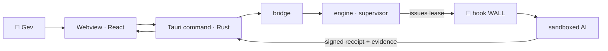

<div align="center">

# menqstudio / OS

**A governed AI operations desktop — a safe cockpit on a contained engine.**

**Կառավարվող AI-գործառնությունների desktop — անվտանգ cockpit՝ զսպված engine-ի վրա։**

[English](#english) · [Հայերեն](#հայերեն)

</div>

---

## English

**OS** is one product assembled from two halves:

| Half | Repo of origin | Role |
|------|----------------|------|
| 🧠 **Engine** (`engine/`) | [`menqstudio/Bro`](https://github.com/menqstudio/Bro) | The governance brain — a security harness that safely runs AI agents behind an enforcement wall (signed leases, approval gates, an evidence chain, a protected control plane). |
| 🖥️ **Cockpit** (`apps/desktop/`) | [`menqstudio/BroPS`](https://github.com/menqstudio/BroPS) | The human-facing Tauri desktop app — conversations, runs, approvals, files, calendar, knowledge. What Gev actually opens. |

The point of merging them: the cockpit is the only thing a person touches, and **every AI action it triggers flows through the engine's wall** — lease → gate → sandbox → signed receipt. No direct, ungoverned model execution. One safe, presentable product instead of two loose pieces.

### Repository structure

```
OS/
├── apps/
│   └── desktop/        🖥️  Cockpit (Tauri: React/TS frontend + Rust backend + SQLite core)
├── engine/             🧠  Governance engine (Python: runtime, tools, schemas, laws)
├── bridge/             🔗  Integration layer — desktop backend → governed engine call (Phase 1)
├── contracts/          📜  Shared schemas both sides agree on (lease · approval · task-contract)
├── docs/               📚  Architecture & design (bilingual)
├── .claude/            🧱  The enforcement wall (hooks) — governs dev/agent work too
└── .github/workflows/  ✅  Unified CI: frontend build · Rust core · Python engine
```

### How it fits together



The cockpit never spawns a model directly; it asks the engine, which issues a scoped, single-use lease and runs the work behind the wall, returning a signed receipt.

### Roadmap

- **Phase 0 — Scaffold** *(this step)* — monorepo assembled, both codebases in place with history, unified CI, bilingual docs. Both halves still build independently; nothing wired yet.
- **Phase 1 — Bridge** — route the desktop's AI execution through the engine's supervisor/lease/wall.
- **Phase 2 — One approval gate** — the desktop defers to the engine's Ed25519 approval/lease system (single authoritative gate).
- **Phase 3 — Contracts** — dedupe shared schemas into `contracts/` as the single source of truth.

### Development

Each half still runs on its own toolchain (Phase 0):

```bash
# Cockpit (desktop app)
cd apps/desktop
npm ci && npm run build        # typecheck + vite build
cargo test -p brops-core --manifest-path src-tauri/Cargo.toml

# Engine
cd engine
python -m unittest discover -s tests
```

---

## Հայերեն

**OS**-ը մեկ product ա՝ հավաքված երկու կեսից․

| Կես | Ծագման repo | Դեր |
|-----|-------------|-----|
| 🧠 **Engine** (`engine/`) | [`menqstudio/Bro`](https://github.com/menqstudio/Bro) | Կառավարման ուղեղը — security harness, որ **անվտանգ վազեցնում ա AI agent-ներին** enforcement wall-ի հետևում (signed lease-եր, approval gate-եր, evidence chain, protected control plane)։ |
| 🖥️ **Cockpit** (`apps/desktop/`) | [`menqstudio/BroPS`](https://github.com/menqstudio/BroPS) | Մարդուն ուղղված Tauri **desktop app-ը** — conversations, runs, approvals, files, calendar, knowledge։ Էն, ինչ Gev-ը իրական բացում ա։ |

Միացնելու իմաստը՝ cockpit-ն ա միակ բանը, որ մարդ դիպչում ա, ու **նրա trigger արած ամեն AI action անցնում ա engine-ի wall-ով** — lease → gate → sandbox → signed receipt։ Ոչ մի ուղիղ, չկառավարվող model execution։ Մեկ անվտանգ, ներկայանալի product երկու առանձին կտորի փոխարեն։

### Repo-ի կառուցվածքը

```
OS/
├── apps/
│   └── desktop/        🖥️  Cockpit (Tauri՝ React/TS frontend + Rust backend + SQLite core)
├── engine/             🧠  Governance engine (Python՝ runtime, tools, schemas, laws)
├── bridge/             🔗  Ինտեգրման շերտ — desktop backend → governed engine call (Phase 1)
├── contracts/          📜  Shared schema-ներ երկու կողմի համար (lease · approval · task-contract)
├── docs/               📚  Architecture ու design (երկլեզու)
├── .claude/            🧱  Enforcement wall-ը (hooks) — govern ա անում նաև dev/agent work-ը
└── .github/workflows/  ✅  Միասնական CI՝ frontend build · Rust core · Python engine
```

### Ինչպես են իրար կապվում

Cockpit-ը երբեք ուղիղ model չի spawn անում. խնդրում ա engine-ին, որը scoped, single-use lease ա տալիս ու աշխատանքը վազեցնում ա wall-ի հետևում՝ վերադարձնելով signed receipt։ (Դիագրամը՝ վերևի «How it fits together»-ում։)

### Roadmap

- **Phase 0 — Scaffold** *(այս քայլը)* — monorepo հավաքված, երկու codebase-ը տեղում history-ով, միասնական CI, երկլեզու docs։ Երկու կեսն էլ դեռ independently build են; ոչ մի wiring։
- **Phase 1 — Bridge** — desktop-ի AI execution-ը անցկացնել engine-ի supervisor/lease/wall-ով։
- **Phase 2 — Մեկ approval gate** — desktop-ը defer ա անում engine-ի Ed25519 approval/lease համակարգին (մեկ authoritative gate)։
- **Phase 3 — Contracts** — shared schema-ները dedupe անել `contracts/`-ում՝ single source of truth։

### Development

Ամեն կես դեռ իր toolchain-ով ա վազում (Phase 0)՝ տես վերևի «Development» բլոկը։

---

<div align="center">
<sub>menqstudio · governed by the wall 🧱</sub>
</div>
