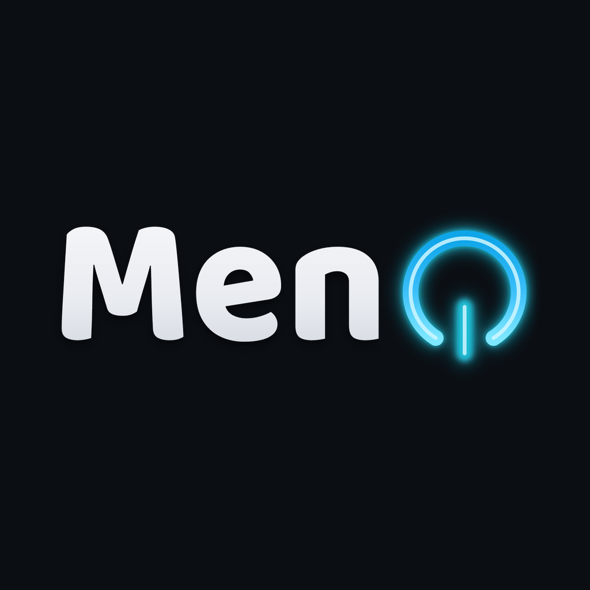
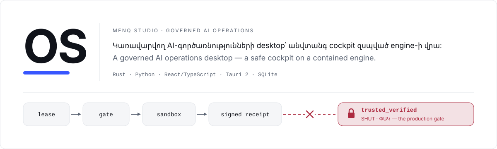

<div align="center">



<h1 align="center">
  <picture>
    <source media="(prefers-color-scheme: dark)" srcset="docs/brand/readme/hero-dark.svg">
    
  </picture>
</h1>

Շղթան վերևում նախագիծն ա։ Վերջին hop-ը՝ `production trusted_verified`, **ՓԱԿ** ա։

The chain above is the design. The last hop, `production trusted_verified`, is **SHUT**.

**[`CLAUDE.md`](./CLAUDE.md)** · **[`PROJECT_STATE.md`](./PROJECT_STATE.md)** · **[`MASTER_EXECUTION_ROADMAP.md`](./MASTER_EXECUTION_ROADMAP.md)** · **[`docs/README_CLAIM_HISTORY.md`](./docs/README_CLAIM_HISTORY.md)**

</div>

---

## Փաստաթղթի տվյալները · Document metadata

| Դաշտ · Field (English / Հայերեն) | Արժեք · Value |
| :--- | :--- |
| Title / Վերնագիր | `menqstudio/OS` — the front page · առաջին էջը |
| Status / Կարգավիճակ | Live · Կենդանի |
| Version / Տարբերակ | `0.1.0` — `apps/desktop/package.json` and `apps/desktop/src-tauri/Cargo.toml` |
| Owner / Պատասխանատու | Gev / MenQ (`menqstudio`) |
| Document class / Փաստաթղթի դաս | Informative · Տեղեկատու — the normative documents are [`CLAUDE.md`](./CLAUDE.md), [`PROJECT_STATE.md`](./PROJECT_STATE.md), [`MASTER_EXECUTION_ROADMAP.md`](./MASTER_EXECUTION_ROADMAP.md) |
| Canonical repository / Canonical repo | `github.com/menqstudio/OS`, default branch `main` |
| Canonical path / Canonical ուղի | `README.md` |
| Measured at / Չափված ա | 2026-09-19, `main` @ `45ea71e`, on a Windows box · Windows-ի վրա |
| Standing independent verdict / Գործող անկախ վճիռ | **RED** — ninth round · իններորդ ռաունդ, [`apps/desktop/AUDIT/2026-08-19-ninth-audit-5cf9b8c.md`](./apps/desktop/AUDIT/2026-08-19-ninth-audit-5cf9b8c.md) |
| Production gate / Արտադրական դարպաս | **SHUT · ՓԱԿ** |
| Brand / Բրենդ | MenQ foundation tokens · MenQ-ի foundation token-ներ, `menqstudio/MenQ-Standard` decision `D-025`; artwork in [`docs/brand/`](./docs/brand/) |
| Review trigger / Վերանայման պայման | Any number on this page changes → re-measure, and append the correction to [`docs/README_CLAIM_HISTORY.md`](./docs/README_CLAIM_HISTORY.md)<br>Այս էջի որևէ թիվ փոխվում ա → նորից չափիր, ու ուղղումը ավելացրու նույն ֆայլին |

---

## Կարդա դարպասը, ոչ թե փուլը · Read the gate, not the phase

**HY:** Այս էջի ամեն թիվ այս repo-ի մի ստուգման տպածն ա, ոչ թե արձակի պնդում։ Ուր որ բանը
չի աշխատում, ֆայլը դա ասում ա ամեն ուրիշ բանից առաջ։ Փաստաթղթված պնդումը ապացույց չի, ու
կանաչ թեստը անցած ստուգում չի։

**EN:** Every number on this page is what a check in this repository printed, not a claim in
prose. Where something does not work, this file says so before it says anything else. A
documented claim is not evidence, and a green test is not a passing check.

---

## Ի՞նչ ա OS-ը · What OS is

**HY:** **OS**-ը մեկ product ա՝ հավաքված երկու կեսից։

**EN:** **OS** is one product assembled from two halves.

| Կես · Half | Ծագման repo · Repo of origin | Դեր · Role |
| :--- | :--- | :--- |
| **Engine**<br>`engine/` | [`menqstudio/Bro`](https://github.com/menqstudio/Bro) | Կառավարման ուղեղը — security harness, որ AI agent-ներին վազեցնում ա enforcement wall-ի հետևում՝ ստորագրված lease-եր, approval gate-եր, evidence chain, պաշտպանված control plane։<br><br>The governance brain — a security harness that runs AI agents behind an enforcement wall: signed leases, approval gates, an evidence chain, a protected control plane. |
| **Cockpit**<br>`apps/desktop/` | [`menqstudio/BroPS`](https://github.com/menqstudio/BroPS) | Մարդուն ուղղված Tauri desktop app-ը — conversations, runs, approvals, files, calendar, knowledge։ Էն, ինչ Owner-ը իրական բացում ա։<br><br>The human-facing Tauri desktop app — conversations, runs, approvals, files, calendar, knowledge. What the Owner actually opens. |

**HY:** Միացնելու իմաստը՝ cockpit-ն ա միակ բանը, որ մարդ դիպչում ա, ու **նախագծով** նրա
trigger արած ամեն AI action անցնում ա engine-ի wall-ով՝ lease → gate → sandbox → signed receipt։

**EN:** The point of merging them: the cockpit is the only thing a person touches, and by
design **every AI action it triggers flows through the engine's wall** — lease → gate →
sandbox → signed receipt.

---

## Արտադրական դարպասը · The production gate

<div align="center">

<picture>
  <source media="(prefers-color-scheme: dark)" srcset="docs/brand/readme/gate-dark.svg">
  
</picture>

</div>

> [!WARNING]
> **HY: Դա նախագիծն ա։ Դեռ ոչ shipped վարքագիծը։**
> Կառավարվող շղթան ապացուցված ա ծայրից ծայր՝ Linux-ի ու Windows-ի վրա, բայց desktop
> հավելվածում **production `trusted_verified`-ը անհասանելի ա**։ Ամեն կառավարվող turn
> մերժում ա, ոչ թե ձևացնում։ Սովորական չատը այսօր անցնում ա Claude CLI provider-ով՝
> զսպված, բայց ոչ կառավարվող, ու UI-ը հենց դա էլ ասում ա, փոխ չառնելով կառավարվողի բառերը։
>
> **EN: That is the design. It is not yet the shipped behaviour.**
> The governed chain is proven end to end on Linux and on Windows, but in the desktop
> application **production `trusted_verified` is unreachable**. Every governed turn refuses
> rather than pretending. Ordinary chat today runs through the Claude CLI provider —
> contained, but not governed — and the UI says exactly that instead of borrowing governed
> vocabulary.

<details>
<summary><b>Երեք իրական մերժումը — մեջբերիր սրանք, ոչ թե spec-ի սիմվոլը · The three real refusals — cite these, not the spec symbol</b></summary>

<br>

**HY:** `platform_governed_execution_supported()` **անունով ֆունկցիա ծառում չկա** —
`grep -rn "fn platform_governed_execution_supported"` այս ծառի վրա ոչինչ չի գտնում։ Դա
`docs/design/WINDOWS_BROKER_DESIGN.md`-ի platform-gate բաժնի spec-ի սիմվոլն ա, ու
`config/spec-conformance.json`-ը գրանցում ա որպես `partial` հենց այդ պատճառով։

**EN:** `platform_governed_execution_supported()` **does not exist in this tree** —
`grep -rn "fn platform_governed_execution_supported"` finds nothing here. It is the
specification symbol from the platform-gate section of `docs/design/WINDOWS_BROKER_DESIGN.md`,
which `config/spec-conformance.json` records as `partial` for exactly that reason.

Ինչն ա փաստացի մերժում · What actually refuses:

| # | Ֆունկցիա · Function | Ֆայլ · File | Վարքագիծ · Behaviour |
| :-- | :--- | :--- | :--- |
| 1 | `governed_verification_unconfigured()` | `apps/desktop/src-tauri/src/commands.rs` | Այս ծառի վրա ամեն կանչին վերադարձնում ա `Some(...)`, ու աշխատում ա **մոդելին կանչելուց առաջ**։ Մերժումը *չափում* ա հինգ provisioning-ի մուտք, ոչ թե պնդում, ու հինգն էլ compile-time բացակա են։<br><br>Returns `Some(...)` on every call in this tree, and fires **before the model is called**. It *measures* five provisioning inputs rather than asserting the refusal, and all five are compile-time absent. |
| 2 | `connect_broker()` | `apps/desktop/src-tauri/src/governed_turn.rs` | Linux-ից դուրս ամեն host-ի վրա՝ `UnsupportedPlatform`։<br><br>Returns `UnsupportedPlatform` on every host but Linux. |
| 3 | `build_governed_executor()` | `apps/desktop/src-tauri/broker/src/main.rs` | Տալիս ա `UpstreamBlockedExecutor`, **քանի դեռ** `$BROPS_BROKER_CONFIG`-ը չի ցույց տալիս TCB-root-ով ստորագրված manifest-ով config։ Shipped հավելվածում ոչինչ այդ փոփոխականը չի դնում։<br><br>Serves `UpstreamBlockedExecutor` **unless** `$BROPS_BROKER_CONFIG` names a deployment config carrying a TCB-root-signed manifest. Nothing in the shipped app sets that variable. |

**HY:** Առաջինը նշիր **իր մեխանիզմով**, երրորդը՝ **իր պայմանով**։

Առաջինը անվերապահ `Some(...)` էր մինչև `T-048`-ը այն դարձրեց չափում հինգ մուտքի վրա՝
`GOVERNED_TRUSTED_MANIFEST_PROVISIONED` (`false`), երկու policy digest (`absent:…` sentinel,
որ `is_lower_hex64`-ը չի անցնում), ու executor-ի և builder-ի ցուցակները (երկուսն էլ `&[]`)։
Այս build-ի պատասխանը նույնն ա; փոխվածը էն ա, որ այդ հինգը provision անելը շարժում ա այն,
ոչ թե մարդ պիտի հիշի security ֆունկցիա խմբագրել։ «Անվերապահ» ասելը հիմա հին ծառ ա
նկարագրում — ու մի քանի canonical փաստաթուղթ դեռ այդպես ա գրում։

Երրորդն առանց իր պայմանի ավելի վատ ա․ այլապես `build_governed_executor`-ը վերադարձնում ա
իրական `ChainExecutor`, որի resolver-ը կարա հասնի `TrustState::Production`-ի — ուստի
«broker-ը տալիս ա `UpstreamBlockedExecutor`» կտրուկ ձևակերպումը սուտ ա, ու սուտ ա հենց այն
ուղղությամբ, որ ընթերցողին սխալ բան ա ցույց տալիս որպես կրող։

Դարպասը բացելու համար պետք ա անկախ աուդիտ **ու** Owner-ի հաստատումը։ Կանաչ CI-ն ոչ մեկն ա։

**EN:** State the first **with its mechanism** and the third **with its condition**.

Refusal 1 was an unconditional `Some(...)` until `T-048` made it a measurement over
`GOVERNED_TRUSTED_MANIFEST_PROVISIONED` (`false`), two policy digests (`absent:…` sentinels
that cannot pass `is_lower_hex64`), and the executor and builder rosters (both `&[]`). The
answer on this build is identical; what changed is that provisioning those five inputs moves
it, instead of a person having to remember to edit a security function. Saying "unconditional"
now describes an older tree — and several canonical documents still do.

Refusal 3 without its condition is worse: `build_governed_executor` otherwise returns a real
`ChainExecutor` whose resolver can reach `TrustState::Production` — so "the broker hands out
`UpstreamBlockedExecutor`" stated flatly is false, and false in the direction that tells a
reader the wrong thing is load-bearing.

Opening the gate requires an independent audit **and** the Owner's approval. A green CI run is
neither.

</details>

---

## Repo-ի կառուցվածքը · Repository structure

```text
OS/
├── apps/
│   └── desktop/        Cockpit — Tauri 2: React/TS frontend + Rust workspace + SQLite core
├── engine/             Governance engine — Python: runtime, tools, schemas, laws
│   └── .claude/        The enforcement wall — 9 hook events, fail-closed
├── bridge/             Desktop backend → engine, one op dispatch (governed turn · governance.read)
├── contracts/          5 extracted shared schemas — lease · evidence · receipt · grant · contract
├── config/             The machine-checkable state — required checks, budgets, the negative matrix
├── docs/               Architecture, security model, guides, evidence, brand (bilingual)
├── tools/              39 check_*.py gate scripts — capabilities · reachability · release signing · …
├── .claude/            262 generated specialist definitions + 6 coordination hook events
└── .github/workflows/  8 workflow files · ci.yml alone defines 21 jobs · 34 contexts required on main
```

> **HY: Root-ի `.claude/`-ը wall-ը չի։** Այնտեղ մասնագետ ագենտների սահմանումներն են՝
> գեներացված pack-ի ու authority-ի ռեեստրներից (`tools/generate_agent_definitions.py`),
> գումարած hook-եր, որ հսկում են coordination-փաստաթղթերի համաձայնությունը։ Enforcement
> wall-ը `engine/.claude/settings.json`-ում ա ու wire արած ա ինը event-ի համար։
>
> Root-ում wire անելը բաց որոշում ա. այսօր դա կմերժեր **ամեն** tool call մինչև session
> state dir-ի ու operator-ի ստորագրած workspace binding-ի գոյությունը, ու `engine/`-ը իր
> առանձին git checkout-ը չի։
>
> **EN: `.claude/` at the repository root is not the wall.** It holds the specialist agent
> definitions — generated from the pack and authority registries by
> `tools/generate_agent_definitions.py` — plus hooks that guard coordination-document
> consistency. The enforcement wall is `engine/.claude/settings.json`, wired for nine events.
>
> Wiring the wall at the root is a known open decision: today it would deny every tool call
> until a session-state directory and an operator-signed workspace binding exist, and
> `engine/` is not its own git checkout.

---

## Ինչպես ա իրար կպչում · How it fits together

<div align="center">

<picture>
  <source media="(prefers-color-scheme: dark)" srcset="docs/brand/readme/architecture-dark.svg">
  
</picture>

</div>

**HY:** Cockpit-ը երբեք ուղիղ մոդել չի spawn անում — խնդրում ա engine-ին, որ տալիս ա scoped,
մեկանգամյա lease ու գործը վազեցնում ա wall-ի հետևում՝ վերադարձնելով ստորագրված receipt։
**Shipped build-ի վրա վերջին hop-ը մերժում ա, նախագծով** — տես վերևի զգուշացումը։

**EN:** The cockpit never spawns a model directly. It asks the engine, which issues a scoped,
single-use lease and runs the work behind the wall, returning a signed receipt. **On the
shipped build the last hop refuses, by design** — see the warning above.

---

## Բրոն, ու ով ինչ իրավունք ունի · Bro, and who may do what

**HY:** Բրոն կոնդուկտորն ա։ Ցանկացած չատում տալիս ես տասկ, ինքը հասկանում ա ինչ նկատի
ունես, հաստատում ա, ու գործը դնում ա մասնագետների վրա։ Մասնագետին սահմանափակում ա երկու
բան, ու երկուսն էլ Բրոն ա դնում։

**EN:** Bro is the conductor. You give him a task in any chat; he works out what you meant,
confirms it, and hands the work to specialists. Two things bound a specialist, and Bro sets
both.

| Սահման · Bound | Ինչ ա · What it is | Պարտադրվո՞ւմ ա · Enforced? |
| :--- | :--- | :--- |
| **Կարողություն**<br>**Capability** | Երեք tier-ից մեկը, inline փոխանցվում ա CLI-ին՝ `reader` (Read/Grep/Glob) · `runner` (+Bash) · `builder` (+Edit/Write)։<br><br>One of three tiers, passed to the CLI inline: `reader` (Read/Grep/Glob) · `runner` (adds Bash) · `builder` (adds Edit/Write). | **Այո · Yes.** Tier-ն ա իրականում սահմանափակում run-ը։<br><br>The tier is what actually bounds the run. |
| **Ուղի**<br>**Path** | `scope` ու `prohibited_scope`, նշված ամեն տասկի համար։<br><br>`scope` and `prohibited_scope`, stated per task. | **Մասամբ · Partly.** Գնում ա որպես **տեքստ տասկի prompt-ի ներսում**։ `engine/runtime/bro_security.enforce_scope`-ն ա իրական պարունակողը, ու desktop-ի spawn-ը դրան չի հասնում։ Delegation-ի քարտը դա գրում ա ամեն grant-ի վրա։<br><br>It travels as **text in the task prompt**. `engine/runtime/bro_security.enforce_scope` is what genuinely contains a path, and a desktop spawn does not reach it. The delegation card says so on every grant it draws. |
| **Ցանց**<br>**Network** | — | **Ո՛չ · No. Ցանցի առանցք չկա։** Ոչ egress allowlist, ոչ մեկուսացման primitive։ `USE_NETWORK`-ը կա lease-ի schema-ում, բայց երկու task class-երից ոչ մեկը չի թույլատրում այն, ուստի այն կրող lease չի կարա վավերացվի։<br><br>**No network axis exists.** No egress allowlist, no isolation primitive. `USE_NETWORK` appears in the lease schema but neither task class permits it, so a lease carrying it cannot validate. |

**HY:** `.claude/agents/`-ի 262 pack-role ֆայլը գրանցում ա, թե ամեն հայտարարված դերը ինչ
authority-ով ա ածանցվել։ Բրոն կարդում ա դրանք՝ համապատասխան tier ընտրելու համար; իրենք
հավելվածից չեն պարտադրվում։

**EN:** The 262 pack-role files under `.claude/agents/` record the authority each declared
role was derived with. Bro reads them to pick the matching tier; they are not themselves
enforced from the app.

---

## Ստուգման վիճակը · Verification state

<div align="center">

<picture>
  <source media="(prefers-color-scheme: dark)" srcset="docs/brand/readme/verification-dark.svg">
  
</picture>

</div>

**HY:** Այստեղ տոկոս չկա։ Ամեն տող այն ա, ինչ ստուգումը տպում ա, ու ամեն մեկի կողքը իրեն
տպող հրամանն ա։ Ամբողջ աղյուսակը **մեկ head-ի** չափում ա՝ `45ea71e`; `main`-ը արագ ա շարժվում,
ուրեմն վազեցրու հրամանը, ոչ թե վստահիր թվին։

**EN:** Nothing here is a percentage. Each row is what a check prints, and each carries the
command that printed it. The whole table is measured at **one head**, `45ea71e`; `main` moves
fast, so run the command rather than trusting the number.

| Մակերես · Surface | Չափված · Measured | Հրաման · Command |
| :--- | ---: | :--- |
| Engine test suite | **2143** թեստ · tests, 97 skipped | `BRO_ENV=ci python -m unittest discover -s engine/tests -t engine/tests -q` |
| Bridge test suite | **210** թեստ · tests | `BRO_ENV=ci python -m unittest discover -s bridge/tests -t bridge/tests -q` |
| Rust workspace | **10** crate | `cargo metadata --no-deps --manifest-path apps/desktop/src-tauri/Cargo.toml` |
| Gate scripts | **39** | `ls tools/check_*.py \| wc -l` |
| Declared controls | **59** — 39 check · 20 tool | `config/control-invocation.json`, derived by `tools/check_control_invocation.py`; the split is `ls tools/check_*.py \| wc -l` and `ls engine/tools/*.py \| wc -l`, each set-equal to its half of that file |
| Workflow files | **8** | `ls .github/workflows/*.yml \| wc -l` |
| Jobs in `ci.yml` | **21** | the `jobs` keys of `.github/workflows/ci.yml` |
| Required contexts on `main` | **34** · +5 deliberately excluded | `gh api repos/menqstudio/OS/branches/main/protection --jq '.required_status_checks.contexts\|length'` |
| Specialist definitions | **262** | `ls .claude/agents/*.md \| wc -l` |

> **HY:** Cockpit-ի frontend-ի (`vitest`) թիվը **այստեղ չափված չի** ու դրա համար էլ գրված
> չի։ `npx vitest run`-ին պետք ա `node_modules`, որ այս checkout-ում չկա, ու մի թիվ
> պատճենելը, որ ինքդ չես չափել, հենց էն ա, ինչի համար
> [`docs/README_CLAIM_HISTORY.md`](./docs/README_CLAIM_HISTORY.md)-ը գոյություն ունի։
>
> **EN:** The cockpit frontend (`vitest`) count is **not measured here**, so it is not
> printed. `npx vitest run` needs `node_modules`, which this checkout does not have, and
> copying a number you did not measure is exactly what
> [`docs/README_CLAIM_HISTORY.md`](./docs/README_CLAIM_HISTORY.md) exists to stop.

**HY: Հայտարարված security negative-ներ** — `config/negative-matrix.json`, պարտադրվում ա
`tools/check_negative_matrix.py`-ով։

**EN: Declared security negatives** — `config/negative-matrix.json`, enforced by
`tools/check_negative_matrix.py`.

| Կարգավիճակ · Status | Քանակ · Count | Իմաստ · Meaning |
| :--- | ---: | :--- |
| `implemented` | 132 | Թեստ կա ու կրում ա case-ի ID-ն։ · A test exists and carries the case ID. |
| `blocked` | 54 | Ամեն մեկը նշում ա՝ ինչ պիտի նախ գոյություն ունենա։ · Each names what must exist first. |
| `unreviewed` | 56 | **Ոչ ոք չի ստուգել։** Սառեցված որպես baseline — գեյթը մերժում ա *նոր* պարտք։ · **Nobody has checked.** Frozen as a baseline — the gate refuses *new* debt. |
| **Ընդամենը · Total** | **242** | Matrix-ի ամեն ID կապված ա երեքից մեկին։ · Every ID in the matrix is bound to one of the three. |

**HY:** `unreviewed`-ը անցում չի։ Դա ազնիվ ելակետն ա գեյթի համար, որ retrofit ա արվել
գոյություն ունեցող կոդի վրա։

**EN:** `unreviewed` is not a pass. It is the honest starting state for a gate retrofitted
onto existing code.

### Ինչ դեռ հաստատված չի · What is not confirmed

**HY:** Գործող անկախ վճիռը **RED** ա — իններորդ ռաունդը, `main` @ `5cf9b8c`, P0 չկա։
Այդ ծայրից ի վեր **78 pull request**, **248 ֆայլ** ու **47 550 ավելացված տող** են merge
եղել, ու դրանցից **ոչ մեկը անկախ հաստատված չի**։ Արձակի ամեն ✅ ստուգիր
[`apps/desktop/AUDIT/AUDIT_LEDGER.md`](./apps/desktop/AUDIT/AUDIT_LEDGER.md)-ի դեմ, նախքան
հավատալը։

**EN:** The standing independent verdict is **RED** — the ninth round, `main` @ `5cf9b8c`,
no P0. Since that head, **78 pull requests**, **248 files** and **47,550 inserted lines**
have merged, and **none of it is independently confirmed**. Check any tick in prose against
[`apps/desktop/AUDIT/AUDIT_LEDGER.md`](./apps/desktop/AUDIT/AUDIT_LEDGER.md) before believing
it.

    git log --format=%s 5cf9b8c..HEAD | grep -oE "\(#[0-9]+\)$" | sort -u | wc -l   # 78
    git diff --shortstat 5cf9b8c..HEAD    # 248 files changed, 47550 insertions(+), 13464 deletions(-)

**HY:** Այս ֆայլի ամեն թիվ գոնե մեկ անգամ սխալ ա եղել։ Ամեն մեկը ինչ էր գրում ու ո՞ր
հրամանն ա ուղղել — գրանցված ա
[`docs/README_CLAIM_HISTORY.md`](./docs/README_CLAIM_HISTORY.md)-ում, ոչ թե ջնջված։

**EN:** Every number in this file has been wrong at least once. What each one used to say, and
the command that corrected it, is recorded in
[`docs/README_CLAIM_HISTORY.md`](./docs/README_CLAIM_HISTORY.md) rather than deleted.

---

## Ճանապարհային քարտեզը · Roadmap

**HY:** Կանոնական պլանը 11-փուլանոց
[`MASTER_EXECUTION_ROADMAP.md`](./MASTER_EXECUTION_ROADMAP.md)-ն ա։ Ընթացիկ վիճակը՝ branch,
PR, blocker — [`NEXT_CHAT.md`](./NEXT_CHAT.md)-ում, ու նույն banner-ը կրում են
[`PROJECT_STATE.md`](./PROJECT_STATE.md)-ն ու [`TASKS.md`](./TASKS.md)-ը։

Phase 0-ը փակ ա։ Phase 1–10-ը բոլորն էլ մասամբ կառուցված են։ Ազնիվ ամփոփումն ա, որ
մակերեսները կան, կառավարվող շղթան ապացուցված ա բայց դարպասով փակ, ու մնացած գործը
հիմնականում **միացնելն** ա այն ինչ արդեն կառուցվել ա, ու **հանելը** այն պնդումների որ
ոչինչ չի հաստատել։

Ոչ մի տեղ phase-ի տոկոսը վարքագծի խոստում մի կարդա։ **Դարպասը կարդա։**

**EN:** The canonical plan is the 11-phase
[`MASTER_EXECUTION_ROADMAP.md`](./MASTER_EXECUTION_ROADMAP.md). Current state — branch, PR,
blockers — lives in [`NEXT_CHAT.md`](./NEXT_CHAT.md), with the same banner carried by
[`PROJECT_STATE.md`](./PROJECT_STATE.md) and [`TASKS.md`](./TASKS.md).

Phase 0 is locked. Phases 1–10 are all partly built. The honest summary: the surfaces exist,
the governed chain is proven but gated off, and the remaining work is mostly **connecting**
things that were built and **removing** claims nothing established.

Do not read a phase percentage anywhere as a promise about behaviour. **Read the gate.**

---

## Մշակում · Development

**HY:** Ներքևի հրամանները նույնն են երկու լեզվի համար — կոդը լեզու չի փոխում։ Բացատրությունը
կրկնվում ա երկուսով։

**EN:** The commands below are the same for both languages — code does not change language.
The explanation is given in both.

```bash
# Cockpit — frontend
cd apps/desktop
npm ci
npx tsc --noEmit -p tsconfig.json     # types
npx vitest run                        # test count NOT printed here: it was not measured
npm run build                         # typecheck + vite build
```

```bash
# Cockpit — Rust workspace: 9 members —
#   core · launcher · executor · broker · proof · win-broker · win-live · provision · audit-signer
#   — plus the root `brops` host crate, which is why --workspace builds 10.
cargo test --manifest-path apps/desktop/src-tauri/Cargo.toml --workspace
```

```bash
# Engine  (BRO_ENV=ci is required — operator-pin gating denies without it)
BRO_ENV=ci python -m unittest discover -s engine/tests -t engine/tests -q

# Bridge
BRO_ENV=ci python -m unittest discover -s bridge/tests -t bridge/tests -q
```

```bash
# Every repository gate
for g in tools/check_*.py; do python "$g"; done
python tools/generate_agent_definitions.py --check
python tools/generate_negative_matrix.py --check
```

**HY:** Գեյթերից մի քանիսը արգումենտ են ուզում ու բարե հրամանի դեպքում verdict-ի փոխարեն
usage են տպում — `check_canonical_sync.py`, `check_prior_art.py`, `check_read_receipt.py` —
իսկ `check_bundle_budget.py`-ին Vite-ի manifest ա պետք, ուրեմն RED ա մինչև `npm run build`-ը
վազի։ Չորսից ոչ մեկը քո առաջացրած ձախողումը չի։ Windows-ի վրա `PYTHONUTF8=1` դիր ամեն կանչի
վրա, թե չէ enforcement hook-երը կարան կոնսոլի կոդավորման վրա ընկնեն։

**EN:** A few gates want arguments and print usage instead of a verdict when that bare loop
runs them — `check_canonical_sync.py`, `check_prior_art.py`, `check_read_receipt.py` — and
`check_bundle_budget.py` wants a Vite manifest, so it is RED until `npm run build` has run.
None of the four is a failure you caused. On Windows, set `PYTHONUTF8=1` on every invocation,
or the enforcement hooks can trip over the console encoding.

### Հավաքում · Build

```bash
cd apps/desktop && npx tauri build --no-bundle
# → apps/desktop/src-tauri/target/release/brops       (Linux/macOS)
# → apps/desktop/src-tauri/target/release/brops.exe   (Windows)
```

**HY:** Binary-ն կրում ա root Cargo package-ի անունը՝ `brops`; `tauri.conf.json`-ը
`mainBinaryName` չի դնում, ու `productName`-ը (`BroPS`) bundle-ն ա անվանում, ոչ թե այս
ֆայլը։ **Մշակման մեքենան Debian ա**, ուրեմն այնտեղ `brops`-ն ա ստացվածը։

**EN:** The binary is named for the root Cargo package, `brops`; `tauri.conf.json` sets no
`mainBinaryName`, and `productName` (`BroPS`) names the bundle, not this file. **The
development box is Debian**, so `brops` is the artifact you get there.

---

## Բրենդը · Brand

**HY:** Հիմքերը MenQ-ի foundation token-ներն են՝ `menqstudio/MenQ-Standard`, որոշում `D-025`։
Ութ token, ու **ոչ մի brand accent երանգ** — դա դիտավորյալ Phase-A հիմք ա։ Այս էջի հիմքերը
`#ffffff` ու `#0b0d10` են, ռիթմը՝ 8px, անկյունը՝ 12px։ Կապույտ accent-ը MenQ-ի ստանդարտից
չի գալիս — այն այս repo-ի սեփական product token-ն ա՝
[`apps/desktop/src/theme/tokens.css`](./apps/desktop/src/theme/tokens.css) (`#3856fe` լույսի,
`#7c8dff` մուգի համար)։

Բառանշանը չի վերագծվել․ [`docs/brand/`](./docs/brand/)-ում պառկած PNG-ներն են բնօրինակը, ու
[`docs/brand/README.md`](./docs/brand/README.md)-ը բացատրում ա ամեն ֆայլն ինչ ա։ Այս էջի
SVG-ները [`docs/brand/readme/`](./docs/brand/readme/)-ում են՝ լույս ու մուգ զույգերով, առանց
script-ի, առանց հեռավոր հղման, առանց արտաքին տառատեսակի։

**EN:** The grounds are MenQ's foundation tokens — `menqstudio/MenQ-Standard`, decision
`D-025`. Eight tokens, and **no brand accent hue at all**: that is a deliberate Phase-A
foundation. This page's grounds are `#ffffff` and `#0b0d10`, its rhythm 8px, its corner 12px.
The blue accent does **not** come from MenQ's standard — it is this repository's own product
token, [`apps/desktop/src/theme/tokens.css`](./apps/desktop/src/theme/tokens.css) (`#3856fe`
light, `#7c8dff` dark).

The wordmark is not redrawn: the PNGs in [`docs/brand/`](./docs/brand/) are the originals, and
[`docs/brand/README.md`](./docs/brand/README.md) explains what each file is. This page's SVGs
live in [`docs/brand/readme/`](./docs/brand/readme/) as light and dark pairs, with no scripts,
no remote references and no external fonts.

---

<div align="center">


**menqstudio** · **OS** · governed by the wall · պահված wall-ով

<sub>Այս էջի թիվը կա՛մ չափում ա, կա՛մ ոչինչ · A number on this page is a measurement or it is nothing</sub>

</div>
