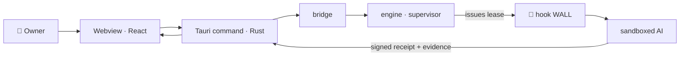

<div align="center">

# OS

**A governed AI operations desktop — a safe cockpit on a contained engine.**

**Կառավարվող AI-գործառնությունների desktop — անվտանգ cockpit՝ զսպված engine-ի վրա։**

`Rust` · `Python` · `React / TypeScript` · `Tauri 2` · `SQLite`

[**English**](#english) · [**Հայերեն**](#հայերեն)

</div>

---

<div align="center">

### Read the gate, not the phase

Every number below is produced by a check in this repository, not by prose.
Where something does not work, this file says so before it says anything else.

</div>

---

## English

**OS** is one product assembled from two halves.

| Half | Repo of origin | Role |
| :--- | :--- | :--- |
| 🧠 **Engine**<br>`engine/` | [`menqstudio/Bro`](https://github.com/menqstudio/Bro) | The governance brain — a security harness that runs AI agents behind an enforcement wall: signed leases, approval gates, an evidence chain, a protected control plane. |
| 🖥️ **Cockpit**<br>`apps/desktop/` | [`menqstudio/BroPS`](https://github.com/menqstudio/BroPS) | The human-facing Tauri desktop app — conversations, runs, approvals, files, calendar, knowledge. What the Owner actually opens. |

The point of merging them: the cockpit is the only thing a person touches, and by design **every AI action it triggers flows through the engine's wall** — lease → gate → sandbox → signed receipt.

> [!WARNING]
> **That is the design. It is not yet the shipped behaviour.**
>
> The governed chain is proven end to end on Linux and on Windows, but in the desktop
> application **production `trusted_verified` is unreachable**. Every governed turn refuses
> rather than pretending. Ordinary chat today runs through the Claude CLI provider —
> contained, but not governed — and the UI says exactly that instead of borrowing
> governed vocabulary.

<details>
<summary><b>The three real refusals — cite these, not the spec symbol</b></summary>

<br>

`platform_governed_execution_supported()` **does not exist in this tree.** It is the
specification symbol from `docs/design/WINDOWS_BROKER_DESIGN.md` §0.1, which
`config/spec-conformance.json` records as `partial` for exactly that reason.

What actually refuses:

| # | Function | File | Behaviour |
| :-- | :--- | :--- | :--- |
| 1 | `governed_verification_unconfigured()` | `apps/desktop/src-tauri/src/commands.rs` | Returns `Some(...)` on every call in this tree, and fires **before the model is called**. It *measures* five provisioning inputs rather than asserting the refusal, and all five are compile-time absent. |
| 2 | `connect_broker()` | `apps/desktop/src-tauri/src/governed_turn.rs` | Returns `UnsupportedPlatform` on every host but Linux. |
| 3 | `build_governed_executor()` | `apps/desktop/src-tauri/broker/src/main.rs` | Serves `UpstreamBlockedExecutor` **unless** `$BROPS_BROKER_CONFIG` names a deployment config carrying a TCB-root-signed manifest. Nothing in the shipped app sets that variable. |

State the first **with its mechanism** and the third **with its condition**.

Refusal 1 was an unconditional `Some(...)` until `T-048` made it a measurement over
`GOVERNED_TRUSTED_MANIFEST_PROVISIONED` (`false`), two policy digests (`absent:…` sentinels
that cannot pass `is_lower_hex64`), and the executor and builder rosters (both `&[]`). The
answer on this build is identical; what changed is that provisioning those five inputs moves
it, instead of a person having to remember to edit a security function. Saying "unconditional"
now describes an older tree — and several canonical documents still do.

Refusal 3 without its condition is worse: `build_governed_executor` otherwise returns a real
`ChainExecutor` whose resolver can reach `TrustState::Production` — so "the broker hands out
`UpstreamBlockedExecutor`" stated flatly is false, and false in the direction that tells a
reader the wrong thing is load-bearing.

Opening the gate requires an independent audit **and** the Owner's approval. A green CI run is
neither.

</details>

### Repository structure

```
OS/
├── apps/
│   └── desktop/        🖥️  Cockpit — Tauri 2: React/TS frontend + Rust workspace + SQLite core
├── engine/             🧠  Governance engine — Python: runtime, tools, schemas, laws
│   └── .claude/        🧱  The enforcement wall — 9 hook events, fail-closed
├── bridge/             🔗  Desktop backend → engine, one op dispatch (governed turn · governance.read)
├── contracts/          📜  5 extracted shared schemas — lease · evidence · receipt · grant · contract
├── docs/               📚  Architecture, security model, guides, evidence (bilingual)
├── tools/              ✅  32 repository gates — capabilities · reachability · release signing · …
├── .claude/            🤖  262 generated specialist definitions + 5 coordination hook events
└── .github/workflows/  ⚙️  8 workflows · 33 contexts required on `main`
```

> **`.claude/` at the repository root is not the wall.** It holds the specialist agent
> definitions — generated from the pack and authority registries by
> `tools/generate_agent_definitions.py` — plus hooks that guard coordination-document
> consistency. The enforcement wall is `engine/.claude/settings.json`, wired for nine events.
>
> Wiring the wall at the root is a known open decision: today it would deny every tool call
> until a session-state directory and an operator-signed workspace binding exist, and
> `engine/` is not its own git checkout.

### How it fits together


```mermaid
flowchart LR
    U[👤 Owner] --> W[Webview · React]
    W --> R[Tauri command · Rust]
    R --> B[bridge]
    B --> S[engine · supervisor]
    S -->|issues lease| G[🧱 hook WALL]
    G --> C[sandboxed AI]
    C -->|signed receipt + evidence| R
    R --> W
```

The cockpit never spawns a model directly. It asks the engine, which issues a scoped,
single-use lease and runs the work behind the wall, returning a signed receipt. **On the
shipped build the last hop refuses, by design** — see the warning above.

### Bro, and who may do what

Bro is the conductor. You give him a task in any chat; he works out what you meant, confirms
it, and hands the work to specialists. Two things bound a specialist, and Bro sets both.

| Bound | What it is | Enforced? |
| :--- | :--- | :--- |
| **Capability** | One of three tiers, passed to the CLI inline: `reader` (Read/Grep/Glob) · `runner` (adds Bash) · `builder` (adds Edit/Write). | ✅ The tier is what actually bounds the run. |
| **Path** | `scope` and `prohibited_scope`, stated per task. | ⚠️ Travels as **text in the task prompt**. `engine/runtime/bro_security.enforce_scope` is what genuinely contains a path, and a desktop spawn does not reach it. The delegation card says so on every grant it draws. |
| **Network** | — | ❌ **No network axis exists.** No egress allowlist, no isolation primitive. `USE_NETWORK` appears in the lease schema but neither task class permits it, so a lease carrying it cannot validate. |

The 262 pack-role files under `.claude/agents/` record the authority each declared role was
derived with. Bro reads them to pick the matching tier; they are not themselves enforced from
the app.

### Verification state

Nothing here is a percentage. Each row is what a check prints.

| Surface | Measured |
| :--- | ---: |
| Engine test suite (`BRO_ENV=ci`) | **2031** tests |
| Bridge test suite | **210** tests |
| Cockpit frontend (`vitest`) | **758** tests · 80 files |
| Rust workspace | 10 crates |
| Repository gates | **32** |
| Required contexts on `main` | **33** |

**Declared security negatives** — `config/negative-matrix.json`, enforced by
`tools/check_negative_matrix.py`:

| Status | Count | Meaning |
| :--- | ---: | :--- |
| `implemented` | 29 | A test exists and carries the case ID. |
| `blocked` | 12 | Each names what must exist first. |
| `unreviewed` | 201 | **Nobody has checked.** Frozen as a baseline — the gate refuses *new* debt. |
| **Total** | **242** | Every ID in the matrix is bound to one of the three. |

`unreviewed` is not a pass. It is the honest starting state for a gate retrofitted onto
existing code.

Every number in this file has been wrong at least once. What each one used to say, and the
command that corrected it, is recorded in
[`docs/README_CLAIM_HISTORY.md`](./docs/README_CLAIM_HISTORY.md) rather than deleted.

### Roadmap

The canonical plan is the 11-phase [`MASTER_EXECUTION_ROADMAP.md`](./MASTER_EXECUTION_ROADMAP.md).
Current state — branch, PR, blockers — lives in [`NEXT_CHAT.md`](./NEXT_CHAT.md), with the same
banner carried by [`PROJECT_STATE.md`](./PROJECT_STATE.md) and [`TASKS.md`](./TASKS.md).

Phase 0 is locked. Phases 1–10 are all partly built. The honest summary: the surfaces exist,
the governed chain is proven but gated off, and the remaining work is mostly **connecting**
things that were built and **removing** claims nothing established.

Do not read a phase percentage anywhere as a promise about behaviour. **Read the gate.**

### Development

```bash
# Cockpit — frontend
cd apps/desktop
npm ci
npx tsc --noEmit -p tsconfig.json     # types
npx vitest run                         # 80 files / 758 tests
npm run build                          # typecheck + vite build
```

```bash
# Cockpit — Rust workspace: 9 members —
#   core · launcher · executor · broker · proof · win-broker · win-live · provision · audit-signer
#   — plus the root `brops` host crate, which is why --workspace builds 10.
cargo test --manifest-path apps/desktop/src-tauri/Cargo.toml --workspace
```

```bash
# Engine  (BRO_ENV=ci is required — operator-pin gating denies without it)
BRO_ENV=ci python -m unittest discover -s engine/tests -t engine/tests -q

# Bridge
BRO_ENV=ci python -m unittest discover -s bridge/tests -t bridge/tests -q
```

```bash
# Every repository gate
for g in tools/check_*.py; do python "$g"; done
python tools/generate_agent_definitions.py --check
python tools/generate_negative_matrix.py --check
```

Three of the 32 gates want arguments and print usage instead of a verdict when that loop runs
them bare — `check_canonical_sync.py`, `check_prior_art.py`, `check_read_receipt.py` — and
`check_bundle_budget.py` wants a Vite manifest, so it is RED until `npm run build` has run.
None of the four is a failure you caused.

Building the desktop application:

```bash
cd apps/desktop && npx tauri build --no-bundle
# → apps/desktop/src-tauri/target/release/brops       (Linux/macOS)
# → apps/desktop/src-tauri/target/release/brops.exe   (Windows)
```

The binary is named for the root Cargo package, `brops`; `tauri.conf.json` sets no
`mainBinaryName`, and `productName` (`BroPS`) names the bundle, not this file. **The
development box is Debian**, so `brops` is the artifact you get here.

---

## Հայերեն

**OS**-ը մեկ product ա՝ հավաքված երկու կեսից։

| Կես | Ծագման repo | Դեր |
| :--- | :--- | :--- |
| 🧠 **Engine**<br>`engine/` | [`menqstudio/Bro`](https://github.com/menqstudio/Bro) | Կառավարման ուղեղը — security harness, որ AI agent-ներին վազեցնում ա enforcement wall-ի հետևում՝ ստորագրված lease-եր, approval gate-եր, evidence chain, պաշտպանված control plane։ |
| 🖥️ **Cockpit**<br>`apps/desktop/` | [`menqstudio/BroPS`](https://github.com/menqstudio/BroPS) | Մարդուն ուղղված Tauri desktop app-ը — conversations, runs, approvals, files, calendar, knowledge։ Էն, ինչ Owner-ը իրական բացում ա։ |

Միացնելու իմաստը՝ cockpit-ն ա միակ բանը, որ մարդ դիպչում ա, ու **նախագծով** նրա trigger արած ամեն AI action անցնում ա engine-ի wall-ով՝ lease → gate → sandbox → signed receipt։

> [!WARNING]
> **Դա նախագիծն ա։ Դեռ ոչ shipped վարքագիծը։**
>
> Կառավարվող շղթան ապացուցված ա ծայրից ծայր՝ Linux-ի ու Windows-ի վրա, բայց desktop
> հավելվածում **production `trusted_verified`-ը անհասանելի ա**։ Ամեն կառավարվող turn
> մերժում ա, ոչ թե ձևացնում։ Սովորական չատը այսօր անցնում ա Claude CLI provider-ով՝
> զսպված, բայց ոչ կառավարվող, ու UI-ը հենց դա էլ ասում ա։

<details>
<summary><b>Երեք իրական մերժումը — մեջբերիր սրանք, ոչ թե spec-ի սիմվոլը</b></summary>

<br>

`platform_governed_execution_supported()` **անունով ֆունկցիա ծառում չկա։** Դա spec-ի
սիմվոլն ա (`docs/design/WINDOWS_BROKER_DESIGN.md` §0.1), ու `config/spec-conformance.json`-ը
գրանցում ա որպես `partial` հենց այդ պատճառով։

Ինչն ա փաստացի մերժում․

| # | Ֆունկցիա | Ֆայլ | Վարքագիծ |
| :-- | :--- | :--- | :--- |
| 1 | `governed_verification_unconfigured()` | `apps/desktop/src-tauri/src/commands.rs` | Այս ծառի վրա ամեն կանչին վերադարձնում ա `Some(...)`, ու աշխատում ա **մոդելին կանչելուց առաջ**։ Մերժումը *չափում* ա հինգ provisioning-ի մուտք, ոչ թե պնդում, ու հինգն էլ compile-time բացակա են։ |
| 2 | `connect_broker()` | `apps/desktop/src-tauri/src/governed_turn.rs` | Linux-ից դուրս ամեն host-ի վրա՝ `UnsupportedPlatform`։ |
| 3 | `build_governed_executor()` | `apps/desktop/src-tauri/broker/src/main.rs` | Տալիս ա `UpstreamBlockedExecutor`, **քանի դեռ** `$BROPS_BROKER_CONFIG`-ը չի ցույց տալիս TCB-root-ով ստորագրված manifest-ով config։ Shipped հավելվածում ոչինչ այդ փոփոխականը չի դնում։ |

Առաջինը նշիր **իր մեխանիզմով**, երրորդը՝ **իր պայմանով**։

Առաջինը անվերապահ `Some(...)` էր մինչև `T-048`-ը այն դարձրեց չափում հինգ մուտքի վրա՝
`GOVERNED_TRUSTED_MANIFEST_PROVISIONED` (`false`), երկու policy digest (`absent:…` sentinel,
որ `is_lower_hex64`-ը չի անցնում), ու executor-ի և builder-ի ցուցակները (երկուսն էլ `&[]`)։
Այս build-ի պատասխանը նույնն ա; փոխվածը էն ա, որ այդ հինգը provision անելը շարժում ա այն,
ոչ թե մարդ պիտի հիշի security ֆունկցիա խմբագրել։ «Անվերապահ» ասելը հիմա հին ծառ ա նկարագրում
— ու մի քանի canonical փաստաթուղթ դեռ այդպես ա գրում։

Երրորդն առանց իր պայմանի ավելի վատ ա․ այլապես `build_governed_executor`-ը վերադարձնում ա իրական
`ChainExecutor`, որի resolver-ը կարա հասնի `TrustState::Production`-ի — ուստի «broker-ը տալիս
ա `UpstreamBlockedExecutor`» կտրուկ ձևակերպումը սուտ ա, ու սուտ ա հենց այն ուղղությամբ, որ
ընթերցողին սխալ բան ա ցույց տալիս որպես կրող։

Դարպասը բացելու համար պետք ա անկախ աուդիտ **ու** Owner-ի հաստատումը։ Կանաչ CI-ն ոչ մեկն ա։

</details>

### Repo-ի կառուցվածքը

```
OS/
├── apps/
│   └── desktop/        🖥️  Cockpit — Tauri 2՝ React/TS frontend + Rust workspace + SQLite core
├── engine/             🧠  Governance engine — Python՝ runtime, tools, schemas, laws
│   └── .claude/        🧱  Enforcement wall-ը — 9 hook event, fail-closed
├── bridge/             🔗  Desktop backend → engine, մեկ op dispatch (governed turn · governance.read)
├── contracts/          📜  5 հանված shared schema — lease · evidence · receipt · grant · contract
├── docs/               📚  Architecture, security model, ուղեցույցներ, ապացույցներ (երկլեզու)
├── tools/              ✅  32 repository gate — capabilities · reachability · release signing · …
├── .claude/            🤖  262 գեներացված մասնագետ + 5 coordination hook event
└── .github/workflows/  ⚙️  8 workflow · 33 պարտադիր կոնտեքստ `main`-ի վրա
```

> **Root-ի `.claude/`-ը wall-ը չի։** Այնտեղ մասնագետ ագենտների սահմանումներն են՝ գեներացված
> pack-ի ու authority-ի ռեեստրներից (`tools/generate_agent_definitions.py`), գումարած hook-եր,
> որ հսկում են coordination-փաստաթղթերի համաձայնությունը։ Enforcement wall-ը
> `engine/.claude/settings.json`-ում ա ու wire արած ա ինը event-ի համար։
>
> Root-ում wire անելը բաց որոշում ա. այսօր դա կմերժեր **ամեն** tool call մինչև session state
> dir-ի ու operator-ի ստորագրած workspace binding-ի գոյությունը, ու `engine/`-ը իր առանձին
> git checkout-ը չի։

### Ինչպես ա իրար կպչում

Տես վերևի [diagram-ը](#how-it-fits-together)։ Cockpit-ը երբեք ուղիղ մոդել չի spawn անում —
խնդրում ա engine-ին, որ տալիս ա scoped, մեկանգամյա lease ու գործը վազեցնում ա wall-ի հետևում՝
վերադարձնելով ստորագրված receipt։ **Shipped build-ի վրա վերջին hop-ը մերժում ա, նախագծով։**

### Բրոն, ու ով ինչ իրավունք ունի

Բրոն կոնդուկտորն ա։ Ցանկացած չատում տալիս ես տասկ, ինքը հասկանում ա ինչ նկատի ունես,
հաստատում ա, ու գործը դնում ա մասնագետների վրա։ Մասնագետին սահմանափակում ա երկու բան, ու
երկուսն էլ Բրոն ա դնում։

| Սահման | Ինչ ա | Պարտադրվո՞ւմ ա |
| :--- | :--- | :--- |
| **Կարողություն** | Երեք tier-ից մեկը, inline փոխանցվում ա CLI-ին՝ `reader` (Read/Grep/Glob) · `runner` (+Bash) · `builder` (+Edit/Write)։ | ✅ Tier-ն ա իրականում սահմանափակում run-ը։ |
| **Ուղի** | `scope` ու `prohibited_scope`, նշված ամեն տասկի համար։ | ⚠️ Գնում ա որպես **տեքստ տասկի prompt-ի ներսում**։ `engine/runtime/bro_security.enforce_scope`-ն ա իրական պարունակողը, ու desktop-ի spawn-ը դրան չի հասնում։ Delegation-ի քարտը դա գրում ա ամեն grant-ի վրա։ |
| **Ցանց** | — | ❌ **Ցանցի առանցք չկա։** Ոչ egress allowlist, ոչ մեկուսացման primitive։ `USE_NETWORK`-ը կա lease-ի schema-ում, բայց երկու task class-երից ոչ մեկը չի թույլատրում այն, ուստի այն կրող lease չի կարա վավերացվի։ |

`.claude/agents/`-ի 262 pack-role ֆայլը գրանցում ա, թե ամեն հայտարարված դերը ինչ authority-ով ա
ածանցվել։ Բրոն կարդում ա դրանք՝ համապատասխան tier ընտրելու համար; իրենք հավելվածից չեն
պարտադրվում։

### Ստուգման վիճակը

Այստեղ տոկոս չկա։ Ամեն տող այն ա, ինչ ստուգումը տպում ա։

| Մակերես | Չափված |
| :--- | ---: |
| Engine test suite (`BRO_ENV=ci`) | **2031** թեստ |
| Bridge test suite | **210** թեստ |
| Cockpit frontend (`vitest`) | **758** թեստ · 80 ֆայլ |
| Rust workspace | 10 crate |
| Repository gate | **32** |
| Պարտադիր կոնտեքստ `main`-ի վրա | **33** |

**Հայտարարված security negative-ներ** — `config/negative-matrix.json`, պարտադրվում ա
`tools/check_negative_matrix.py`-ով․

| Կարգավիճակ | Քանակ | Իմաստ |
| :--- | ---: | :--- |
| `implemented` | 29 | Թեստ կա ու կրում ա case-ի ID-ն։ |
| `blocked` | 12 | Ամեն մեկը նշում ա՝ ինչ պիտի նախ գոյություն ունենա։ |
| `unreviewed` | 201 | **Ոչ ոք չի ստուգել։** Սառեցված որպես baseline — գեյթը մերժում ա *նոր* պարտք։ |
| **Ընդամենը** | **242** | Matrix-ի ամեն ID կապված ա երեքից մեկին։ |

`unreviewed`-ը անցում չի։ Դա ազնիվ ելակետն ա գեյթի համար, որ retrofit ա արվել գոյություն
ունեցող կոդի վրա։

Այս ֆայլի ամեն թիվ գոնե մեկ անգամ սխալ ա եղել։ Ամեն մեկը ինչ էր գրում ու ո՞ր հրամանն ա ուղղել —
գրանցված ա [`docs/README_CLAIM_HISTORY.md`](./docs/README_CLAIM_HISTORY.md)-ում, ոչ թե ջնջված։

### Roadmap

Կանոնական պլանը 11-phase [`MASTER_EXECUTION_ROADMAP.md`](./MASTER_EXECUTION_ROADMAP.md)-ն ա։
Ընթացիկ վիճակը՝ branch, PR, blocker — [`NEXT_CHAT.md`](./NEXT_CHAT.md)-ում, ու նույն banner-ը
կրում են [`PROJECT_STATE.md`](./PROJECT_STATE.md)-ն ու [`TASKS.md`](./TASKS.md)-ը։

Phase 0-ը փակ ա։ Phase 1–10-ը բոլորն էլ մասամբ կառուցված են։ Ազնիվ ամփոփումն ա, որ մակերեսները
կան, կառավարվող շղթան ապացուցված ա բայց դարպասով փակ, ու մնացած գործը հիմնականում **միացնելն**
ա այն ինչ արդեն կառուցվել ա, ու **հանելը** այն պնդումների որ ոչինչ չի հաստատել։

Ոչ մի տեղ phase-ի տոկոսը վարքագծի խոստում մի կարդա։ **Դարպասը կարդա։**

### Development

Բոլոր հրամանները նույնն են՝ տես վերևի [Development](#development) բլոկը։ Մեկ բան, որ արժի
կրկնել․ **development-ի մեքենան Debian ա**, ուստի `tauri build`-ի արտադրանքը
`apps/desktop/src-tauri/target/release/brops` ա, ոչ թե `brops.exe` — վերջինը Windows-ի անունն ա։

---

<div align="center">

**menqstudio** · governed by the wall 🧱

</div>
