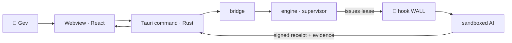

<div align="center">

# menqstudio / OS

**A governed AI operations desktop — a safe cockpit on a contained engine.**

**Կառավարվող AI-գործառնությունների desktop — անվտանգ cockpit՝ զսպված engine-ի վրա։**

[English](#english) · [Հայերեն](#հայերեն)

</div>

---

## English

**OS** is one product assembled from two halves:

| Half | Repo of origin | Role |
|------|----------------|------|
| 🧠 **Engine** (`engine/`) | [`menqstudio/Bro`](https://github.com/menqstudio/Bro) | The governance brain — a security harness that safely runs AI agents behind an enforcement wall (signed leases, approval gates, an evidence chain, a protected control plane). |
| 🖥️ **Cockpit** (`apps/desktop/`) | [`menqstudio/BroPS`](https://github.com/menqstudio/BroPS) | The human-facing Tauri desktop app — conversations, runs, approvals, files, calendar, knowledge. What Gev actually opens. |

The point of merging them: the cockpit is the only thing a person touches, and the design is that **every AI action it triggers flows through the engine's wall** — lease → gate → sandbox → signed receipt.

> **Read this before you trust the sentence above.** That is the design, and it is not yet the
> shipped behaviour. The governed chain is proven end to end on Linux and on Windows, but in the
> desktop application **production `trusted_verified` is unreachable** — every governed turn
> refuses rather than pretending.
>
> **Do not go looking for `platform_governed_execution_supported()`. No function of that name exists in the tree** — it is the *specification* symbol from `docs/design/WINDOWS_BROKER_DESIGN.md` §0.1, which `config/spec-conformance.json` records as `partial` for exactly that reason. The gate is three real refusals, all in the tree: `governed_verification_unconfigured()` (`apps/desktop/src-tauri/src/commands.rs`) returns `Some(...)` unconditionally and fires *before the model is called*; `connect_broker()` (`src/governed_turn.rs`) returns `UnsupportedPlatform` on every host but Linux; and the broker's `build_governed_executor` (`broker/src/main.rs`) serves `UpstreamBlockedExecutor` **unless `$BROPS_BROKER_CONFIG` names a deployment config carrying a TCB-root-signed manifest** — nothing in the shipped app sets that variable, so the fallback is what runs.
>
> Flipping that gate needs an independent audit and the Owner's approval. Ordinary chat today runs through the Claude CLI provider, contained but
> not governed, and the UI says so rather than borrowing the governed vocabulary.

### Repository structure

```
OS/
├── apps/
│   └── desktop/        🖥️  Cockpit (Tauri: React/TS frontend + Rust backend + SQLite core)
├── engine/             🧠  Governance engine (Python: runtime, tools, schemas, laws)
│   └── .claude/        🧱  The enforcement wall — 9 hook events, fail-closed
├── bridge/             🔗  Desktop backend → engine, one op dispatch (governed turn · governance.read)
├── contracts/          📜  Reserved for shared schemas — a README only, nothing extracted yet
├── docs/               📚  Architecture, security model, guides, evidence (bilingual)
├── tools/              ✅  15 repository gates (capabilities · reachability · release signing · …)
├── .claude/            🤖  262 generated specialist definitions + one coordination Stop guard
└── .github/workflows/  ⚙️  7 workflows, 31 checks per PR (none *required* — see below)
```

**`.claude/` at the repository root is not the wall.** It holds the specialist agent definitions
(generated from the pack + authority registries — see `tools/generate_agent_definitions.py`) and a
single `Stop` hook that guards coordination-document consistency. The enforcement wall lives at
`engine/.claude/settings.json` and is wired for nine events. Wiring it at the root is a known open
decision: today it would deny every tool call until a session state directory and an
operator-signed workspace binding exist, and `engine/` is not its own git checkout.

### How it fits together


```mermaid
flowchart LR
    U[👤 Gev] --> W[Webview · React]
    W --> R[Tauri command · Rust]
    R --> B[bridge]
    B --> S[engine · supervisor]
    S -->|issues lease| G[🧱 hook WALL]
    G --> C[sandboxed AI]
    C -->|signed receipt + evidence| R
    R --> W
```

The cockpit never spawns a model directly; it asks the engine, which issues a scoped, single-use
lease and runs the work behind the wall, returning a signed receipt. On the shipped build the last
hop refuses, by design — see the note above.

### Bro, and who may do what

Bro is the conductor. You give him a task in any chat; he works out what you meant, confirms it,
and hands the work to specialists. Two things bound a specialist and Bro sets both:

- **Capability** — Bro chooses one of three tiers, passed to the CLI inline: `reader`
  (Read/Grep/Glob), `runner` (adds Bash), `builder` (adds Edit/Write). The tier is what actually
  bounds the run.
- **Path** — `scope` and `prohibited_scope`, stated per task. These travel as text in the task
  prompt and are **not** enforced on the desktop route; `engine/runtime/bro_security.enforce_scope`
  is what genuinely contains a path, and a desktop spawn does not reach it. The delegation card
  says so on every grant it draws.

The 262 pack-role files under `.claude/agents/` record the authority each declared role was derived
with. Bro reads them to pick the matching tier; they are not themselves enforced from the app.

### Roadmap

The canonical plan is the 11-phase [`MASTER_EXECUTION_ROADMAP.md`](./MASTER_EXECUTION_ROADMAP.md).
The exact current state — branch, PR, blockers — is [`NEXT_CHAT.md`](./NEXT_CHAT.md), and
[`PROJECT_STATE.md`](./PROJECT_STATE.md) and [`TASKS.md`](./TASKS.md) carry the same banner.

Phase 0 is locked. Phases 1–10 are all partly built; the honest summary is that the surfaces exist,
the governed chain is proven but gated off, and the remaining work is mostly *connecting* things
that were built and *removing* claims nothing established. Do not read a phase percentage anywhere
as a promise about behaviour — read the gate.

### Development

```bash
# Cockpit — frontend
cd apps/desktop
npm ci
npx tsc --noEmit -p tsconfig.json     # types
npx vitest run                         # 68 files / 627 tests
npm run build                          # typecheck + vite build

# Cockpit — Rust (workspace: core, broker, win-broker, win-live, proof, launcher)
cargo test --manifest-path apps/desktop/src-tauri/Cargo.toml --workspace

# Engine (BRO_ENV=ci is required — operator-pin gating denies without it)
BRO_ENV=ci python -m unittest discover -s engine/tests -t engine/tests -q

# Bridge
BRO_ENV=ci python -m unittest discover -s bridge/tests -t bridge/tests -q

# Every repository gate
for g in tools/check_*.py; do python "$g"; done
python tools/generate_agent_definitions.py --check
```

Building the desktop application itself:

```bash
cd apps/desktop && npx tauri build --no-bundle
# → apps/desktop/src-tauri/target/release/brops.exe
```

---

## Հայերեն

**OS**-ը մեկ product ա՝ հավաքված երկու կեսից․

| Կես | Ծագման repo | Դեր |
|-----|-------------|-----|
| 🧠 **Engine** (`engine/`) | [`menqstudio/Bro`](https://github.com/menqstudio/Bro) | Կառավարման ուղեղը — security harness, որ **անվտանգ վազեցնում ա AI agent-ներին** enforcement wall-ի հետևում (signed lease-եր, approval gate-եր, evidence chain, protected control plane)։ |
| 🖥️ **Cockpit** (`apps/desktop/`) | [`menqstudio/BroPS`](https://github.com/menqstudio/BroPS) | Մարդուն ուղղված Tauri **desktop app-ը** — conversations, runs, approvals, files, calendar, knowledge։ Էն, ինչ Gev-ը իրական բացում ա։ |

Միացնելու իմաստը՝ cockpit-ն ա միակ բանը, որ մարդ դիպչում ա, ու **նախագծով** նրա trigger արած ամեն AI action անցնում ա engine-ի wall-ով՝ lease → gate → sandbox → signed receipt։

> **Կարդա սա նախքան վերևի նախադասությանը վստահելը։** Դա նախագիծն ա, ու **դեռ ոչ** shipped
> վարքագիծը։ Կառավարվող շղթան ապացուցված ա ծայրից ծայր՝ Linux-ի ու Windows-ի վրա, բայց desktop
> հավելվածում **production `trusted_verified`-ը անհասանելի ա** —
> ամեն կառավարվող turn մերժում ա, ոչ թե ձևացնում։ Այդ դարպասը բացելու համար պետք ա անկախ աուդիտ ու
> Տիրոջ հաստատումը։ Սովորական չատը այսօր անցնում ա Claude CLI provider-ով՝ զսպված, բայց ոչ
> կառավարվող, ու UI-ը հենց դա էլ ասում ա, ոչ թե փոխառում կառավարվողի բառապաշարը։
>
> **`platform_governed_execution_supported()` անունով ֆունկցիա ծառում չկա։** Դա spec-ի սիմվոլն ա (`docs/design/WINDOWS_BROKER_DESIGN.md` §0.1), ու `config/spec-conformance.json`-ը գրանցում ա որպես `partial`։ Դարպասը երեք իրական մերժումն են՝ `governed_verification_unconfigured()`-ը անպայման `Some(...)` ա վերադարձնում մոդելին կանչելուց առաջ, `connect_broker()`-ը Linux-ից դուրս վերադարձնում ա `UnsupportedPlatform`, ու broker-ի `build_governed_executor`-ը տալիս ա `UpstreamBlockedExecutor` **քանի դեռ `$BROPS_BROKER_CONFIG`-ը չի ցույց տալիս TCB-root-ով ստորագրված manifest-ով config** — shipped հավելվածում ոչինչ այդ փոփոխականը չի դնում։

### Repo-ի կառուցվածքը

```
OS/
├── apps/
│   └── desktop/        🖥️  Cockpit (Tauri՝ React/TS frontend + Rust backend + SQLite core)
├── engine/             🧠  Governance engine (Python՝ runtime, tools, schemas, laws)
│   └── .claude/        🧱  Enforcement wall-ը — 9 hook event, fail-closed
├── bridge/             🔗  Desktop backend → engine, մեկ op dispatch (governed turn · governance.read)
├── contracts/          📜  Վերապահված shared schema-ների համար — միայն README, դեռ ոչինչ հանված չի
├── docs/               📚  Architecture, security model, ուղեցույցներ, ապացույցներ (երկլեզու)
├── tools/              ✅  15 repository gate (capabilities · reachability · release signing · …)
├── .claude/            🤖  262 գեներացված մասնագետի սահմանում + մեկ coordination Stop guard
└── .github/workflows/  ⚙️  7 workflow, 31 ստուգում ամեն PR-ի վրա (ոչ մեկը *պարտադիր* չի — տես ավելի ներքև)
```

**Root-ի `.claude/`-ը wall-ը չի։** Այնտեղ մասնագետ ագենտների սահմանումներն են (գեներացված pack-ի ու
authority-ի ռեեստրներից — տես `tools/generate_agent_definitions.py`) ու մեկ `Stop` hook, որ
հսկում ա coordination-փաստաթղթերի համաձայնությունը։ Enforcement wall-ը
`engine/.claude/settings.json`-ում ա ու wire արած ա ինը event-ի համար։ Root-ում wire անելը բաց
որոշում ա. այսօր դա կմերժեր **ամեն** tool call մինչև session state dir-ի ու operator-ի ստորագրած
workspace binding-ի գոյությունը, ու `engine/`-ը իր առանձին git checkout-ը չի։

### Բրոն, ու ով ինչ իրավունք ունի

Բրոն կոնդուկտորն ա։ Ցանկացած չատում տալիս ես տասկ, ինքը հասկանում ա ինչ նկատի ունես, հաստատում ա,
ու գործը դնում ա մասնագետների վրա։ Մասնագետին սահմանափակում ա երկու բան, ու երկուսն էլ Բրոն ա դնում․

- **Կարողություն** — Բրոն ընտրում ա երեք tier-ից մեկը, որ inline փոխանցվում ա CLI-ին՝ `reader`
  (Read/Grep/Glob), `runner` (ավելանում ա Bash), `builder` (ավելանում ա Edit/Write)։ **Tier-ն ա**
  իրականում սահմանափակում run-ը։
- **Ուղի** — `scope` ու `prohibited_scope`, նշված ամեն տասկի համար։ Սրանք գնում են որպես տեքստ
  տասկի prompt-ի ներսում ու desktop-ի ճանապարհին **չեն** պարտադրվում;
  `engine/runtime/bro_security.enforce_scope`-ն ա իրական պարունակողը, ու desktop-ի spawn-ը դրան
  չի հասնում։ Delegation-ի քարտը դա գրում ա ամեն grant-ի վրա։

`.claude/agents/`-ի 262 pack-role ֆայլը գրանցում ա, թե ամեն հայտարարված դերը ինչ authority-ով ա
ածանցվել։ Բրոն կարդում ա դրանք՝ համապատասխան tier ընտրելու համար; իրենք հավելվածից չեն պարտադրվում։

### Roadmap

Կանոնական պլանը 11-phase [`MASTER_EXECUTION_ROADMAP.md`](./MASTER_EXECUTION_ROADMAP.md)-ն ա։
Ընթացիկ ճշգրիտ վիճակը՝ branch, PR, blocker — [`NEXT_CHAT.md`](./NEXT_CHAT.md)-ում, ու նույն
banner-ը կրում են [`PROJECT_STATE.md`](./PROJECT_STATE.md)-ն ու [`TASKS.md`](./TASKS.md)-ը։

Phase 0-ը փակ ա։ Phase 1–10-ը բոլորն էլ մասամբ կառուցված են; ազնիվ ամփոփումն ա, որ մակերեսները կան,
կառավարվող շղթան ապացուցված ա բայց դարպասով փակ, ու մնացած գործը հիմնականում **միացնելն** ա այն
ինչ արդեն կառուցվել ա, ու **հանելը** այն պնդումների որ ոչինչ չի հաստատել։ Ոչ մի տեղ phase-ի տոկոսը
վարքագծի խոստում մի կարդա — **դարպասը** կարդա։

### Development

Տես վերևի «Development» բլոկը՝ բոլոր հրամանները նույնն են։

---

<div align="center">
<sub>menqstudio · governed by the wall 🧱</sub>
</div>
